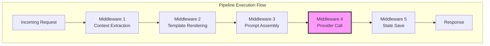
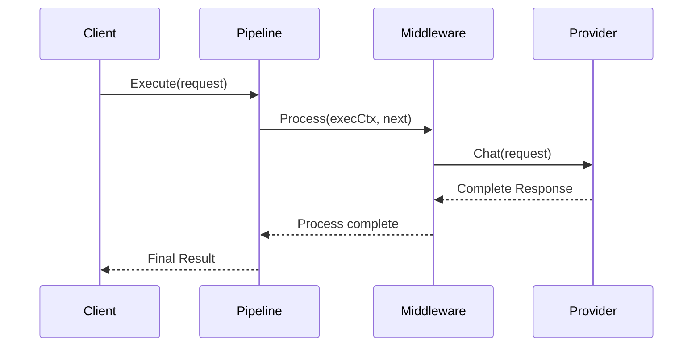
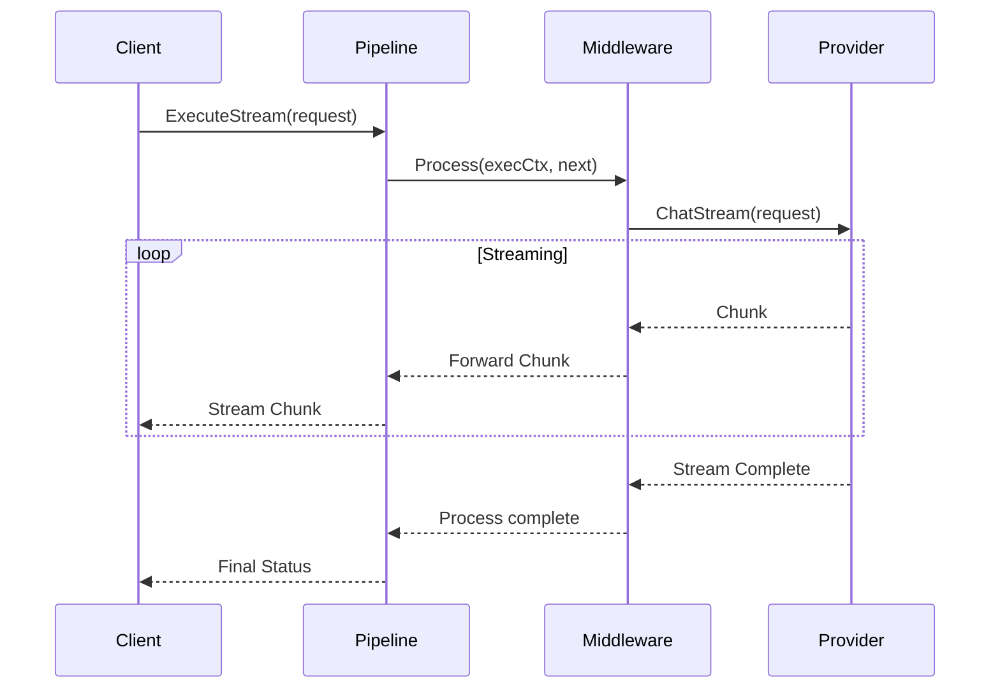
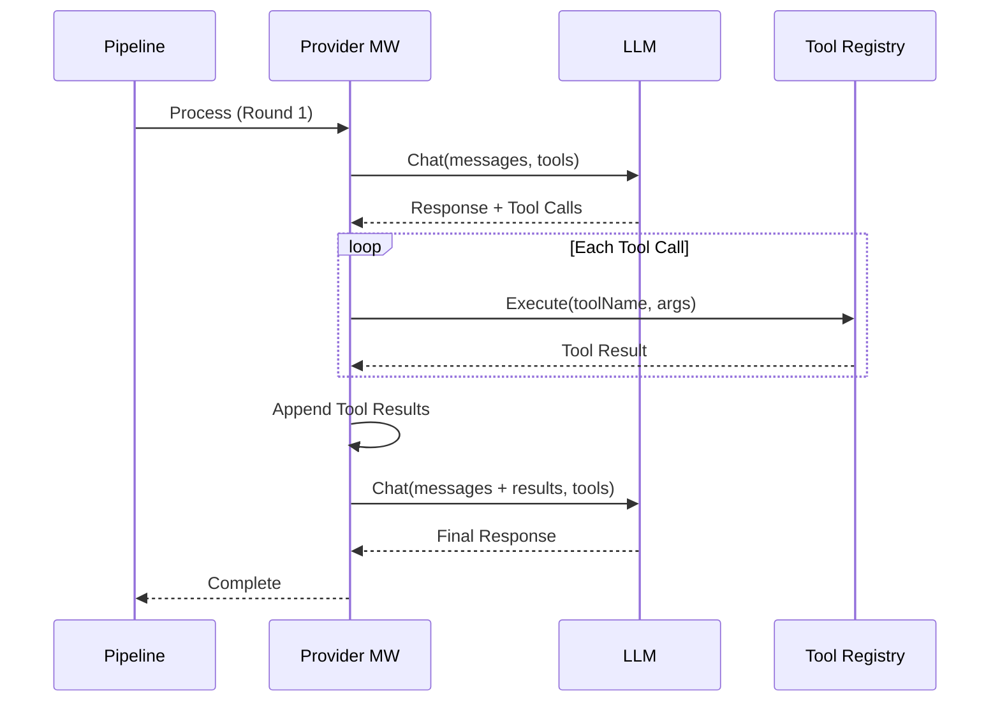
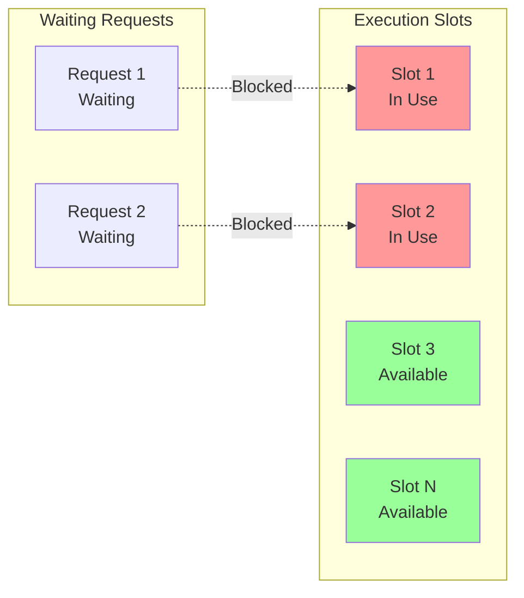
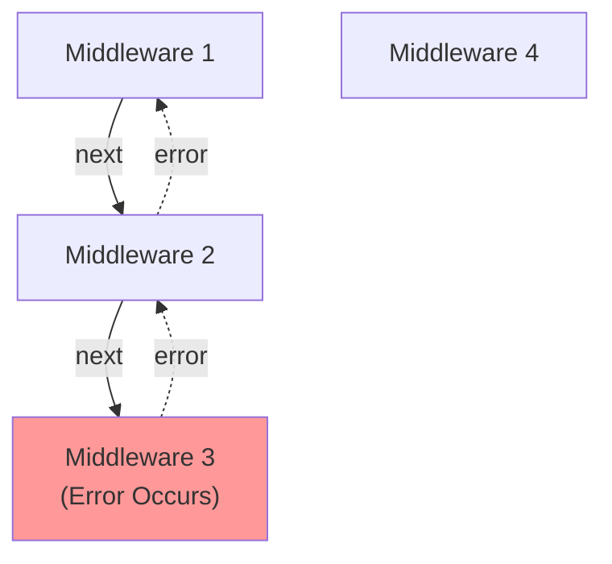
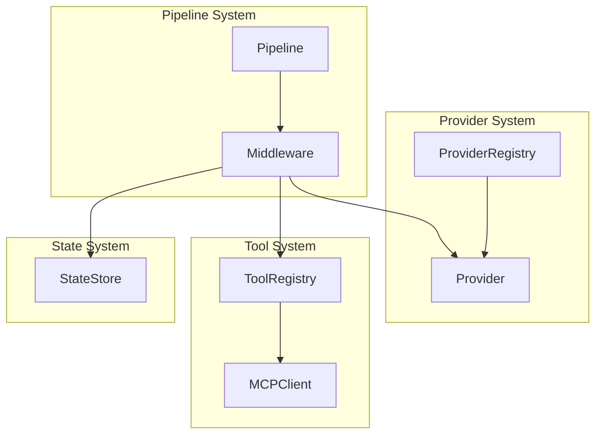

# Runtime Pipeline Architecture

The PromptKit runtime pipeline is a middleware-based execution engine that processes LLM interactions through a composable chain of processing stages. This architecture provides flexibility, extensibility, and clear separation of concerns.

## Overview

The pipeline system is inspired by the middleware pattern found in web frameworks, applying it to LLM interaction workflows. Each middleware component has a specific responsibility and can modify the request, process it, delegate to the next middleware, and post-process the response.



## Core Components

### Pipeline

The `Pipeline` type coordinates middleware execution and manages concurrency. It provides:

- **Middleware Chain Execution**: Processes each middleware in sequence
- **Concurrency Control**: Limits concurrent pipeline executions using semaphores
- **Graceful Shutdown**: Waits for in-flight executions to complete
- **Execution Timeouts**: Prevents runaway executions
- **Stream Management**: Handles both streaming and non-streaming modes

**Key Configuration:**
- `MaxConcurrentExecutions`: Limits concurrent pipeline runs (default: 100)
- `StreamBufferSize`: Buffer size for streaming channels (default: 100)
- `ExecutionTimeout`: Maximum execution duration (default: 30s)
- `GracefulShutdownTimeout`: Shutdown wait time (default: 10s)

### ExecutionContext

The `ExecutionContext` carries state through the middleware chain:

```go
type ExecutionContext struct {
    Context              context.Context
    Messages             []types.Message
    ResponseMessage      *types.Message
    StreamMode           bool
    StreamOutput         chan types.StreamChunk
    AllowedTools         []string
    Metadata             map[string]interface{}
    // ... additional fields
}
```

This context object is passed through the entire pipeline, allowing middleware to:
- Read incoming messages
- Add metadata
- Control tool usage
- Write streaming responses
- Store intermediate state

### Middleware Interface

```go
type Middleware interface {
    Process(execCtx *ExecutionContext, next func() error) error
}
```

Each middleware must:
1. Perform its preprocessing logic
2. Call `next()` exactly once to continue the chain
3. Perform any post-processing after `next()` returns
4. Return any errors that occurred

## Standard Middleware Components

### 1. Context Extraction Middleware

**Purpose**: Extracts and enriches execution context from incoming requests.

**Responsibilities**:
- Parse request metadata
- Extract allowed tools from configuration
- Set up tracing and debugging context
- Initialize execution state

**Location**: `runtime/pipeline/middleware/context_extraction.go`

### 2. Template Middleware

**Purpose**: Renders template variables in message content.

**Responsibilities**:
- Process template variables in messages
- Apply template context
- Handle template errors gracefully

**Location**: `runtime/pipeline/middleware/template.go`

### 3. Prompt Assembly Middleware

**Purpose**: Assembles prompts from fragments and applies configuration.

**Responsibilities**:
- Load prompt configurations
- Resolve prompt fragments
- Merge system prompts with user messages
- Apply versioning rules

**Location**: `runtime/pipeline/middleware/prompt_assembly.go`

### 4. Provider Middleware

**Purpose**: Executes LLM calls and handles tool execution loops.

**Responsibilities**:
- Call the configured LLM provider
- Handle streaming and non-streaming modes
- Execute tool calls in multi-round interactions
- Track latency and token usage
- Handle provider errors and retries

**Location**: `runtime/pipeline/middleware/provider.go`

This is the most complex middleware, handling:
- Provider capability detection
- Multi-round tool execution
- Streaming chunk forwarding
- Response validation

### 5. State Store Middleware

**Purpose**: Persists conversation state for continuity.

**Responsibilities**:
- Load previous conversation state
- Save updated conversation state
- Handle state store errors

**Locations**:
- Load: `runtime/pipeline/middleware/statestore_load.go`
- Save: `runtime/pipeline/middleware/statestore_save.go`

### 6. Validation Middleware

**Purpose**: Validates responses against schemas and constraints.

**Responsibilities**:
- Apply dynamic validation rules
- Validate structured outputs
- Support streaming validation
- Chain multiple validators

**Location**: `runtime/pipeline/middleware/dynamic_validator.go`

### 7. Debug Middleware

**Purpose**: Provides debugging and introspection capabilities.

**Responsibilities**:
- Log execution details
- Capture intermediate state
- Record timing information
- Enable step-through debugging

**Location**: `runtime/pipeline/middleware/debug.go`

## Execution Modes

### Non-Streaming Execution

In non-streaming mode, the pipeline waits for the complete response before proceeding:



**Use Cases**:
- Batch processing
- Testing scenarios
- Response post-processing
- Full validation before returning

### Streaming Execution

In streaming mode, responses are forwarded as chunks arrive:



**Use Cases**:
- Interactive chat interfaces
- Real-time applications
- Progressive content display
- Reduced perceived latency

## Multi-Round Tool Execution

The Provider Middleware handles complex tool calling scenarios:



**Features**:
- Automatic tool call detection
- Parallel tool execution
- Result aggregation
- Round limit enforcement (default: 10 rounds)
- Tool policy enforcement

## Concurrency & Resource Management

### Semaphore-Based Concurrency Control



The pipeline uses a weighted semaphore to limit concurrent executions:
- Requests acquire a slot before execution
- Blocked requests wait for available slots
- Slots are released after execution completes
- Prevents resource exhaustion

### Graceful Shutdown

When shutting down:
1. Stop accepting new requests
2. Wait for in-flight executions to complete
3. Timeout after `GracefulShutdownTimeout`
4. Return error if timeout expires

## Error Handling Strategy

### Middleware Error Propagation



Errors propagate back up the middleware chain, allowing each middleware to:
- Clean up resources
- Add context to errors
- Perform error recovery
- Log failures

### Provider Error Handling

The Provider Middleware implements sophisticated error handling:
- **Retries**: Automatic retry with exponential backoff
- **Fallbacks**: Try alternative models or providers
- **Graceful Degradation**: Return partial results when possible
- **Error Context**: Enrich errors with request details

## Configuration & Customization

### Creating a Custom Pipeline

```go
pipeline := pipeline.NewPipelineWithConfig(
    &pipeline.PipelineRuntimeConfig{
        MaxConcurrentExecutions: 50,
        StreamBufferSize:        200,
        ExecutionTimeout:        60 * time.Second,
    },
    middleware.ContextExtraction(),
    middleware.TemplateMiddleware(templateRenderer),
    middleware.PromptAssembly(promptRegistry),
    middleware.ProviderMiddleware(provider, toolRegistry, toolPolicy, config),
    middleware.StateStoreSave(stateStore),
    middleware.DynamicValidator(validators),
)
```

### Custom Middleware Example

```go
type loggingMiddleware struct {
    logger *log.Logger
}

func (m *loggingMiddleware) Process(execCtx *pipeline.ExecutionContext, next func() error) error {
    start := time.Now()
    m.logger.Printf("Starting execution: %d messages", len(execCtx.Messages))

    err := next()

    duration := time.Since(start)
    m.logger.Printf("Execution complete: %v (took %v)", err == nil, duration)

    return err
}
```

## Performance Considerations

### Optimization Strategies

1. **Middleware Ordering**: Place fast-failing middleware early in the chain
2. **Concurrency Limits**: Tune based on provider rate limits and system resources
3. **Stream Buffer Sizing**: Balance memory usage vs. throughput
4. **Timeout Configuration**: Set based on provider SLAs and user expectations

### Monitoring & Observability

Key metrics to track:
- **Execution Duration**: Time spent in each middleware
- **Concurrency Utilization**: Active vs. available slots
- **Error Rates**: Failures by middleware and error type
- **Tool Execution**: Tool call frequency and duration
- **Provider Performance**: Latency and token usage

## Integration with Other Runtime Components



The pipeline integrates with:
- **Provider System**: For LLM interactions (see [Provider Architecture](./runtime-providers.md))
- **Tool System**: For tool execution (see [Tool & MCP Architecture](./runtime-tools-mcp.md))
- **State System**: For conversation persistence
- **Validation System**: For response validation

## Best Practices

1. **Keep Middleware Focused**: Each middleware should have a single, clear responsibility
2. **Always Call Next**: Middleware must call `next()` exactly once to maintain chain integrity
3. **Handle Errors Gracefully**: Don't swallow errors; add context and propagate
4. **Use Context Properly**: Respect context cancellation for responsive shutdown
5. **Test Middleware Independently**: Unit test each middleware with mock dependencies
6. **Document Side Effects**: Clearly document what state each middleware modifies
7. **Consider Ordering**: Middleware order matters; document dependencies

## Future Enhancements

Potential areas for evolution:
- **Conditional Middleware**: Skip middleware based on request properties
- **Branching Pipelines**: Support alternative execution paths
- **Middleware Versioning**: Allow multiple versions of middleware to coexist
- **Dynamic Middleware**: Add/remove middleware at runtime
- **Circuit Breakers**: Automatic failure detection and recovery
- **Middleware Marketplace**: Community-contributed middleware plugins

---

**Related Documentation**:
- [Provider System Architecture](./runtime-providers.md)
- [Tool & MCP Integration Architecture](./runtime-tools-mcp.md)
- [System Overview](./system-overview.md)
