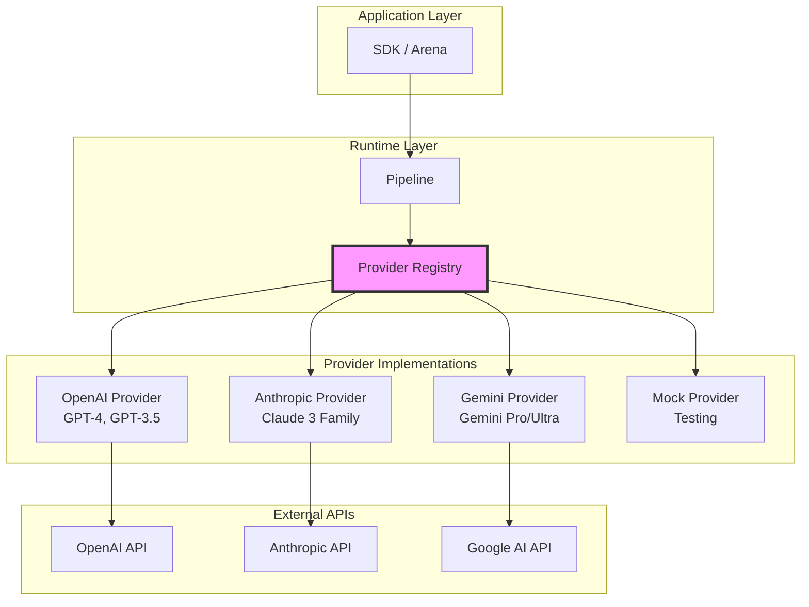
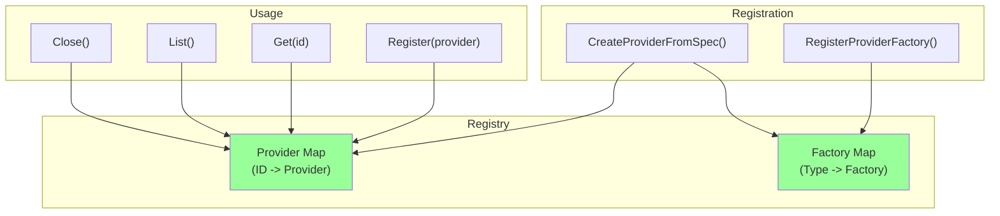
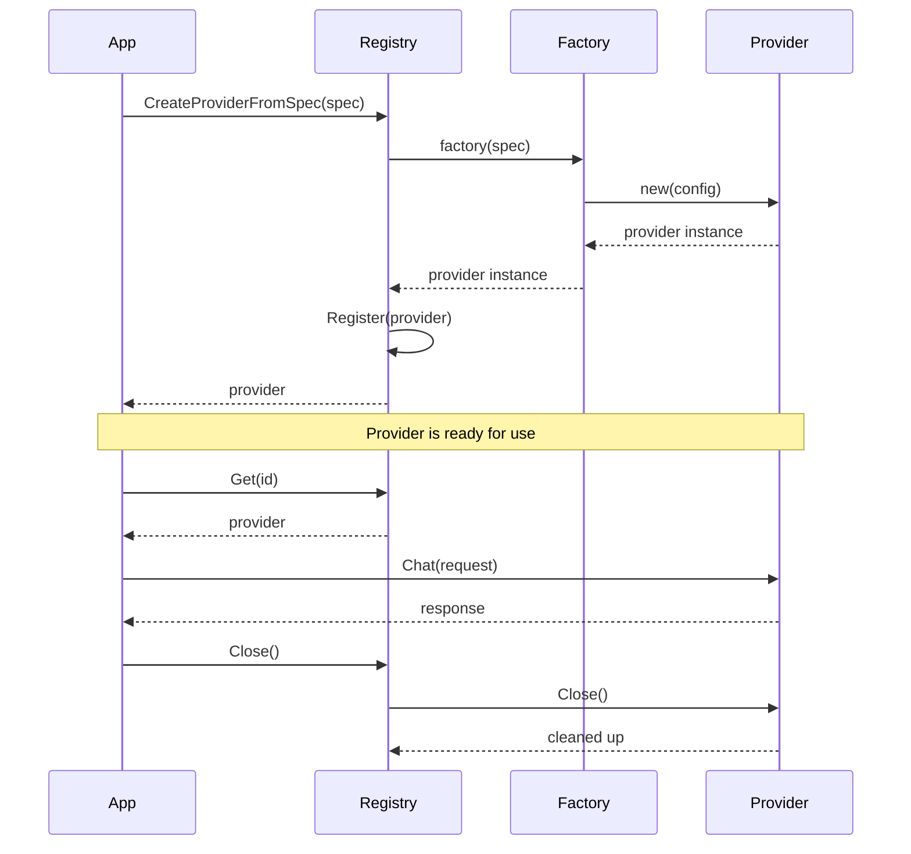
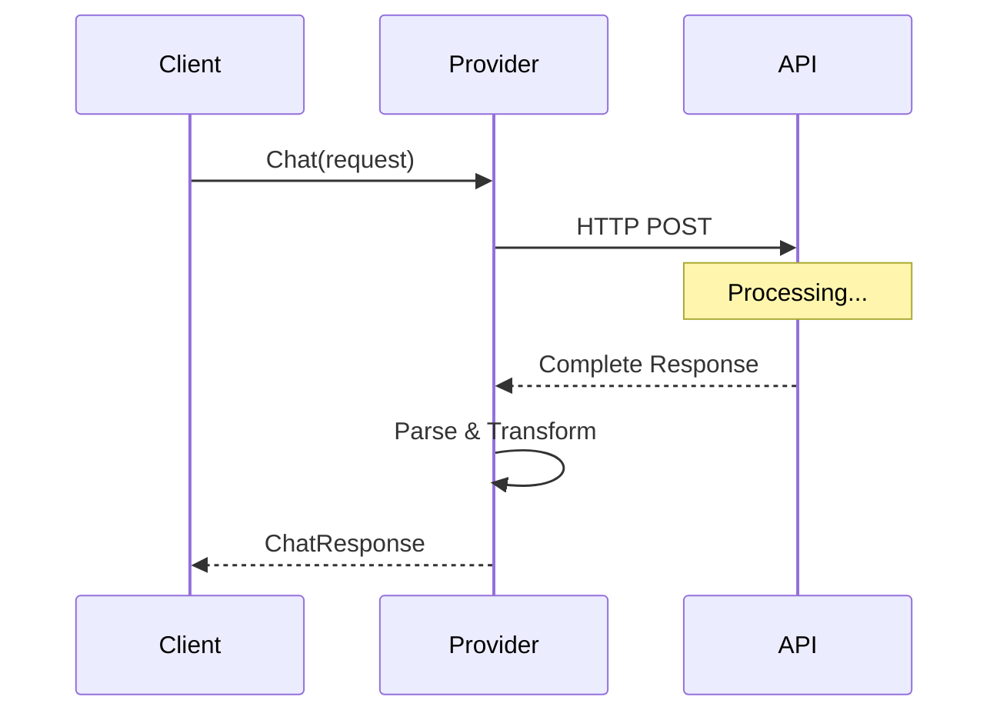
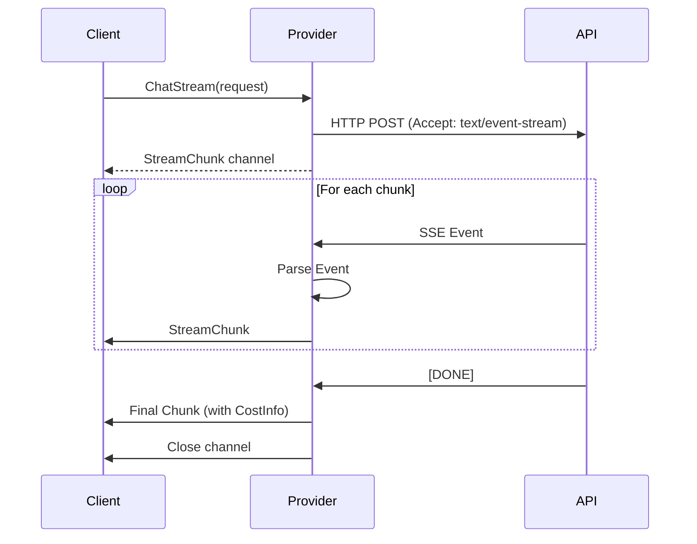
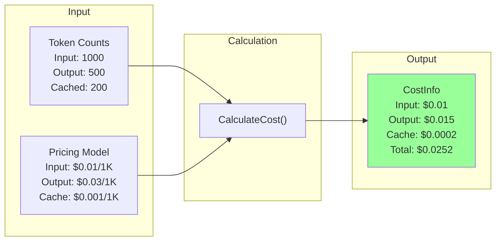
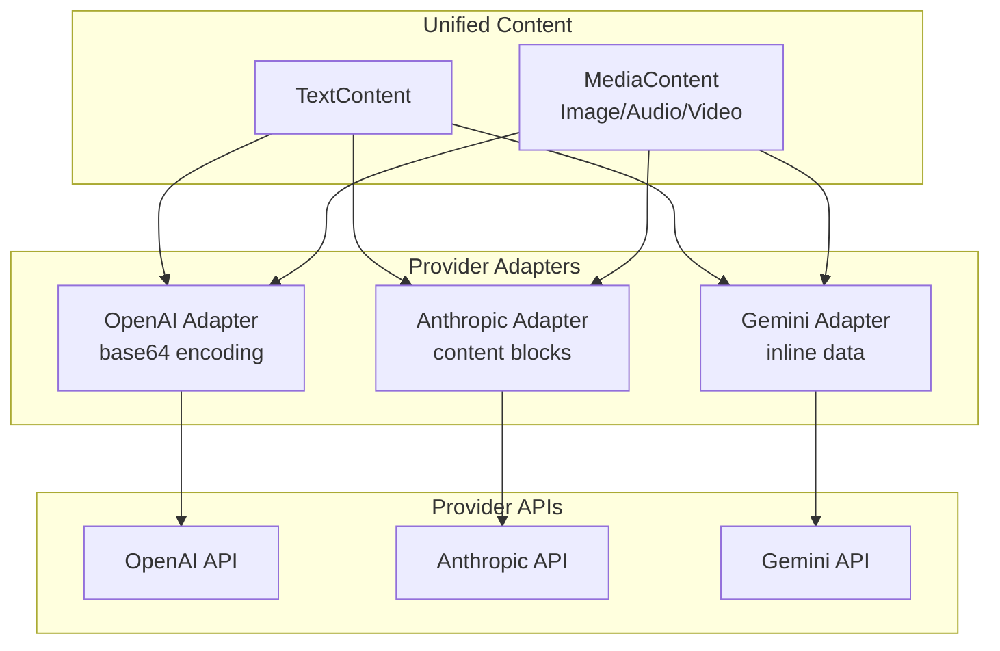
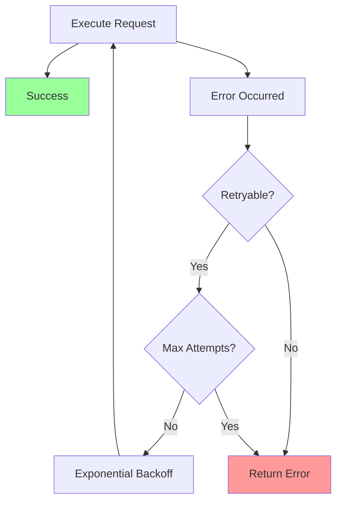
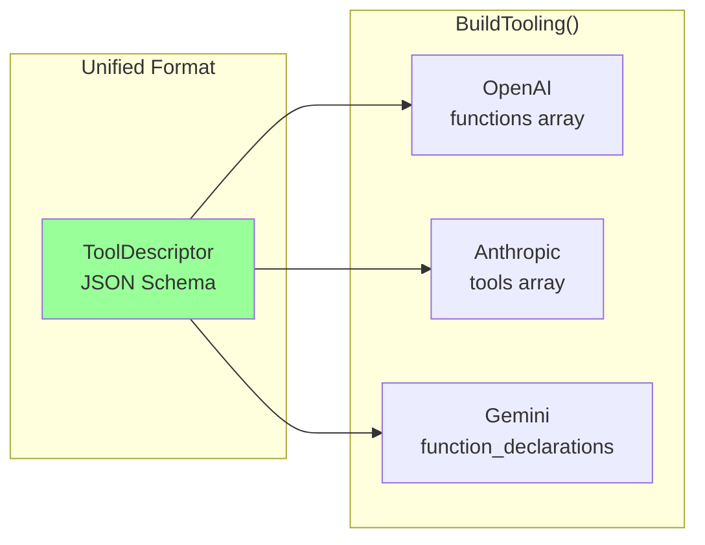

The PromptKit provider system provides a unified abstraction for interacting with multiple LLM providers while handling provider-specific details transparently. This architecture enables seamless switching between providers and facilitates multi-provider testing and comparison.

## Overview

The provider system abstracts away the differences between various LLM APIs (OpenAI, Anthropic, Google Gemini, etc.) behind a consistent interface. This allows the runtime to work with any provider without changing application code.



## Core Interfaces

### Provider Interface

The base `Provider` interface defines the minimal contract all providers must implement:

```go
type Provider interface {
    // Identity
    ID() string

    // Chat operations
    Chat(ctx context.Context, req ChatRequest) (ChatResponse, error)
    ChatStream(ctx context.Context, req ChatRequest) (<-chan StreamChunk, error)
    SupportsStreaming() bool

    // Cost calculation
    CalculateCost(inputTokens, outputTokens, cachedTokens int) types.CostInfo

    // Configuration
    ShouldIncludeRawOutput() bool

    // Lifecycle
    Close() error
}
```

**Key Responsibilities**:
- **Identity**: Unique provider identification
- **Chat**: Execute chat completions (blocking)
- **Streaming**: Execute streaming chat completions
- **Cost**: Calculate provider-specific costs
- **Configuration**: Runtime behavior flags
- **Lifecycle**: Resource cleanup

### ToolSupport Interface

Providers that support tool/function calling extend the base interface:

```go
type ToolSupport interface {
    Provider // Extends base Provider

    // Convert tool descriptors to provider-native format
    BuildTooling(descriptors []*ToolDescriptor) (interface{}, error)

    // Execute chat with tool support
    ChatWithTools(
        ctx context.Context,
        req ChatRequest,
        tools interface{},
        toolChoice string,
    ) (ChatResponse, []types.MessageToolCall, error)
}
```

**Why Separate?**: Not all providers support tools. This optional interface allows capability detection and graceful fallbacks.

### StreamingInputSupport Interface

For providers that support streaming input (audio, video, etc.):

```go
type StreamingInputSupport interface {
    Provider // Extends base Provider

    // Execute chat with streaming media input
    ChatStreamWithMedia(
        ctx context.Context,
        req ChatRequest,
        mediaStream <-chan types.MediaContent,
    ) (<-chan StreamChunk, error)
}
```

**Use Cases**:
- Real-time audio transcription
- Video stream processing
- Live multimodal interactions

## Request & Response Types

### ChatRequest

Unified request format across all providers:

```go
type ChatRequest struct {
    System      string                 // System prompt
    Messages    []types.Message        // Conversation history
    Temperature float32                // Sampling temperature
    TopP        float32                // Nucleus sampling
    MaxTokens   int                    // Maximum response length
    Seed        *int                   // Reproducibility seed
    Metadata    map[string]interface{} // Provider-specific extras
}
```

**Design Principles**:
- **Provider Agnostic**: Works with all providers
- **Extensible**: Metadata field for provider-specific options
- **Type Safe**: Structured fields prevent errors

### ChatResponse

Unified response format:

```go
type ChatResponse struct {
    Content    string                  // Response text
    ToolCalls  []types.MessageToolCall // Tool invocations
    CostInfo   *types.CostInfo         // Token usage & cost
    Latency    time.Duration           // Response time
    Raw        []byte                  // Raw API response (debug)
    RawRequest interface{}             // Raw API request (debug)
}
```

**Key Features**:
- **Cost Tracking**: Built-in cost calculation
- **Performance Metrics**: Latency measurement
- **Debugging**: Optional raw data capture
- **Tool Support**: Unified tool call format

### StreamChunk

For streaming responses:

```go
type StreamChunk struct {
    Content      string                  // Accumulated content
    Delta        string                  // New content in this chunk
    TokenCount   int                     // Total tokens so far
    DeltaTokens  int                     // Tokens in this delta
    ToolCalls    []types.MessageToolCall // Tool calls (if any)
    FinishReason *string                 // Completion reason
    Error        error                   // Error (if failed)
    CostInfo     *types.CostInfo         // Final chunk only
}
```

**Streaming Design**:
- **Incremental Updates**: Delta-based content delivery
- **Progress Tracking**: Token counts for UI updates
- **Error Handling**: In-band error signaling
- **Final Summary**: Cost info in last chunk

## Provider Registry

The `Registry` manages provider instances and provides discovery:



### Provider Lifecycle



### ProviderSpec

Configuration for creating providers:

```go
type ProviderSpec struct {
    ID               string                 // Unique identifier
    Type             string                 // Provider type (openai, claude, etc.)
    Model            string                 // Model name
    BaseURL          string                 // API endpoint (optional)
    Defaults         ProviderDefaults       // Default parameters
    IncludeRawOutput bool                   // Include raw API responses
    AdditionalConfig map[string]interface{} // Provider-specific config
}
```

**Factory Pattern**: Each provider type registers a factory function:

```go
func init() {
    RegisterProviderFactory("openai", func(spec ProviderSpec) (Provider, error) {
        return NewOpenAIProvider(spec)
    })
}
```

## Provider Implementations

### OpenAI Provider

**Supported Models**:
- GPT-4 (all variants)
- GPT-3.5 Turbo
- GPT-4 Turbo

**Features**:
- ✅ Streaming
- ✅ Tool calling
- ✅ Seed-based reproducibility
- ✅ JSON mode
- ✅ Vision (multimodal)

**Special Handling**:
- Token counting via tiktoken
- Exponential backoff on rate limits
- Automatic retry on transient errors

### Anthropic Provider

**Supported Models**:
- Claude 3 Opus
- Claude 3.5 Sonnet
- Claude 3 Haiku

**Features**:
- ✅ Streaming
- ✅ Tool calling
- ✅ Extended context (200K tokens)
- ✅ Vision (multimodal)
- ✅ Prompt caching

**Special Handling**:
- Message role constraints (alternating user/assistant)
- System prompt as separate parameter
- Tool use pattern (tool_use blocks)

### Google Gemini Provider

**Supported Models**:
- Gemini Pro
- Gemini Ultra
- Gemini Pro Vision

**Features**:
- ✅ Streaming
- ✅ Tool calling
- ✅ Multimodal (audio, video, images)
- ✅ Live API (streaming input)

**Special Handling**:
- Content parts structure
- Safety settings configuration
- Multimodal content encoding

### Mock Provider

**Purpose**: Testing and development

**Features**:
- ✅ Configurable responses
- ✅ Simulated latency
- ✅ Error injection
- ✅ Tool call simulation

**Use Cases**:
- Unit testing
- Integration testing
- Offline development
- Scenario reproduction

## Streaming Architecture

### Non-Streaming Flow



**Characteristics**:
- Simple request/response
- Complete result before return
- Higher perceived latency
- Easier error handling

### Streaming Flow



**Characteristics**:
- Progressive content delivery
- Lower perceived latency
- Real-time UI updates
- Complex error handling (mid-stream failures)

### SSE Parser

PromptKit includes a robust SSE (Server-Sent Events) parser:

```go
// Parse SSE stream and emit events
parser := NewSSEParser(reader)
for {
    event, err := parser.Next()
    if err == io.EOF {
        break
    }
    if err != nil {
        return err
    }

    // Process event.Data
    chunk := parseProviderChunk(event.Data)
    chunkChan <- chunk
}
```

**Features**:
- Handles chunked transfer encoding
- Robust newline parsing
- Error recovery
- Multiple provider formats

## Cost Calculation

Each provider implements cost calculation based on token usage:



**Cost Tracking Features**:
- Per-request cost breakdown
- Cached token discounts (Anthropic)
- Aggregation across conversations
- Multi-provider cost comparison

## Multimodal Support

### Content Types

PromptKit supports rich content beyond text:

```go
type MessageContent interface {
    ContentType() string
}

type TextContent struct {
    Text string
}

type MediaContent struct {
    Type     string // "image", "audio", "video"
    MimeType string // "image/jpeg", "audio/mp3", etc.
    Data     []byte // Raw data
    URL      string // Or URL reference
}
```

### Provider-Specific Encoding



**Provider Differences**:
- **OpenAI**: Base64-encoded images in content array
- **Anthropic**: Separate content blocks with source
- **Gemini**: Inline data with blob structure

## Error Handling & Resilience

### Error Types

```go
// Provider-specific errors
type ProviderError struct {
    Provider string
    Type     string // "rate_limit", "auth", "invalid_request", "timeout"
    Message  string
    Retryable bool
}

// Network errors
type NetworkError struct {
    Operation string
    Err       error
}

// Unsupported provider
type UnsupportedProviderError struct {
    ProviderType string
}
```

### Retry Strategy



**Retryable Errors**:
- Rate limits (429)
- Transient network failures
- Server errors (500, 502, 503, 504)

**Non-Retryable Errors**:
- Authentication failures (401, 403)
- Invalid requests (400)
- Not found (404)
- Content policy violations

## Configuration & Defaults

### ProviderDefaults

Each provider has sensible defaults:

```go
type ProviderDefaults struct {
    Temperature float32
    TopP        float32
    MaxTokens   int
    Pricing     Pricing
}
```

**OpenAI Defaults**:
```go
{
    Temperature: 0.7,
    TopP:        1.0,
    MaxTokens:   2048,
    Pricing: {
        InputCostPer1K:  0.01,
        OutputCostPer1K: 0.03,
    },
}
```

**Override Hierarchy**:
1. Request-level parameters (highest priority)
2. Provider defaults (from spec)
3. Global defaults (lowest priority)

## Tool Calling Integration

### Tool Descriptor Format

Unified tool representation:

```go
type ToolDescriptor struct {
    Name         string          // Function name
    Description  string          // What the tool does
    InputSchema  json.RawMessage // JSON Schema for arguments
    OutputSchema json.RawMessage // JSON Schema for results
}
```

### Provider-Specific Transformation



**Example Transformation**:
```go
// Unified format
tool := &ToolDescriptor{
    Name: "get_weather",
    Description: "Get weather for a location",
    InputSchema: /* JSON Schema */,
}

// OpenAI format
openaiTool := {
    "type": "function",
    "function": {
        "name": "get_weather",
        "description": "Get weather for a location",
        "parameters": /* JSON Schema */,
    },
}

// Anthropic format
claudeTool := {
    "name": "get_weather",
    "description": "Get weather for a location",
    "input_schema": /* JSON Schema */,
}
```

## Performance Optimization

### Connection Pooling

```go
httpClient := &http.Client{
    Transport: &http.Transport{
        MaxIdleConns:        100,
        MaxIdleConnsPerHost: 10,
        IdleConnTimeout:     90 * time.Second,
    },
}
```

**Benefits**:
- Reuse TCP connections
- Reduce TLS handshake overhead
- Improve request latency

### Response Caching

Providers can implement optional caching:
- Prompt caching (Anthropic)
- Deterministic responses (seed-based)
- Semantic caching (application-level)

### Batch Processing

Future enhancement for batch operations:
- Multiple requests in single API call
- Reduced per-request overhead
- Better resource utilization

## Testing & Observability

### Mock Provider

Full-featured mock for testing:

```go
mock := NewMockProvider("test-provider")
mock.AddResponse("Hello", nil)
mock.AddToolCall("get_weather", args, result)
mock.SetLatency(100 * time.Millisecond)

response, err := mock.Chat(ctx, request)
```

### Logging Integration

Providers integrate with the runtime logger:

```go
logger.LLMCall(provider.ID(), "user", len(messages), temperature)
logger.LLMResponse(provider.ID(), "assistant", inputTokens, outputTokens, cost)
logger.LLMError(provider.ID(), "assistant", err)
```

### Metrics

Key metrics to monitor:
- **Latency**: P50, P95, P99 response times
- **Token Usage**: Input/output tokens per request
- **Cost**: Spend per provider/model
- **Error Rate**: Failed requests by error type
- **Throughput**: Requests per second

## Best Practices

1. **Use Registry**: Let the registry manage provider instances
2. **Handle Errors Gracefully**: Implement retries with exponential backoff
3. **Monitor Costs**: Track token usage and spending
4. **Test with Mock**: Use mock provider for fast, deterministic tests
5. **Stream When Possible**: Provide better user experience
6. **Close Resources**: Always call Close() to clean up connections
7. **Respect Rate Limits**: Implement proper backoff strategies
8. **Validate Input**: Check message formats before sending to provider

## Future Enhancements

- **Circuit Breaker**: Automatic failure detection and recovery
- **Provider Fallbacks**: Automatic failover to backup providers
- **Load Balancing**: Distribute requests across provider instances
- **Request Deduplication**: Cache identical requests
- **Cost Optimization**: Automatic model selection based on budget
- **A/B Testing**: Split traffic between providers for comparison

---

**Related Documentation**:
- [Runtime Pipeline Architecture](./runtime-pipeline.md)
- [Tool & MCP Integration Architecture](./runtime-tools-mcp.md)
- [System Overview](./system-overview.md)
