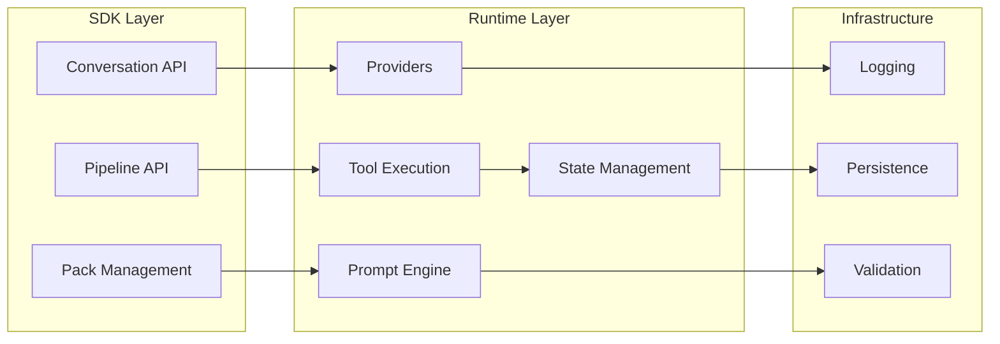
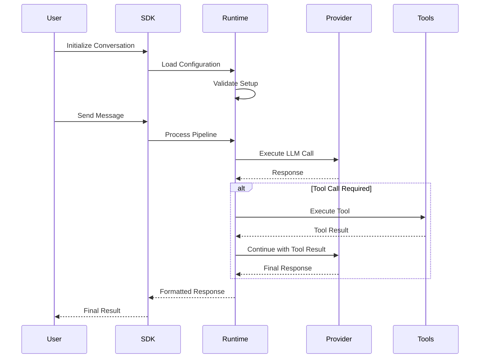
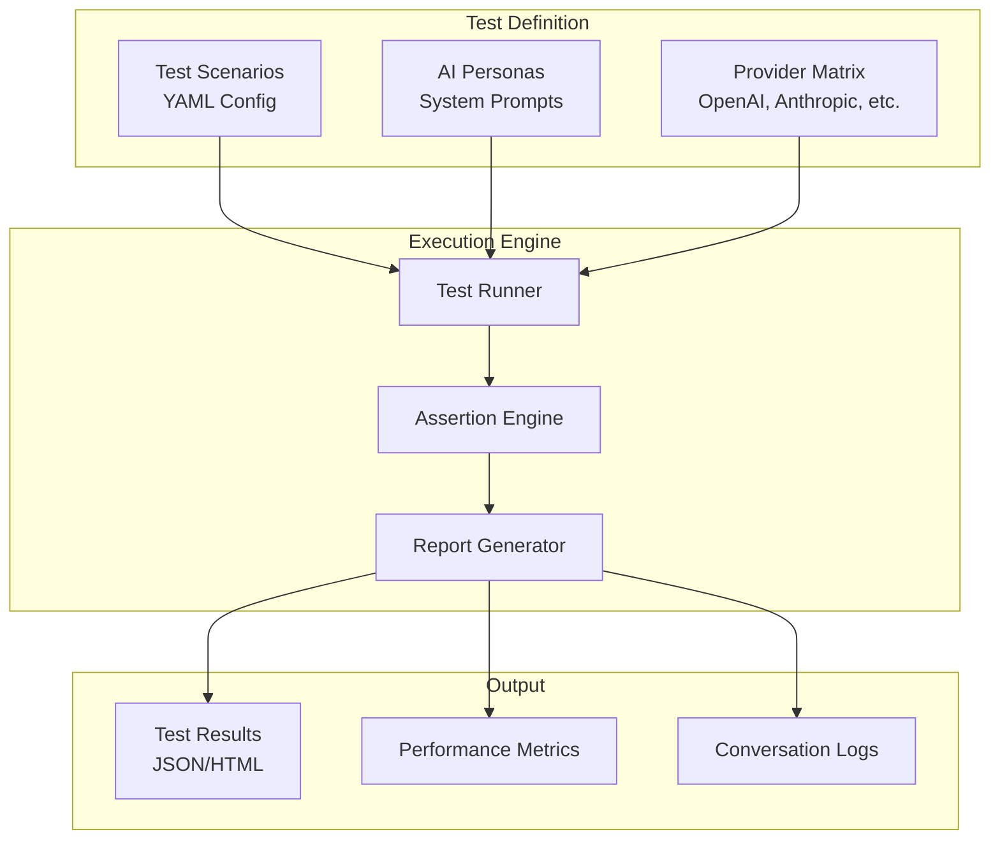
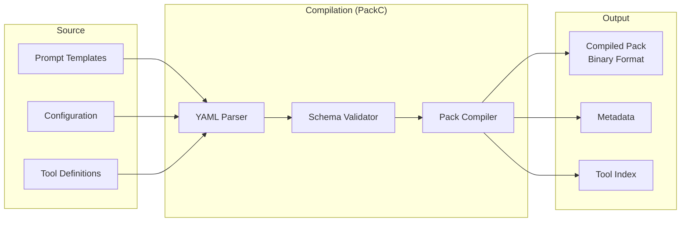

# PromptKit System Architecture

This document provides visual representations of the PromptKit system architecture and component relationships.

## System Overview

```mermaid
graph TB
    subgraph "PromptKit Components"
        Arena["🏟️ Arena CLI<br/>Testing Framework"]
        PackC["📦 PackC CLI<br/>Pack Compiler"]
        SDK["🚀 SDK<br/>Production Library"]
        Runtime["⚙️ Runtime<br/>Core Engine"]
    end
    
    subgraph "External Integrations"
        OpenAI["OpenAI<br/>GPT-4, GPT-3.5"]
        Anthropic["Anthropic<br/>Claude 3"]
        Google["Google<br/>Gemini"]
        MCP["MCP Servers<br/>Tools & Memory"]
    end
    
    subgraph "User Workflows"
        Testing["Testing Workflow"]
        Development["Development Workflow"]
        Production["Production Deployment"]
    end
    
    Testing --> Arena
    Development --> SDK
    Production --> SDK
    
    Arena --> Runtime
    SDK --> Runtime
    PackC --> Runtime
    
    Runtime --> OpenAI
    Runtime --> Anthropic
    Runtime --> Google
    Runtime --> MCP
    
    Arena --> PackC
    SDK --> PackC
```

## Component Architecture

## Data Flow Architecture

## Testing Architecture (Arena)

## Pack Format Architecture

