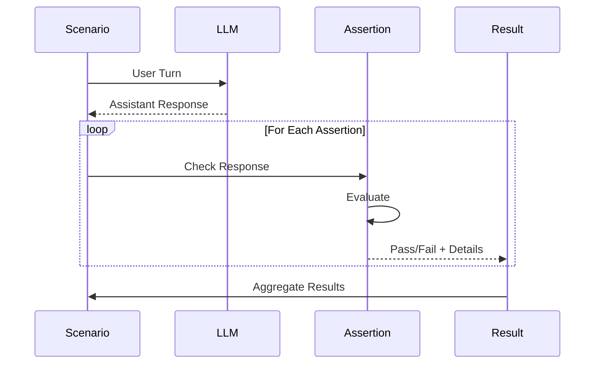
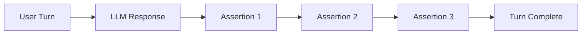

# Assertions Reference


Assertions are checks that verify LLM behavior during test execution. They run after each turn and determine whether the response meets expectations.

## How Assertions Work



## Assertion Structure

All assertions follow this structure:

```yaml
assertions:
  - type: assertion_name          # Required: Assertion type
    params:                       # Required: Type-specific parameters
      param1: value1
      param2: value2
    message: "Description"        # Optional: Human-readable description
```

**Fields**:
- `type`: The assertion type (see list below)
- `params`: Parameters specific to the assertion type
- `message`: Optional description shown in reports

## Available Assertions

### Content Assertions

#### `content_includes`

Checks that the response contains specific text (case-insensitive).

**Use Cases**:
- Verify specific keywords appear
- Check that important information is mentioned
- Ensure acknowledgment phrases are present

**Parameters**:
- `text` (string): Text that must appear in response

**Example**:
```yaml
- role: user
  content: "What is the capital of France?"
  assertions:
    - type: content_includes
      params:
        text: "Paris"
        message: "Should mention Paris"
```

**Matching**: Case-insensitive substring match
- ✅ "Paris" matches "The capital is Paris"
- ✅ "paris" matches "PARIS is the capital"
- ❌ "Pari" does not match "Paris"

**Multiple Patterns**:
```yaml
assertions:
  - type: content_includes
    params:
      patterns:
        - "Paris"
        - "France"
      message: "Should mention both Paris and France"
```

**Failure Details**:
```json
{
  "passed": false,
  "details": {
    "missing_patterns": ["Paris"]
  }
}
```

---

#### `content_matches`

Checks that the response matches a regular expression pattern.

**Use Cases**:
- Flexible pattern matching
- Validate response structure
- Check for specific formats (emails, phone numbers, etc.)

**Parameters**:
- `pattern` (string): Regular expression pattern (Go regex syntax)

**Example**:
```yaml
- role: user
  content: "What's your email?"
  assertions:
    - type: content_matches
      params:
        pattern: "(?i)\\b[A-Za-z0-9._%+-]+@[A-Za-z0-9.-]+\\.[A-Z|a-z]{2,}\\b"
        message: "Should provide email address"
```

**Pattern Examples**:

```yaml
# Case-insensitive word match
pattern: "(?i)hello"

# Match phone number
pattern: "\\d{3}-\\d{3}-\\d{4}"

# Match order number
pattern: "#\\d{5,}"

# Match "yes" or "no"
pattern: "(?i)\\b(yes|no)\\b"

# Match empathy phrases
pattern: "(?i)(understand|sorry|apologize|help)"
```

**Regex Flags**:
- `(?i)`: Case-insensitive
- `(?m)`: Multiline mode
- `(?s)`: Dot matches newline

**Common Patterns**:

```yaml
# Email
pattern: "(?i)\\b[A-Za-z0-9._%+-]+@[A-Za-z0-9.-]+\\.[A-Z|a-z]{2,}\\b"

# URL
pattern: "https?://[^\\s]+"

# Order/Tracking Number
pattern: "#?[A-Z0-9]{6,}"

# Currency
pattern: "\\$\\d+(\\.\\d{2})?"

# Phone (US)
pattern: "\\(?\\d{3}\\)?[-.\\s]?\\d{3}[-.\\s]?\\d{4}"
```

**Failure Details**:
```json
{
  "passed": false,
  "details": {
    "pattern": "(?i)email",
    "content": "Please call us instead"
  }
}
```

---

### Tool Call Assertions

#### `tools_called`

Verifies that specific tools were invoked in the response.

**Use Cases**:
- Verify function calling behavior
- Ensure LLM uses available tools
- Check tool selection logic

**Parameters**:
- `tools` (array): List of tool names that should be called

**Example**:
```yaml
- role: user
  content: "What's the weather in San Francisco?"
  assertions:
    - type: tools_called
      params:
        tools:
          - get_weather
        message: "Should call weather tool"
```

**Multiple Tools**:
```yaml
- role: user
  content: "Check my order and update my address"
  assertions:
    - type: tools_called
      params:
        tools:
          - check_order_status
          - update_customer_address
        message: "Should call both order and address tools"
```

**Failure Details**:
```json
{
  "passed": false,
  "details": {
    "missing_tools": ["get_weather"],
    "called_tools": ["search_web"]
  }
}
```

**Important Notes**:
- Checks that ALL specified tools were called
- Order doesn't matter
- Tool may be called multiple times (counts as one)
- Only checks current turn, not previous turns

---

#### `tools_not_called`

Verifies that specific tools were NOT invoked in the response.

**Use Cases**:
- Ensure inappropriate tools aren't used
- Verify tool policies are enforced
- Check conditional tool usage

**Parameters**:
- `tools` (array): List of tool names that should NOT be called

**Example**:
```yaml
- role: user
  content: "What's the weather like?"
  assertions:
    - type: tools_not_called
      params:
        tools:
          - delete_account
          - charge_credit_card
        message: "Should not call destructive tools"
```

**Policy Enforcement**:
```yaml
# Ensure read-only operations
- role: user
  content: "Show me my account details"
  assertions:
    - type: tools_not_called
      params:
        tools:
          - update_account
          - delete_account
          - create_order
        message: "Should only read, not modify"
```

**Failure Details**:
```json
{
  "passed": false,
  "details": {
    "forbidden_tools_called": ["delete_account"],
    "all_called_tools": ["get_account", "delete_account"]
  }
}
```

---

#### `tools_called_with`

Verifies that a tool was called with specific arguments.

**Use Cases**:
- Validate argument passing
- Check parameter extraction from user input
- Ensure correct tool configuration

**Parameters**:
- `tool` (string): Tool name to check
- `expected_args` (object): Expected argument values

**Example**:
```yaml
- role: user
  content: "What's the weather in San Francisco?"
  assertions:
    - type: tools_called_with
      params:
        tool: get_weather
        expected_args:
          location: "San Francisco"
        message: "Should pass location correctly"
```

**Partial Match**:
```yaml
# Only check specific args, ignore others
- type: tools_called_with
  params:
    tool: search_products
    expected_args:
      category: "electronics"
      # Ignores other args like limit, sort, etc.
```

**Exact Match**:
```yaml
- type: tools_called_with
  params:
    tool: get_weather
    expected_args:
      location: "San Francisco"
      units: "celsius"
    exact: true  # All args must match exactly
```

**Failure Details**:
```json
{
  "passed": false,
  "details": {
    "tool": "get_weather",
    "expected": {"location": "San Francisco"},
    "actual": {"location": "SF"}
  }
}
```

---

### Guardrail Assertions

#### `guardrail_triggered`

Verifies that a specific validator/guardrail was triggered.

**Use Cases**:
- Test that guardrails work correctly
- Verify policy enforcement
- Ensure validators catch violations

**Parameters**:
- `guardrail` (string): Validator type that should trigger
- `expected` (bool): Whether trigger is expected (default: true)

**Example**:
```yaml
# Verify banned word is caught
- role: user
  content: "Will this definitely work?"
  assertions:
    - type: guardrail_triggered
      params:
        guardrail: banned_words
        expected: true
        message: "Should catch banned word 'definitely'"

# Verify no guardrail triggered
- role: user
  content: "This should be fine"
  assertions:
    - type: guardrail_triggered
      params:
        expected: false
        message: "Should not trigger any guardrail"
```

**Testing Length Limits**:
```yaml
- role: user
  content: "Tell me everything about the universe"
  assertions:
    - type: guardrail_triggered
      params:
        guardrail: max_length
        expected: true
        message: "Should trigger length limit"
```

**Failure Details**:
```json
{
  "passed": false,
  "details": {
    "expected_triggered": true,
    "actually_triggered": false,
    "guardrail": "banned_words"
  }
}
```

---

## Advanced Assertion Patterns

### Combining Assertions

Multiple assertions can check different aspects:

```yaml
- role: user
  content: "What's the weather?"
  assertions:
    # Check content
    - type: content_includes
      params:
        text: "weather"
        message: "Should acknowledge weather request"

    # Check tool usage
    - type: tools_called
      params:
        tools: ["get_weather"]
        message: "Should call weather tool"

    # Check response format
    - type: content_matches
      params:
        pattern: "\\d+°[CF]"
        message: "Should include temperature with unit"
```

### Conditional Logic

Use different assertions for different scenarios:

```yaml
# Test A: Expect tool call
- role: user
  content: "What's the weather in NYC?"
  assertions:
    - type: tools_called
      params:
        tools: ["get_weather"]

# Test B: Expect admission of limitation
- role: user
  content: "What's the weather next month?"
  assertions:
    - type: content_matches
      params:
        pattern: "(?i)(can't|cannot|unable|don't know)"
        message: "Should admit inability to predict future"
    - type: tools_not_called
      params:
        tools: ["get_weather"]
        message: "Should not attempt weather call for future"
```

### Progressive Verification

Check behavior across multiple turns:

```yaml
turns:
  # Turn 1: Initial request
  - role: user
    content: "I need help with my order"
    assertions:
      - type: content_includes
        params:
          text: "order"

  # Turn 2: Provide details
  - role: user
    content: "Order #12345"
    assertions:
      - type: content_includes
        params:
          text: "#12345"
      - type: tools_called
        params:
          tools: ["check_order_status"]

  # Turn 3: Follow-up
  - role: user
    content: "When will it arrive?"
    assertions:
      - type: content_matches
        params:
          pattern: "(?i)(date|time|day)"
```

## Assertion Best Practices

### 1. Be Specific

```yaml
# ❌ Too vague
- type: content_includes
  params:
    text: "help"

# ✅ Specific and meaningful
- type: content_includes
  params:
    text: "Let me help you track your order"
    message: "Should offer specific order tracking help"
```

### 2. Use Messages

```yaml
# ❌ No message
- type: content_matches
  params:
    pattern: "(?i)email"

# ✅ Clear message for reports
- type: content_matches
  params:
    pattern: "(?i)email"
    message: "Should provide email contact information"
```

### 3. Test Both Success and Failure

```yaml
# Test success case
- role: user
  content: "Get the weather"
  assertions:
    - type: tools_called
      params:
        tools: ["get_weather"]

# Test failure case (should NOT call tool)
- role: user
  content: "What's the weather like generally?"
  assertions:
    - type: tools_not_called
      params:
        tools: ["get_weather"]
        message: "Should not call tool for general question"
```

### 4. Use Appropriate Assertion Types

```yaml
# ❌ Using regex for simple text match
- type: content_matches
  params:
    pattern: "Paris"

# ✅ Using content_includes for simple text
- type: content_includes
  params:
    text: "Paris"

# ✅ Using regex for complex patterns
- type: content_matches
  params:
    pattern: "(?i)\\b(bonjour|hello|hi)\\b"
```

## Troubleshooting Assertions

### Assertion Always Fails

**Check**:
1. Case sensitivity (use `(?i)` in patterns)
2. Exact text vs substring matching
3. Whitespace and punctuation
4. Regex escaping

```yaml
# ❌ May fail due to case or punctuation
pattern: "Hello!"

# ✅ More robust
pattern: "(?i)hello"
```

### Tool Assertion Fails

**Check**:
1. Tool name matches exactly
2. Tool is registered in arena.yaml
3. Provider supports function calling
4. Prompt allows tool usage

### Regex Pattern Errors

**Common Issues**:

```yaml
# ❌ Missing escape
pattern: "."  # Matches any character

# ✅ Escaped literal dot
pattern: "\\."

# ❌ Unescaped dollar
pattern: "$100"

# ✅ Escaped dollar sign
pattern: "\\$100"
```

## Performance Considerations

### Assertion Execution

Assertions run synchronously after each turn:



**Tips**:
- Limit assertions per turn (3-5 recommended)
- Use specific patterns (avoid complex regex)
- Combine related checks when possible

### Regex Performance

```yaml
# ❌ Slow: backtracking
pattern: "(a+)+"

# ✅ Fast: specific
pattern: "\\ba+\\b"

# ❌ Slow: lookahead/lookbehind
pattern: "(?<=word)pattern(?=word)"

# ✅ Fast: simple match
pattern: "word.*pattern.*word"
```

## Next Steps

- **[Validators Reference](./validators-reference.md)** - Runtime guardrails
- **[Configuration Reference](./config-reference.md)** - Full config documentation
- **[Writing Scenarios](./writing-scenarios.md)** - Effective test authoring

---

**See Examples**: Check `examples/` directory for real-world assertion usage.
