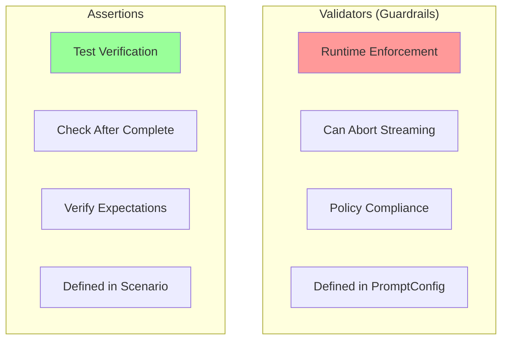
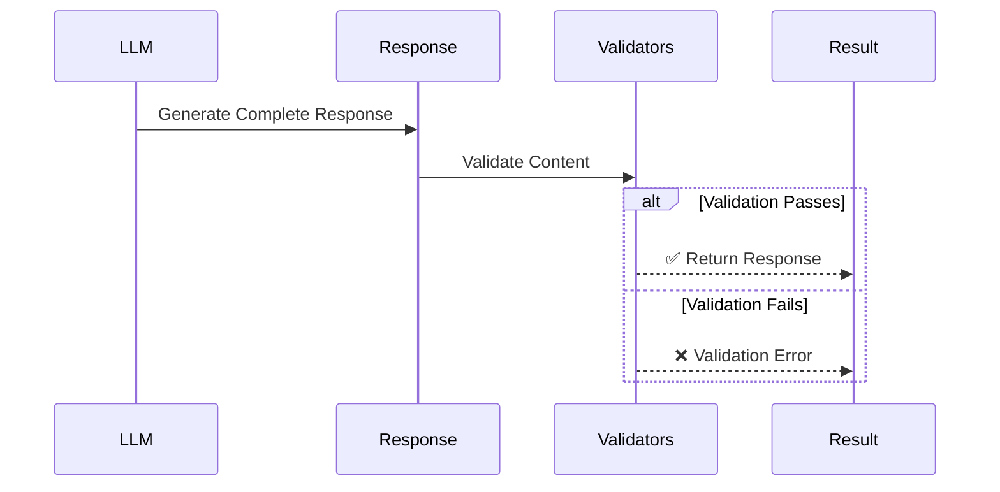
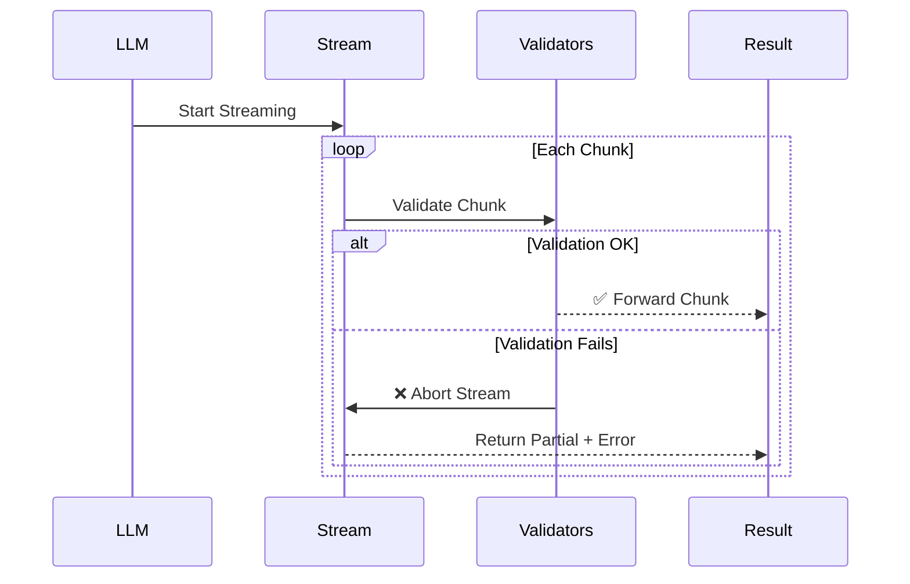
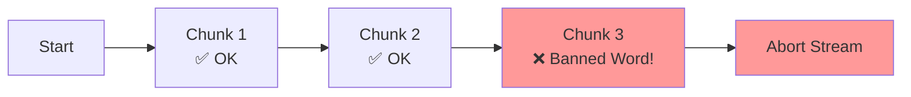

# Validators Reference

# Validators Reference


Validators (also called guardrails) are runtime checks that enforce policies on LLM responses. Unlike assertions that verify test expectations, validators actively prevent policy violations and can abort streaming responses early.

## Validators vs Assertions



**Key Differences**:

| Aspect | Validators | Assertions |
|--------|-----------|------------|
| Purpose | Enforce policies | Verify behavior |
| When | During generation | After generation |
| Streaming | Can abort early | Runs after complete |
| Defined In | PromptConfig | Scenario |
| Failure | Policy violation | Test failure |

## How Validators Work

### Non-Streaming Mode



### Streaming Mode



**Benefits of Streaming Validation**:
- Catch violations immediately
- Save API costs by aborting early
- Faster failure detection
- Prevent bad content from reaching users

## Validator Structure

Validators are defined in PromptConfig:

```yaml
# prompts/my-prompt.yaml
spec:
  system_template: |
    Your system prompt here...

  validators:
    - type: validator_name       # Required: Validator type
      params:                    # Required: Type-specific params
        param1: value1
        param2: value2
      message: "Policy description"  # Optional: Violation message
```

## Available Validators

### Content Safety Validators

#### `banned_words`

Prevents responses containing banned words or phrases.

**Use Cases**:
- Avoid making absolute promises
- Prevent inappropriate language
- Enforce brand guidelines
- Maintain professional tone

**Parameters**:
- `words` (array): List of banned words/phrases (case-insensitive)

**Streaming**: ✅ Yes - Aborts immediately when banned word detected

**Example**:
```yaml
validators:
  - type: banned_words
    params:
      words:
        - guarantee
        - promise
        - definitely
        - "100%"
        - absolutely
        - always
        - never
      message: "Avoid absolute promises"
```

**How It Works**:
- Case-insensitive matching
- Word boundary detection (won't match partial words)
- "guarantee" matches "I guarantee" but not "guaranteed"
- Checks accumulated content in streaming mode

**Real-World Example** (Customer Support):
```yaml
validators:
  - type: banned_words
    params:
      words:
        # Absolute promises
        - guarantee
        - promise
        - definitely
        - "100%"
        - absolutely
        - certainly

        # Inappropriate for support
        - stupid
        - idiot
        - dumb

        # Avoid legal liability
        - sue
        - lawsuit
        - lawyer
      message: "Maintain professional tone and avoid absolute promises"
```

**Validation Details**:
```json
{
  "passed": false,
  "details": ["guarantee", "definitely"]
}
```

---

#### `max_length`

Enforces maximum response length.

**Use Cases**:
- Keep responses concise
- Control API costs
- Enforce UX constraints
- Prevent rambling

**Parameters**:
- `max_characters` (int): Maximum character count
- `max_tokens` (int): Maximum token count (approximate)

**Streaming**: ✅ Yes - Aborts when limit exceeded

**Example**:
```yaml
validators:
  - type: max_length
    params:
      max_characters: 1000
      max_tokens: 250
      message: "Keep responses under 250 tokens"
```

**Token Estimation**:
- If provider returns token count: uses exact count
- Otherwise: estimates as `characters / 4`
- Streaming: uses `chunk.TokenCount` if available

**Both Limits**:
```yaml
# Enforce both character and token limits
validators:
  - type: max_length
    params:
      max_characters: 2000  # Hard limit
      max_tokens: 500       # API limit
```

**Validation Details**:
```json
{
  "passed": false,
  "details": {
    "character_count": 1250,
    "max_characters": 1000,
    "token_count": 312,
    "max_tokens": 250
  }
}
```

---

### Structure Validators

#### `max_sentences`

Enforces maximum number of sentences in response.

**Use Cases**:
- Enforce conciseness
- Maintain consistent response length
- UI constraints (e.g., chat bubbles)

**Parameters**:
- `max_sentences` (int): Maximum sentence count

**Streaming**: ❌ No - Requires complete response

**Example**:
```yaml
validators:
  - type: max_sentences
    params:
      max_sentences: 5
      message: "Keep responses to 5 sentences or less"
```

**Sentence Counting**:
- Splits on `.`, `!`, `?`
- Handles common abbreviations (Dr., Mr., etc.)
- Counts non-empty sentences

**Example Scenarios**:

```yaml
# ✅ 3 sentences - PASS
"Hello! How can I help? Let me know."

# ❌ 6 sentences - FAIL
"Hello! How are you? I can help with that. Let me check.
 I'll get back to you. Please wait."
```

**Validation Details**:
```json
{
  "passed": false,
  "details": {
    "count": 6,
    "max": 5
  }
}
```

---

#### `required_fields`

Ensures response contains required fields/information.

**Use Cases**:
- Verify structured responses
- Ensure key information is provided
- Enforce response templates

**Parameters**:
- `required_fields` (array): List of required text fields

**Streaming**: ❌ No - Requires complete response

**Example**:
```yaml
validators:
  - type: required_fields
    params:
      required_fields:
        - "order number"
        - "tracking number"
        - "estimated delivery"
      message: "Must provide order, tracking, and delivery info"
```

**Use Case** (Support Ticket):
```yaml
validators:
  - type: required_fields
    params:
      required_fields:
        - "ticket number"
        - "priority"
        - "assigned to"
      message: "Support tickets must include number, priority, and assignment"
```

**Validation Details**:
```json
{
  "passed": false,
  "details": {
    "missing": ["tracking number", "estimated delivery"]
  }
}
```

---

#### `commit`

Validates structured decision/commit blocks in responses.

**Use Cases**:
- Enforce decision documentation
- Ensure reasoning is captured
- Structured thinking responses

**Parameters**:
- `must_end_with_commit` (bool): Response must end with commit block
- `commit_fields` (array): Required fields in commit block

**Streaming**: ❌ No - Requires complete response

**Example**:
```yaml
validators:
  - type: commit
    params:
      must_end_with_commit: true
      commit_fields:
        - decision
        - reasoning
        - next step
      message: "Must end with structured decision block"
```

**Expected Format**:
```
Your analysis here...

Decision: Approve the request
Reasoning: Meets all criteria and within policy
Next Step: Process payment
```

**Use Case** (Agent Decision Making):
```yaml
validators:
  - type: commit
    params:
      must_end_with_commit: true
      commit_fields:
        - decision
        - confidence
        - action
```

**Validation Details**:
```json
{
  "passed": false,
  "details": {
    "error": "missing commit structure",
    "missing_fields": ["decision", "reasoning"]
  }
}
```

---

## Combining Validators

Multiple validators can enforce different policies:

```yaml
validators:
  # Content safety
  - type: banned_words
    params:
      words: ["guarantee", "promise"]
      message: "No absolute promises"

  # Length control
  - type: max_length
    params:
      max_characters: 1000
      max_tokens: 250
      message: "Stay concise"

  # Structure
  - type: max_sentences
    params:
      max_sentences: 5
      message: "Maximum 5 sentences"
```

**Execution Order**:
1. Streaming validators run during generation
2. Non-streaming validators run after completion
3. First failure stops validation chain

## Streaming Validator Behavior

### Immediate Abort

Streaming validators abort generation immediately:



**Benefits**:
- Saves API costs (no wasted tokens)
- Faster failure detection
- Prevents bad content in UI

**Example**:
```yaml
# Response starts streaming...
"I can help with that. Let me guarantee that..."
                              ↑
                    Validator detects "guarantee"
                    Aborts immediately
                    Returns partial response + error
```

### Cost Savings

```
Without Streaming Validation:
  Generate 500 tokens @ $0.03/1K = $0.015
  Detect violation after complete = $0.015 wasted

With Streaming Validation:
  Generate 100 tokens @ $0.03/1K = $0.003
  Detect violation early = $0.012 saved
```

## Validator Error Handling

### In Test Mode (Arena)

Validator failures are captured in test results:

```json
{
  "scenario": "test-case",
  "turn": 3,
  "status": "failed",
  "error": {
    "type": "validation_error",
    "validator": "banned_words",
    "message": "Avoid absolute promises",
    "details": ["guarantee"]
  }
}
```

### In Production (SDK)

Configure behavior via fail_on:

```yaml
# arena.yaml
defaults:
  fail_on:
    - validation_error  # Treat as test failure
    # OR omit to allow violations
```

## Best Practices

### 1. Layer Validators

```yaml
validators:
  # Fast checks first (streaming)
  - type: banned_words
    params:
      words: ["inappropriate"]

  - type: max_length
    params:
      max_tokens: 500

  # Slow checks last (post-completion)
  - type: max_sentences
    params:
      max_sentences: 10
```

### 2. Use Meaningful Messages

```yaml
# ❌ Generic message
- type: banned_words
  params:
    words: ["guarantee"]
  message: "Invalid content"

# ✅ Specific guidance
- type: banned_words
  params:
    words: ["guarantee"]
  message: "Avoid absolute promises. Use phrases like 'we'll do our best' instead."
```

### 3. Test Validators

Create scenarios specifically to test guardrails:

```yaml
# scenarios/guardrail-tests.yaml
spec:
  turns:
    - role: user
      content: "Will this definitely work?"
      assertions:
        - type: guardrail_triggered
          params:
            guardrail: banned_words
            expected: true
            message: "Should catch 'definitely'"
```

### 4. Balance Safety and Utility

```yaml
# ❌ Too restrictive - blocks useful content
validators:
  - type: banned_words
    params:
      words: ["can", "will", "should"]  # Too common!

# ✅ Target specific policy violations
validators:
  - type: banned_words
    params:
      words: ["guarantee", "promise", "definitely", "100%"]
```

### 5. Document Policies

```yaml
spec:
  system_template: |
    You are a support agent.

    IMPORTANT: Our validators enforce these policies:
    - No absolute promises (guarantee, definitely, etc.)
    - Max 250 tokens per response
    - Max 5 sentences
    - Professional tone required

  validators:
    - type: banned_words
      params:
        words: ["guarantee", "definitely"]
    - type: max_length
      params:
        max_tokens: 250
    - type: max_sentences
      params:
        max_sentences: 5
```

## Troubleshooting

### Validator Always Triggers

**Check**:
1. Are banned words too common?
2. Is length limit reasonable?
3. Is sentence count realistic?

```yaml
# ❌ Too strict
max_sentences: 1
max_tokens: 50

# ✅ Reasonable
max_sentences: 8
max_tokens: 500
```

### Validator Never Triggers

**Check**:
1. Is validator registered?
2. Are params correct?
3. Is validator type spelled correctly?

```yaml
# ❌ Typo
type: max_lenght

# ✅ Correct
type: max_length
```

### Streaming Abort Issues

**Check**:
1. Does validator support streaming?
2. Is streaming enabled for provider?
3. Are chunks being validated?

```yaml
# Check validator streaming support
banned_words: ✅ Streaming
max_length: ✅ Streaming
max_sentences: ❌ Post-completion only
required_fields: ❌ Post-completion only
commit: ❌ Post-completion only
```

## Performance Considerations

### Validator Speed

```yaml
# Fast (O(n))
- banned_words
- max_length

# Medium (O(n))
- max_sentences
- required_fields

# Slow (O(n²))
- complex regex in custom validators
```

### Optimization Tips

1. **Order matters**: Put fast validators first
2. **Streaming**: Use streaming validators when possible
3. **Specific patterns**: Avoid overly broad checks
4. **Batch validation**: Combine related checks

## Custom Validators

While PromptArena provides built-in validators, the SDK allows custom validators:

```go
// Custom validator example (SDK usage)
type CustomValidator struct {}

func (v *CustomValidator) Validate(content string, params map[string]interface{}) ValidationResult {
    // Your validation logic
    return ValidationResult{
        Passed: true,
        Details: nil,
    }
}
```

Register in SDK:
```go
registry.Register("custom_validator", NewCustomValidator)
```

Use in prompt:
```yaml
validators:
  - type: custom_validator
    params:
      your_param: value
```

## Next Steps

- **[Assertions Reference](./assertions-reference.md)** - Test verification
- **[Configuration Reference](./config-reference.md)** - Full config docs
- **[Best Practices](./best-practices.md)** - Production tips

---

**Examples**: See `examples/customer-support/prompts/support-bot.yaml` for real-world validator usage.
