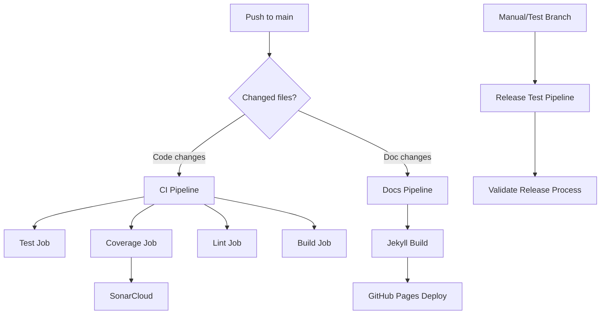

# CI/CD Pipeline Documentation

This document describes all GitHub Actions workflows configured for the PromptKit repository.

## Overview

PromptKit uses GitHub Actions for:
- **Continuous Integration** - Automated testing, linting, and quality checks
- **Documentation Deployment** - Automatic GitHub Pages updates
- **Release Testing** - Safe release workflow validation

## Active Workflows

### 1. CI Pipeline (`ci.yml`)

**Purpose:** Run tests, coverage, linting, and builds on every code change.

**Triggers:**
- Push to `main` branch (excluding docs and markdown files)
- Pull requests to `main` branch (excluding docs and markdown files)

**Jobs:**

#### Test Job
- **Runs on:** Ubuntu Latest
- **Go Version:** 1.25.1
- **Steps:**
  1. Checkout code
  2. Set up Go
  3. Install dependencies (`make install`)
  4. Install `gotestsum` for enhanced test reporting
  5. Run tests (`make test`)
  6. Run tests with race detector (`make test-race`)
  7. Generate JUnit test reports for runtime, SDK, and arena
  8. Publish test results to GitHub Checks

**Test Packages:**
- `./runtime/...` - Core runtime components
- `./sdk/...` - SDK library
- `./tools/arena/...` - Arena CLI tool

#### Coverage Job
- **Runs on:** Ubuntu Latest
- **Go Version:** 1.25.1
- **Steps:**
  1. Checkout code (full depth for SonarCloud)
  2. Set up Go
  3. Install `gotestsum`
  4. Generate coverage reports with JUnit output
  5. Merge coverage files into single `coverage.out`
  6. Publish coverage test results
  7. Verify coverage file
  8. Run SonarCloud scan

**SonarCloud Integration:**
- Analyzes code quality, security, and coverage
- Results visible at: https://sonarcloud.io/project/overview?id=AltairaLabs_PromptKit
- Requires: `SONAR_TOKEN` secret

#### Lint Job
- **Runs on:** Ubuntu Latest
- **Go Version:** 1.25.1
- **Steps:**
  1. Checkout code
  2. Set up Go
  3. Run linting (`make lint`)

**Linting Tools:**
- `go vet` - Static analysis
- `go fmt` - Code formatting
- `golangci-lint` - Comprehensive linting (if installed)

#### Build Job
- **Runs on:** Ubuntu Latest
- **Go Version:** 1.25.1
- **Steps:**
  1. Checkout code
  2. Set up Go
  3. Build runtime components (`make build`)

**Permissions Required:**
```yaml
permissions:
  contents: read
  actions: read
  checks: write
  pull-requests: write
```

---

### 2. Documentation Pipeline (`docs.yml`)

**Purpose:** Deploy documentation to GitHub Pages.

**Triggers:**
- Push to `main` branch with changes to:
  - `docs/**` directory
  - `README.md`
  - `CONTRIBUTING.md`
  - `CODE_OF_CONDUCT.md`
  - `GOVERNANCE.md`
  - `SECURITY.md`
  - `.github/workflows/docs.yml`
- Manual trigger (`workflow_dispatch`)

**Jobs:**

#### Build Job
- **Runs on:** Ubuntu Latest
- **Ruby Version:** 3.1
- **Steps:**
  1. Checkout code
  2. Setup Ruby with bundler cache
  3. Setup GitHub Pages
  4. Install Jekyll dependencies
  5. Build Jekyll site with production environment
  6. Upload site artifact

**Jekyll Configuration:**
- **Source:** `docs/` directory
- **Output:** `docs/_site/`
- **Environment:** Production
- **Base Path:** Configured from GitHub Pages settings

#### Deploy Job
- **Runs on:** Ubuntu Latest
- **Depends on:** Build job
- **Environment:** `github-pages`
- **Steps:**
  1. Deploy artifact to GitHub Pages

**Permissions Required:**
```yaml
permissions:
  contents: read
  pages: write
  id-token: write
```

**Concurrency:**
- Group: `pages`
- Cancel in progress: `false` (ensures complete deployments)

**Live Site:** https://altairalabs.github.io/PromptKit

---

### 3. Release Test Pipeline (`release-test.yml`)

**Purpose:** Safely test release preparation without creating actual releases.

**Triggers:**
- Manual dispatch (`workflow_dispatch`) with inputs:
  - `tool`: Choice of arena or packc
  - `version`: Test version (default: v0.0.1-test)
- Push to branches matching `release-test/**`
- Push to tags matching `test/tools/*/v*`

**Jobs:**

#### Test Release Prep Job
- **Runs on:** Ubuntu Latest
- **Go Version:** 1.25.1
- **Steps:**
  1. Checkout code (full depth)
  2. Setup Go
  3. Determine tool to test (from input or tag)
  4. Show current `go.mod` before changes
  5. Simulate replace directive removal
  6. Show modified `go.mod`
  7. Attempt dependency resolution
  8. Show git diff of changes
  9. Test build with local dependencies
  10. Generate release checklist
  11. Upload checklist as artifact

**Outputs:**
- Release checklist markdown file
- Step-by-step release commands
- Validation of build process

#### Dry Run Summary Job
- **Runs on:** Ubuntu Latest
- **Depends on:** Test release prep job
- **Steps:**
  1. Output summary to GitHub Actions summary page

**Testing Strategies:**
- ✅ Test repo approach
- ✅ Test tags with prefix
- ✅ Test branches

**Permissions Required:**
```yaml
permissions:
  contents: write
```

---

## Secrets Required

The following secrets must be configured in GitHub repository settings:

| Secret | Purpose | Required For |
|--------|---------|--------------|
| `SONAR_TOKEN` | SonarCloud authentication | CI Coverage job |
| `GITHUB_TOKEN` | GitHub API access | Automatically provided by GitHub Actions |

**Setting Secrets:**
1. Go to: Repository Settings → Secrets and variables → Actions
2. Click "New repository secret"
3. Add the secret name and value

---

## Environment Configuration

### Go Version

All workflows use **Go 1.25.1**. Update in all workflow files when upgrading:

```yaml
- name: Set up Go
  uses: actions/setup-go@v5
  with:
    go-version: '1.25.1'
```

### Test Reporting

Test results are published to GitHub Checks using:
- **Tool:** `gotestsum`
- **Format:** JUnit XML
- **Reporter:** `dorny/test-reporter@v1.9.1`

### Code Quality

SonarCloud integration provides:
- Coverage reports
- Code smells detection
- Security vulnerability scanning
- Technical debt analysis

**Configuration:** `sonar-project.properties` in root

---

## Workflow Dependencies



---

## Adding a New Workflow

To add a new GitHub Actions workflow:

1. Create workflow file in `.github/workflows/`
2. Define trigger conditions
3. Specify required permissions
4. Define jobs and steps
5. Test with a pull request
6. Document in this file

**Template:**
```yaml
name: My Workflow

on:
  push:
    branches: [ main ]

permissions:
  contents: read

jobs:
  my-job:
    runs-on: ubuntu-latest
    steps:
      - uses: actions/checkout@v4
      - name: Do something
        run: echo "Hello"
```

---

## Debugging Failed Workflows

### Viewing Logs

1. Go to **Actions** tab in GitHub
2. Click on the failed workflow run
3. Click on the failed job
4. Expand failed step to see logs

### Common Issues

**Test Failures:**
- Check test logs in the Test Results section
- Run tests locally: `make test-race`
- Check for race conditions

**Coverage Issues:**
- Verify coverage files exist: `ls -la *.out`
- Run locally: `make coverage`
- Check SonarCloud dashboard for details

**Build Failures:**
- Verify Go version matches locally: `go version`
- Check dependencies: `make install`
- Test build locally: `make build`

**Documentation Build Failures:**
- Test Jekyll locally: `cd docs && bundle exec jekyll serve`
- Check Gemfile dependencies
- Verify markdown syntax

**Release Test Failures:**
- Review release checklist artifact
- Ensure dependencies would be published first
- Check go.mod for correct replace directives

---

## Local Testing

Before pushing changes, test locally:

```bash
# Run full CI suite locally
make test
make test-race
make lint
make build
make coverage

# Build documentation locally
cd docs
bundle install
bundle exec jekyll serve

# Test release process (dry run)
./scripts/test-release.sh arena v0.0.1-test
```

---

## Pipeline Metrics

Monitor pipeline health:

- **Build Success Rate:** Target > 95%
- **Average Duration:** ~5-10 minutes for CI
- **Coverage Threshold:** Tracked by SonarCloud
- **Documentation Deploy Time:** ~2-3 minutes

**View Metrics:**
- GitHub Actions Insights tab
- SonarCloud dashboard
- Go Report Card: https://goreportcard.com/report/github.com/AltairaLabs/PromptKit

---

## Maintenance Schedule

### Monthly
- Review and update Go version if needed
- Update GitHub Actions to latest versions
- Check for deprecated action warnings

### Quarterly
- Review SonarCloud quality gate rules
- Audit secrets and permissions
- Update Ruby version for docs build

### Annually
- Review and update all third-party actions
- Evaluate new testing/quality tools
- Document lessons learned

---

## Related Documentation

- [Testing Releases](./testing-releases-quickstart.md) - Safe release testing
- [Contributing Guide](../../CONTRIBUTING.md) - Development workflow
- [Makefile](../../Makefile) - Local build commands
- [SonarCloud Configuration](../../sonar-project.properties) - Quality settings

---

## Support

For CI/CD issues:

1. Check [GitHub Actions Status](https://www.githubstatus.com/)
2. Review workflow logs
3. Test locally with make commands
4. Create issue with workflow run link
5. Tag `@maintainers` for urgent issues

---

*Last Updated: 2 November 2025*
