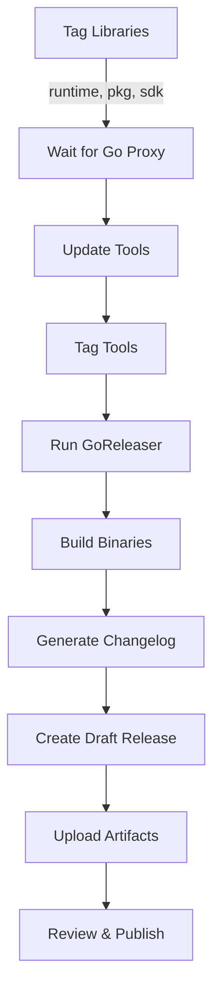

# GoReleaser Integration

This document describes how GoReleaser is integrated into the PromptKit release process to automate binary builds and GitHub releases.

## Overview

GoReleaser automates the creation of:
- **Multi-platform binaries** (Linux, macOS, Windows for amd64 and arm64)
- **Archives** (tar.gz for Unix, zip for Windows)
- **Checksums** (SHA256 for verification)
- **GitHub Releases** (with changelog and artifacts)

## Prerequisites

### Install GoReleaser

```bash
# macOS (Homebrew)
brew install goreleaser/tap/goreleaser

# Linux (snap)
snap install --classic goreleaser

# Go install
go install github.com/goreleaser/goreleaser@latest

# Verify
goreleaser --version
```

### Configuration

GoReleaser is configured in `.goreleaser.yml` at the repository root. Key features:

- **Builds both tools**: promptarena and packc
- **Cross-platform**: Linux, macOS, Windows (amd64, arm64)
- **Version injection**: Embeds version, commit, and date into binaries
- **Draft releases**: Creates drafts for review before publishing
- **Automated changelog**: Groups commits by type (features, fixes, etc.)

## Integration with Release Process

### 1. Local Release Script

The `scripts/release.sh` script includes GoReleaser:

```bash
# Run the full release
./scripts/release.sh v1.0.0

# GoReleaser runs after:
# 1. Libraries are tagged
# 2. Tools are updated and tagged
# 3. All modules are available on Go proxy
```

**What happens:**
- Script asks if you want to run GoReleaser
- Checks if goreleaser is installed
- Runs `goreleaser release --clean`
- Creates draft GitHub release with binaries

### 2. GitHub Actions Workflow

The `.github/workflows/release.yml` workflow uses GoReleaser:

```yaml
- name: Run GoReleaser
  uses: goreleaser/goreleaser-action@v5
  with:
    distribution: goreleaser
    version: latest
    args: release --clean
  env:
    GITHUB_TOKEN: ${{ secrets.GITHUB_TOKEN }}
```

**What happens:**
- Automatically runs after tools are tagged
- Builds binaries in GitHub Actions runners
- Uploads artifacts to GitHub Release
- No local setup needed

## What Gets Built

### Binaries

| Platform | Architecture | Output |
|----------|-------------|---------|
| Linux    | amd64       | `promptarena`, `packc` |
| Linux    | arm64       | `promptarena`, `packc` |
| macOS    | amd64       | `promptarena`, `packc` |
| macOS    | arm64       | `promptarena`, `packc` |
| Windows  | amd64       | `promptarena.exe`, `packc.exe` |
| Windows  | arm64       | `promptarena.exe`, `packc.exe` |

### Archives

Archives are named: `PromptKit_{version}_{OS}_{arch}.{tar.gz|zip}`

Examples:
- `PromptKit_v1.0.0_Linux_x86_64.tar.gz`
- `PromptKit_v1.0.0_Darwin_arm64.tar.gz`
- `PromptKit_v1.0.0_Windows_x86_64.zip`

Each archive contains:
- Binary files (`promptarena`, `packc`)
- `README.md`
- `LICENSE`
- `CHANGELOG.md`

### Checksums

`checksums.txt` contains SHA256 hashes for all archives:

```
abc123...  PromptKit_v1.0.0_Linux_x86_64.tar.gz
def456...  PromptKit_v1.0.0_Darwin_arm64.tar.gz
...
```

Users can verify downloads:
```bash
shasum -a 256 -c checksums.txt
```

## Release Workflow

### Complete Flow



### Step-by-Step

1. **Tag libraries and tools** (done by release script/workflow)
   ```bash
   git tag runtime/v1.0.0
   git tag pkg/v1.0.0
   git tag sdk/v1.0.0
   git tag tools/arena/v1.0.0
   git tag tools/packc/v1.0.0
   ```

2. **GoReleaser runs automatically**
   - Detects latest tag
   - Builds for all platforms
   - Generates changelog from commits

3. **Draft release created**
   - Go to: https://github.com/AltairaLabs/PromptKit/releases
   - Review changelog
   - Check binaries
   - Publish when ready

## Installation Methods After Release

### 1. Pre-built Binaries (Fastest)

```bash
# Download from GitHub release
wget https://github.com/AltairaLabs/PromptKit/releases/download/v1.0.0/PromptKit_v1.0.0_Linux_x86_64.tar.gz

# Extract
tar -xzf PromptKit_v1.0.0_Linux_x86_64.tar.gz

# Verify
shasum -a 256 -c checksums.txt

# Install
sudo mv promptarena /usr/local/bin/
sudo mv packc /usr/local/bin/
```

### 2. Go Install (Latest Go)

```bash
# Arena
go install github.com/AltairaLabs/PromptKit/tools/arena/cmd/promptarena@v1.0.0

# PackC
go install github.com/AltairaLabs/PromptKit/tools/packc@v1.0.0
```

### 3. SDK Library (For Developers)

```bash
go get github.com/AltairaLabs/PromptKit/sdk@v1.0.0
```

## Testing GoReleaser

### Local Test (No Release)

```bash
# Build locally without releasing
goreleaser build --snapshot --clean

# Check output in dist/
ls -lh dist/
```

### Dry Run

```bash
# Simulate release process
goreleaser release --snapshot --clean

# Creates everything in dist/ but doesn't:
# - Push to GitHub
# - Create actual release
# - Upload artifacts
```

### Full Local Release (Requires Tag)

```bash
# Create a test tag
git tag test/v0.0.1-goreleaser
git push origin test/v0.0.1-goreleaser

# Run goreleaser
GITHUB_TOKEN=your_token goreleaser release --clean

# Clean up test release manually on GitHub
```

## Customization

### Add New Build Target

Edit `.goreleaser.yml`:

```yaml
builds:
  - id: promptarena
    # ... existing config ...
    goos:
      - linux
      - darwin
      - windows
      - freebsd  # Add this
```

### Change Archive Format

```yaml
archives:
  - format: tar.gz
    format_overrides:
      - goos: windows
        format: zip
      - goos: darwin
        format: dmg  # Create DMG for macOS
```

### Add Homebrew Support

Uncomment in `.goreleaser.yml`:

```yaml
brews:
  - name: promptkit
    repository:
      owner: AltairaLabs
      name: homebrew-tap
    # ... rest of config
```

Then users can:
```bash
brew tap AltairaLabs/tap
brew install promptkit
```

### Add Docker Images

Uncomment in `.goreleaser.yml`:

```yaml
dockers:
  - image_templates:
      - "ghcr.io/altairalabs/promptarena:{{ .Version }}"
      - "ghcr.io/altairalabs/promptarena:latest"
```

## Troubleshooting

### GoReleaser Not Found

```bash
# Install it
brew install goreleaser/tap/goreleaser

# Or skip it (releases can be created manually)
gh release create v1.0.0 --draft
```

### Build Fails for Platform

Check build logs:
```bash
goreleaser build --snapshot --clean
```

Common issues:
- CGO disabled but code uses C
- Platform-specific code without build tags
- Missing dependencies

### GitHub Token Issues

Ensure `GITHUB_TOKEN` has permissions:
- `contents: write` (for releases)
- `packages: write` (if using Docker)

### Release Already Exists

Delete and retry:
```bash
gh release delete v1.0.0 --yes
git push origin --delete v1.0.0
goreleaser release --clean
```

## Best Practices

### 1. Always Review Draft Releases

GoReleaser creates drafts by default - review before publishing:
- Check changelog accuracy
- Verify binary integrity
- Test a few downloads

### 2. Use Semantic Versioning

```bash
# Good
v1.0.0, v1.1.0, v2.0.0-beta.1

# Bad
release-2024, latest, v1
```

### 3. Keep .goreleaser.yml Updated

When adding new tools or changing structure:
- Update build configurations
- Test with `--snapshot` first
- Document changes

### 4. Tag Appropriately

GoReleaser uses the latest tag. For monorepo:
```bash
# Tag the VERSION, not individual components
git tag v1.0.0  # This triggers GoReleaser
```

## Resources

- **GoReleaser Docs**: https://goreleaser.com
- **GitHub Actions**: https://github.com/goreleaser/goreleaser-action
- **Configuration Reference**: https://goreleaser.com/customization/
- **PromptKit Config**: `.goreleaser.yml`

## Related Documentation

- [Release Automation](./release-automation.md) - Full release process
- [Release Process](./release-process.md) - Manual release steps
- [Testing Releases](./testing-releases.md) - How to test releases safely

---

*Last Updated: 2 November 2025*
