# Complete Workflow: Arena → PackC → SDK

**Goal**: Understand how all PromptKit tools work together from development to production.

**Tools**: Arena, PackC, and SDK

**Time**: 30-45 minutes

---

## Overview

This guide walks through the complete PromptKit workflow:

1. **Develop** prompts with your team
2. **Test** prompts systematically with Arena
3. **Compile** tested prompts with PackC
4. **Deploy** using the SDK in production

```mermaid
graph LR
    A[📝 Write Prompt] --> B[🏟️ Test with Arena]
    B --> C{✅ Tests Pass?}
    C -->|No| A
    C -->|Yes| D[📦 Compile with PackC]
    D --> E[🚀 Deploy with SDK]
    E --> F[📊 Monitor Production]
    F -->|Issues Found| A
    
    style B fill:#e1f5fe
    style D fill:#fff9c4
    style E fill:#f3e5f5
```



---

## Prerequisites

- Go 1.22 or later
- API keys for LLM providers
- All PromptKit tools installed (Arena, PackC, SDK)

---

## Step 1: Develop Your Prompt

Create `prompts/customer-support.yaml`:

```yaml
name: "customer-support"
version: "1.0.0"
description: "Customer support chatbot prompts"

prompts:
  - id: "support-greeting"
    system: |
      You are a helpful customer support agent.
      You are empathetic, professional, and solution-oriented.
      Always ask clarifying questions before providing solutions.
    template: "Greet the customer and ask how you can help them today."
    
  - id: "order-inquiry"
    system: |
      You are assisting with order inquiries.
      You have access to order lookup tools.
      Always verify the customer's identity before sharing order details.
    template: |
      Help the customer with their order inquiry.
      Order number: {{order_number}}
      Customer email: {{customer_email}}

metadata:
  author: "Support Team"
  tags: ["support", "orders", "customer-service"]
```

---

## Step 2: Test with Arena

Create `tests/customer-support-test.yaml`:

```yaml
name: "Customer Support Tests"
description: "Validate customer support prompts"

providers:
  - openai
  - anthropic

scenarios:
  - name: "Greeting - Friendly Tone"
    description: "Test that greeting is warm and professional"
    
    prompt_id: "support-greeting"
    
    messages:
      - role: system
        content: "You are a helpful customer support agent..."
      - role: user
        content: "Hello"
    
    assertions:
      - type: not_empty
      - type: contains_any
        values: ["help", "assist", "support"]
      - type: tone
        expected: "professional_friendly"
      - type: max_tokens
        value: 150
  
  - name: "Order Inquiry - Verification"
    description: "Test that agent requests verification"
    
    prompt_id: "order-inquiry"
    
    variables:
      order_number: "12345"
      customer_email: "test@example.com"
    
    messages:
      - role: system
        content: "You are assisting with order inquiries..."
      - role: user
        content: "I want to check my order status"
    
    assertions:
      - type: contains_any
        values: ["verify", "confirm", "email", "order number"]
        description: "Should request verification"
      - type: not_contains
        values: ["order details", "shipped to"]
        description: "Should not reveal details without verification"
```

Run Arena tests:

```bash
promptarena test tests/customer-support-test.yaml --report html
```

Review results:

- ✅ All assertions pass across providers
- ✅ Response quality is consistent
- ✅ No security issues (doesn't leak info)
- ✅ Performance is acceptable (< 2s, < 1000 tokens)

---

## Step 3: Iterate Based on Test Results

If tests fail, refine your prompts:

```yaml
# prompts/customer-support.yaml (v1.1.0)
prompts:
  - id: "support-greeting"
    system: |
      You are a helpful customer support agent.
      You are empathetic, professional, and solution-oriented.
      Always ask clarifying questions before providing solutions.
      Keep responses concise (under 100 words).  # ← Added based on test feedback
    template: "Greet the customer and ask how you can help them today."
```

Re-run tests until all pass:

```bash
promptarena test tests/customer-support-test.yaml
```

---

## Step 4: Compile with PackC

Once tests pass, compile the prompt:

```bash
packc compile prompts/customer-support.yaml \
  --output dist/customer-support.pack.json \
  --optimize \
  --version 1.0.0
```

Validate the compiled pack:

```bash
packc validate dist/customer-support.pack.json
```

---

## Step 5: Version and Tag

```bash
# Tag in git
git add prompts/customer-support.yaml tests/customer-support-test.yaml
git commit -m "feat: customer support prompts v1.0.0"
git tag v1.0.0
git push origin v1.0.0

# Upload pack to artifact storage
aws s3 cp dist/customer-support.pack.json \
  s3://my-company-packs/customer-support/v1.0.0/
```

---

## Step 6: Deploy with SDK

Create your production application `main.go`:

```go
package main

import (
    "context"
    "fmt"
    "log"
    "net/http"
    "os"

    "github.com/AltairaLabs/PromptKit/sdk"
)

func main() {
    ctx := context.Background()

    // Load the tested and compiled pack
    pack, err := sdk.LoadPromptPack("./packs/customer-support.pack.json")
    if err != nil {
        log.Fatalf("Failed to load pack: %v", err)
    }

    // Configure SDK with production settings
    config := &sdk.Config{
        Provider: "openai",
        Model:    "gpt-4",
        APIKey:   os.Getenv("OPENAI_API_KEY"),
        Pack:     pack,
        StateStore: &sdk.RedisStateStore{
            Addr: os.Getenv("REDIS_URL"),
        },
    }

    manager, err := sdk.NewConversationManager(ctx, config)
    if err != nil {
        log.Fatalf("Failed to create manager: %v", err)
    }
    defer manager.Close()

    // HTTP endpoint for customer support
    http.HandleFunc("/support/chat", func(w http.ResponseWriter, r *http.Request) {
        sessionID := r.URL.Query().Get("session_id")
        message := r.FormValue("message")

        // Get or create conversation
        conv, err := manager.GetOrCreateConversation(ctx, sessionID, "support-greeting")
        if err != nil {
            http.Error(w, "Failed to get conversation", 500)
            return
        }

        // Send message and get response
        response, err := conv.SendMessage(ctx, message)
        if err != nil {
            http.Error(w, "Failed to get response", 500)
            return
        }

        fmt.Fprintf(w, "%s", response)
    })

    log.Println("Customer support server running on :8080")
    log.Fatal(http.ListenAndServe(":8080", nil))
}
```

---

## Step 7: Deploy to Production

### Docker Deployment

Create `Dockerfile`:

```dockerfile
FROM golang:1.22 AS builder
WORKDIR /app
COPY go.mod go.sum ./
RUN go mod download
COPY . .
RUN CGO_ENABLED=0 go build -o server .

FROM alpine:latest
RUN apk --no-cache add ca-certificates
WORKDIR /app
COPY --from=builder /app/server .
COPY packs/ ./packs/
EXPOSE 8080
CMD ["./server"]
```

Build and deploy:

```bash
docker build -t customer-support:v1.0.0 .
docker push myregistry/customer-support:v1.0.0

# Deploy to Kubernetes
kubectl apply -f k8s/deployment.yaml
```

---

## Step 8: Monitor Production

Monitor key metrics:

```go
// Add monitoring middleware
config.Middleware = []sdk.Middleware{
    sdk.LoggingMiddleware(),
    sdk.MetricsMiddleware(metricsClient),
    sdk.RateLimitMiddleware(100), // 100 req/min
}
```

Track:

- 📊 Response times
- 💰 Token usage and costs
- ⚠️ Error rates
- 👥 User satisfaction
- 🔄 Conversation completion rates

---

## Step 9: Continuous Improvement

As you gather production data:

1. **Identify Issues**
   - User complaints
   - Low satisfaction scores
   - High error rates
   - Unexpected behavior

2. **Update Prompts**
   ```yaml
   # prompts/customer-support-v1.1.yaml
   version: "1.1.0"
   # Improvements based on production feedback
   ```

3. **Test Changes**
   ```bash
   promptarena test tests/customer-support-test.yaml
   ```

4. **Deploy Updates**
   ```bash
   packc compile prompts/customer-support-v1.1.yaml
   # Deploy new version
   ```

---

## CI/CD Pipeline Integration

### Complete GitHub Actions Workflow

```yaml
name: PromptKit Complete Workflow

on:
  push:
    branches: [main]
    paths:
      - 'prompts/**'
      - 'tests/**'

jobs:
  test:
    runs-on: ubuntu-latest
    steps:
      - uses: actions/checkout@v3
      
      - name: Set up Go
        uses: actions/setup-go@v4
        with:
          go-version: '1.22'
      
      - name: Install Arena
        run: go install github.com/AltairaLabs/PromptKit/tools/arena@latest
      
      - name: Run Arena Tests
        env:
          OPENAI_API_KEY: ${{ secrets.OPENAI_API_KEY }}
          ANTHROPIC_API_KEY: ${{ secrets.ANTHROPIC_API_KEY }}
        run: |
          promptarena test tests/*.yaml --report json > test-results.json
      
      - name: Upload Test Results
        uses: actions/upload-artifact@v3
        with:
          name: arena-test-results
          path: test-results.json

  compile:
    needs: test
    runs-on: ubuntu-latest
    steps:
      - uses: actions/checkout@v3
      
      - name: Install PackC
        run: go install github.com/AltairaLabs/PromptKit/tools/packc@latest
      
      - name: Compile Packs
        run: |
          packc compile prompts/*.yaml --output-dir dist/packs/ --optimize
      
      - name: Validate Packs
        run: |
          packc validate dist/packs/*.pack.json
      
      - name: Upload Packs
        uses: actions/upload-artifact@v3
        with:
          name: compiled-packs
          path: dist/packs/

  deploy:
    needs: compile
    runs-on: ubuntu-latest
    if: github.ref == 'refs/heads/main'
    steps:
      - uses: actions/checkout@v3
      
      - name: Download Packs
        uses: actions/download-artifact@v3
        with:
          name: compiled-packs
          path: packs/
      
      - name: Build Docker Image
        run: |
          docker build -t customer-support:${{ github.sha }} .
      
      - name: Push to Registry
        run: |
          docker push myregistry/customer-support:${{ github.sha }}
      
      - name: Deploy to Production
        run: |
          kubectl set image deployment/customer-support \
            customer-support=myregistry/customer-support:${{ github.sha }}
```

---

## Best Practices Summary

### Development Phase

- ✅ Use clear, descriptive prompt IDs
- ✅ Include comprehensive system messages
- ✅ Document prompt intent and usage
- ✅ Version prompts semantically

### Testing Phase

- ✅ Test across multiple providers
- ✅ Include edge cases and failure scenarios
- ✅ Validate security (no data leaks)
- ✅ Check performance (tokens, latency)
- ✅ Verify tone and quality

### Compilation Phase

- ✅ Enable optimization for production
- ✅ Validate before deployment
- ✅ Version and tag releases
- ✅ Archive old versions

### Deployment Phase

- ✅ Use production-grade state storage
- ✅ Implement monitoring and logging
- ✅ Add rate limiting and error handling
- ✅ Plan for rollbacks
- ✅ Test in staging first

---

## Troubleshooting the Workflow

### Tests Pass Locally But Fail in CI

- Check environment variables are set in CI
- Verify API keys have sufficient quota
- Check for non-deterministic test assertions
- Use `--seed` flag for reproducible tests

### Pack Compilation Fails

- Validate YAML syntax
- Check all referenced prompt IDs exist
- Verify version format is correct
- Review compiler error messages

### Production Deployment Issues

- Verify pack file is accessible
- Check API keys are configured
- Confirm state store is reachable
- Review application logs

---

## Next Steps

Now that you understand the complete workflow:

- **Deep Dive into Arena**: [Arena Tutorials](/arena/tutorials/)
- **Master the SDK**: [SDK Tutorials](/sdk/tutorials/)
- **Optimize Builds**: [PackC How-To Guides](/packc/how-to/)
- **Understand Architecture**: [System Concepts](/concepts/)

---

## Join the Community

- **Questions**: [GitHub Discussions](https://github.com/AltairaLabs/PromptKit/discussions)
- **Examples**: [Workflow Examples](/workflows/)
- **Issues**: [Report a Bug](https://github.com/AltairaLabs/PromptKit/issues)

---

## Related Resources

- [Testing Workflow](/workflows/testing-workflow/) - Deep dive into Arena testing
- [Deployment Workflow](/workflows/deployment-workflow/) - Production deployment patterns
- [Contribution Workflow](/workflows/contribution-workflow/) - Extending PromptKit
