# PromptKit Documentation

**Professional LLM development framework with testing, packaging, and production deployment tools**

---

## 👥 I am a...

Choose your path based on your role and goals:

### 🎨 Prompt Engineer / ML Ops
**I want to develop and test LLM prompts systematically**

You need **PromptArena** - a comprehensive testing framework for validating prompts across multiple providers.

**Quick Start**: [Arena Tutorial: Your First Test](/arena/tutorials/01-first-test/) (5 minutes)

**What you can do**:
- Test prompts across OpenAI, Claude, Gemini simultaneously
- Validate multi-turn conversations
- Compare provider performance and costs
- Integrate MCP tools for real-world testing
- Generate comprehensive test reports

[**Get Started with Arena →**](/arena/)

---

### 💻 Application Developer
**I want to build production LLM applications**

You need **PromptKit SDK** - a production-ready Go library for building robust LLM applications.

**Quick Start**: [SDK Tutorial: Your First Chatbot](/sdk/tutorials/01-first-chatbot/) (15 minutes)

**What you can do**:
- Use pre-tested, compiled PromptPacks
- Build type-safe conversational applications
- Manage state persistence (Redis, Postgres, in-memory)
- Handle streaming responses
- Deploy confidently to production

[**Get Started with SDK →**](/sdk/)

---

### 🔧 DevOps / Build Engineer
**I want to package prompts and integrate into CI/CD**

You need **PackC** - a compiler for packaging and optimizing PromptPacks.

**Quick Start**: [PackC Tutorial: First Compilation](/packc/tutorials/01-first-compilation/) (5 minutes)

**What you can do**:
- Compile tested prompts into optimized packages
- Validate pack structure and schema
- Integrate into build pipelines
- Version and distribute prompt packages
- Bridge development and production

[**Get Started with PackC →**](/packc/)

---

### 🏗️ Framework Contributor / Advanced User
**I want to extend PromptKit or understand internals**

You need **Runtime** - the core framework powering all PromptKit tools.

**Quick Start**: [Runtime Tutorial: Custom Provider](/runtime/tutorials/01-custom-provider/) (20 minutes)

**What you can do**:
- Build custom LLM providers
- Create custom middleware components
- Implement custom validators
- Understand architectural decisions
- Contribute to framework development

[**Get Started with Runtime →**](/runtime/)

---

## 🔄 Complete Workflow

**See how all tools work together**: [End-to-End Workflow Guide](/workflows/complete-workflow/)

```mermaid
graph LR
    A[👨‍💻 Prompt Engineer<br/>Develops prompts] -->|Tests with| B[🏟️ Arena]
    B -->|Validates| C[✅ Tested Prompts]
    C -->|Compiles with| D[📦 PackC]
    D -->|Produces| E[📄 .pack.json]
    E -->|Used by| F[🚀 SDK]
    F -->|Builds| G[🎯 Production App]
    
    style B fill:#e1f5fe
    style D fill:#fff9c4
    style F fill:#f3e5f5
```

---

## 📚 Browse by Documentation Type

### [📖 Tutorials](/getting-started/)
Step-by-step learning paths for each tool. Start here if you're new.

### [🔧 How-To Guides](/workflows/)
Task-oriented guides for accomplishing specific goals.

### [💡 Concepts & Architecture](/concepts/)
Understand how PromptKit works and why it's designed this way.

### [📋 API & CLI Reference](#)
Technical specifications for all tools:
- [Arena CLI Reference](/arena/reference/cli-commands/)
- [PackC CLI Reference](/packc/reference/cli-commands/)
- [SDK API Reference](/sdk/reference/api/)
- [Runtime API Reference](/runtime/reference/api/)

---

## 🎯 Quick Links by Need

### I need to...

**Install PromptKit**
- [Install Arena](/arena/how-to/installation/) - For testing
- [Install PackC](/packc/how-to/installation/) - For compilation
- [Install SDK](/sdk/how-to/installation/) - For development

**Learn Core Concepts**
- [What are PromptPacks?](/concepts/promptpacks-explained/)
- [Provider Abstraction](/concepts/provider-ecosystem/)
- [MCP Integration](/concepts/mcp-integration/)
- [System Architecture](/concepts/architecture/system-overview/)

**See Examples**
- [Arena Examples](/arena/examples/) - Testing scenarios
- [SDK Examples](/sdk/examples/) - Application patterns
- [Runtime Examples](/runtime/examples/) - Extension patterns

**Contribute**
- [Contributing Guide](/community/contributing/)
- [Architecture Decision Records](/concepts/architecture/adr/)
- [Development Setup](/community/contributing/#development-setup)

---

## 🆘 Need Help?

- **🐛 Bug Reports**: [GitHub Issues](https://github.com/AltairaLabs/PromptKit/issues)
- **💬 Questions**: [GitHub Discussions](https://github.com/AltairaLabs/PromptKit/discussions)
- **🔒 Security**: [Security Policy](/community/security/)
- **📖 More Help**: [Troubleshooting Guides](/workflows/)

---

## 🌟 Popular Pages

- [Your First Arena Test](/arena/tutorials/01-first-test/)
- [Build Your First Chatbot](/sdk/tutorials/01-first-chatbot/)
- [Arena CLI Commands](/arena/reference/cli-commands/)
- [SDK API Reference](/sdk/reference/api/)
- [Complete Workflow Guide](/workflows/complete-workflow/)

---

<small>Built with ❤️ by [AltairaLabs](https://altairalabs.ai) | [Apache 2.0 License](https://github.com/AltairaLabs/PromptKit/blob/main/LICENSE)</small>
