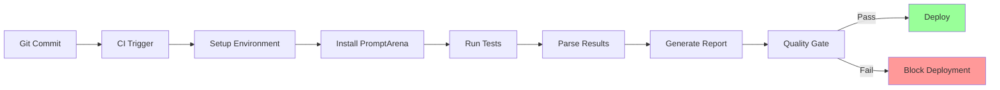

Integrate PromptArena into your CI/CD pipeline to automatically test prompts on every commit, prevent regressions, and maintain quality standards.

## Why CI/CD for Prompts?

### The Problem

Without automated testing:
- Prompt changes break existing functionality
- No validation before deployment
- Manual testing is slow and inconsistent
- Regression bugs slip through

### The Solution

CI/CD integration provides:
- **Automated testing** on every commit
- **Regression prevention** with baseline tests
- **Quality gates** before deployment
- **Performance tracking** over time
- **Cost monitoring** to prevent surprises

## Integration Flow



## Quick Start

### Minimal Configuration

```yaml
# .github/workflows/prompt-tests.yml
name: Prompt Tests

on: [push, pull_request]

jobs:
  test:
    runs-on: ubuntu-latest
    steps:
      - uses: actions/checkout@v3

      - name: Setup Go
        uses: actions/setup-go@v4
        with:
          go-version: '1.21'

      - name: Install PromptArena
        run: |
          git clone https://github.com/AltairaLabs/PromptKit.git
          cd PromptKit
          make install-tools-user
          echo "$HOME/bin" >> $GITHUB_PATH

      - name: Run Tests
        env:
          OPENAI_API_KEY: ${{ secrets.OPENAI_API_KEY }}
        run: promptarena run arena.yaml

      - name: Upload Results
        if: always()
        uses: actions/upload-artifact@v3
        with:
          name: test-results
          path: out/
```

## GitHub Actions

### Complete Workflow

```yaml
# .github/workflows/prompt-tests.yml
name: PromptArena Tests

on:
  push:
    branches: [main, develop]
    paths:
      - 'prompts/**'
      - 'scenarios/**'
      - 'arena.yaml'
  pull_request:
    branches: [main]

jobs:
  test:
    runs-on: ubuntu-latest
    timeout-minutes: 30

    steps:
      - name: Checkout Code
        uses: actions/checkout@v3

      - name: Setup Go
        uses: actions/setup-go@v4
        with:
          go-version: '1.21'
          cache: true

      - name: Install PromptArena
        run: |
          git clone https://github.com/AltairaLabs/PromptKit.git /tmp/promptkit
          cd /tmp/promptkit
          make install-tools-user
          echo "$HOME/bin" >> $GITHUB_PATH

      - name: Verify Installation
        run: promptarena --version

      - name: Run Prompt Tests
        env:
          OPENAI_API_KEY: ${{ secrets.OPENAI_API_KEY }}
          ANTHROPIC_API_KEY: ${{ secrets.ANTHROPIC_API_KEY }}
        run: |
          promptarena run arena.yaml \
            --output test-results \
            --formats json,junit,markdown

      - name: Publish Test Results
        uses: EnricoMi/publish-unit-test-result-action@v2
        if: always()
        with:
          files: test-results/junit.xml
          check_name: Prompt Test Results

      - name: Comment PR with Results
        if: github.event_name == 'pull_request'
        uses: actions/github-script@v6
        with:
          script: |
            const fs = require('fs');
            const results = JSON.parse(fs.readFileSync('test-results/results.json', 'utf8'));
            const summary = results.summary;

            const body = `## 🧪 PromptArena Test Results

            - ✅ Passed: ${summary.passed}
            - ❌ Failed: ${summary.failed}
            - ⏱️ Duration: ${summary.total_duration}
            - 💰 Cost: $${summary.total_cost.toFixed(4)}
            - 🔢 Tokens: ${summary.total_tokens}

            Pass Rate: ${(summary.passed / summary.total_tests * 100).toFixed(1)}%

            <details>
            <summary>Detailed Report</summary>

            ${fs.readFileSync('test-results/report.md', 'utf8')}
            </details>
            `;

            github.rest.issues.createComment({
              issue_number: context.issue.number,
              owner: context.repo.owner,
              repo: context.repo.repo,
              body: body
            });

      - name: Upload Results Artifact
        if: always()
        uses: actions/upload-artifact@v3
        with:
          name: prompt-test-results
          path: test-results/
          retention-days: 30

      - name: Check Quality Gate
        run: |
          PASS_RATE=$(jq -r '(.summary.passed / .summary.total_tests) * 100' test-results/results.json)
          echo "Pass rate: $PASS_RATE%"

          if (( $(echo "$PASS_RATE < 80" | bc -l) )); then
            echo "❌ Quality gate failed: Pass rate below 80%"
            exit 1
          fi

          TOTAL_COST=$(jq -r '.summary.total_cost' test-results/results.json)
          echo "Total cost: \$$TOTAL_COST"

          if (( $(echo "$TOTAL_COST > 1.0" | bc -l) )); then
            echo "⚠️ Warning: Cost exceeds $1.00"
          fi
```

### Secrets Configuration

Add API keys in repository settings:

```
Repository → Settings → Secrets → Actions

OPENAI_API_KEY=sk-...
ANTHROPIC_API_KEY=sk-ant-...
GOOGLE_API_KEY=...
```

### Matrix Testing

Test across multiple providers:

```yaml
jobs:
  test:
    strategy:
      matrix:
        provider: [openai, anthropic, gemini]
    steps:
      - name: Run Tests
        run: |
          promptarena run arena.yaml \
            --providers ${{ matrix.provider }}
```

## GitLab CI

```yaml
# .gitlab-ci.yml
stages:
  - test
  - report

variables:
  ARENA_OUTPUT: "test-results"

prompt_tests:
  stage: test
  image: golang:1.21
  before_script:
    - apt-get update && apt-get install -y git make
    - git clone https://github.com/AltairaLabs/PromptKit.git /tmp/promptkit
    - cd /tmp/promptkit && make install-tools-user
    - export PATH="$HOME/bin:$PATH"
  script:
    - promptarena run arena.yaml --output $ARENA_OUTPUT
  artifacts:
    reports:
      junit: $ARENA_OUTPUT/junit.xml
    paths:
      - $ARENA_OUTPUT/
    expire_in: 30 days
  rules:
    - if: '$CI_PIPELINE_SOURCE == "merge_request_event"'
    - if: '$CI_COMMIT_BRANCH == "main"'
  retry:
    max: 2
    when:
      - api_failure
      - runner_system_failure

quality_gate:
  stage: report
  image: alpine:latest
  before_script:
    - apk add --no-cache jq bc
  script:
    - |
      PASS_RATE=$(jq -r '(.summary.passed / .summary.total_tests) * 100' $ARENA_OUTPUT/results.json)
      echo "Pass rate: $PASS_RATE%"

      if [ $(echo "$PASS_RATE < 80" | bc) -eq 1 ]; then
        echo "Quality gate failed"
        exit 1
      fi
  dependencies:
    - prompt_tests
```

### Environment Variables

Configure in GitLab:

```
Settings → CI/CD → Variables

OPENAI_API_KEY (Protected, Masked)
ANTHROPIC_API_KEY (Protected, Masked)
```

## Jenkins

```groovy
// Jenkinsfile
pipeline {
    agent any

    environment {
        OPENAI_API_KEY = credentials('openai-api-key')
        ANTHROPIC_API_KEY = credentials('anthropic-api-key')
        ARENA_OUTPUT = 'test-results'
    }

    stages {
        stage('Setup') {
            steps {
                sh '''
                    git clone https://github.com/AltairaLabs/PromptKit.git /tmp/promptkit
                    cd /tmp/promptkit
                    make install-tools-user
                '''
            }
        }

        stage('Run Tests') {
            steps {
                sh '''
                    export PATH="$HOME/bin:$PATH"
                    promptarena run arena.yaml --output $ARENA_OUTPUT
                '''
            }
        }

        stage('Quality Gate') {
            steps {
                script {
                    def results = readJSON file: "${ARENA_OUTPUT}/results.json"
                    def passRate = (results.summary.passed / results.summary.total_tests) * 100

                    echo "Pass rate: ${passRate}%"
                    echo "Total cost: \$${results.summary.total_cost}"

                    if (passRate < 80) {
                        error "Quality gate failed: Pass rate below 80%"
                    }

                    if (results.summary.total_cost > 1.0) {
                        unstable "Cost exceeds \$1.00"
                    }
                }
            }
        }
    }

    post {
        always {
            junit "${ARENA_OUTPUT}/junit.xml"
            archiveArtifacts artifacts: "${ARENA_OUTPUT}/**/*", fingerprint: true
        }
        success {
            echo '✅ All tests passed!'
        }
        failure {
            echo '❌ Tests failed'
        }
    }
}
```

## CircleCI


```yaml
# .circleci/config.yml
version: 2.1

jobs:
  test:
    docker:
      - image: cimg/go:1.21
    steps:
      - checkout

      - restore_cache:
          keys:
            - promptkit-v1-{{ .Branch }}
            - promptkit-v1-

      - run:
          name: Install PromptArena
          command: |
            if [ ! -d "/tmp/promptkit" ]; then
              git clone https://github.com/AltairaLabs/PromptKit.git /tmp/promptkit
              cd /tmp/promptkit
              make install-tools-user
            fi
            echo 'export PATH="$HOME/bin:$PATH"' >> $BASH_ENV

      - save_cache:
          key: promptkit-v1-{{ .Branch }}
          paths:
            - /tmp/promptkit
```


      - run:
          name: Run Tests
          command: promptarena run arena.yaml --output test-results

      - run:
          name: Quality Check
          command: |
            PASS_RATE=$(jq -r '(.summary.passed / .summary.total_tests) * 100' test-results/results.json)
            if (( $(echo "$PASS_RATE < 80" | bc -l) )); then
              echo "Quality gate failed"
              exit 1
            fi

      - store_test_results:
          path: test-results/junit.xml

      - store_artifacts:
          path: test-results
          destination: prompt-tests

workflows:
  version: 2
  test:
    jobs:
      - test:
          context: prompt-testing
```

## Azure Pipelines

```yaml
# azure-pipelines.yml
trigger:
  branches:
    include:
      - main
      - develop
  paths:
    include:
      - prompts/**
      - scenarios/**
      - arena.yaml

pool:
  vmImage: 'ubuntu-latest'

variables:
  ARENA_OUTPUT: 'test-results'

steps:
  - task: GoTool@0
    inputs:
      version: '1.21'

  - script: |
      git clone https://github.com/AltairaLabs/PromptKit.git /tmp/promptkit
      cd /tmp/promptkit
      make install-tools-user
      echo "##vso[task.prependpath]$HOME/bin"
    displayName: 'Install PromptArena'

  - script: |
      promptarena run arena.yaml --output $(ARENA_OUTPUT)
    env:
      OPENAI_API_KEY: $(OPENAI_API_KEY)
      ANTHROPIC_API_KEY: $(ANTHROPIC_API_KEY)
    displayName: 'Run Tests'

  - task: PublishTestResults@2
    condition: always()
    inputs:
      testResultsFormat: 'JUnit'
      testResultsFiles: '$(ARENA_OUTPUT)/junit.xml'
      testRunTitle: 'Prompt Tests'

  - script: |
      PASS_RATE=$(jq -r '(.summary.passed / .summary.total_tests) * 100' $(ARENA_OUTPUT)/results.json)
      if (( $(echo "$PASS_RATE < 80" | bc -l) )); then
        echo "##vso[task.logissue type=error]Quality gate failed"
        exit 1
      fi
    displayName: 'Quality Gate'

  - publish: $(ARENA_OUTPUT)
    artifact: prompt-test-results
    condition: always()
```

## Best Practices

### 1. Separate Test Suites

```yaml
# Fast smoke tests (on every commit)
# arena-smoke.yaml
defaults:
  concurrency: 5
  timeout: 10s
scenarios:
  - file: scenarios/smoke-tests.yaml

# Full regression tests (nightly)
# arena-full.yaml
defaults:
  concurrency: 3
  timeout: 30s
scenarios:
  - file: scenarios/regression-tests.yaml
  - file: scenarios/edge-cases.yaml
  - file: scenarios/performance-tests.yaml
```

Run different suites:
```yaml
# Fast tests on PR
- name: Smoke Tests
  run: promptarena run arena-smoke.yaml

# Full tests on main
- name: Full Tests
  if: github.ref == 'refs/heads/main'
  run: promptarena run arena-full.yaml
```

### 2. Conditional Execution

Only run when prompt files change:

```yaml
# GitHub Actions
on:
  push:
    paths:
      - 'prompts/**'
      - 'scenarios/**'
      - 'arena.yaml'
```

```yaml
# GitLab CI
rules:
  - changes:
      - prompts/**
      - scenarios/**
      - arena.yaml
```

### 3. Mock Mode for Fast Feedback

```yaml
# arena-ci.yaml (fast mock tests)
defaults:
  providers:
    - file: providers/mock.yaml  # No API calls

# arena-full.yaml (real providers)
defaults:
  providers:
    - file: providers/openai.yaml
    - file: providers/claude.yaml
```

### 4. Cost Controls

Set spending limits:

```yaml
steps:
  - name: Pre-check Cost Estimate
    run: |
      # Estimate cost based on test count
      TEST_COUNT=$(yq '.scenarios | length' arena.yaml)
      ESTIMATED_COST=$(echo "$TEST_COUNT * 0.01" | bc)

      if (( $(echo "$ESTIMATED_COST > 5.0" | bc -l) )); then
        echo "Estimated cost too high: \$$ESTIMATED_COST"
        exit 1
      fi

  - name: Run Tests
    run: promptarena run arena.yaml

  - name: Check Actual Cost
    run: |
      ACTUAL_COST=$(jq -r '.summary.total_cost' out/results.json)
      echo "Actual cost: \$$ACTUAL_COST"

      if (( $(echo "$ACTUAL_COST > 5.0" | bc -l) )); then
        echo "::warning::Cost exceeded $5.00"
      fi
```

### 5. Retry Logic

Handle transient API failures:

```yaml
# GitHub Actions
- name: Run Tests
  uses: nick-fields/retry@v2
  with:
    timeout_minutes: 10
    max_attempts: 3
    retry_on: error
    command: promptarena run arena.yaml
```

```yaml
# GitLab CI
retry:
  max: 2
  when:
    - api_failure
    - runner_system_failure
```

### 6. Parallel Execution

Speed up tests with parallelism:

```yaml
jobs:
  test:
    strategy:
      matrix:
        scenario: [smoke, regression, edge-cases]
    steps:
      - run: |
          promptarena run arena.yaml \
            --scenarios ${{ matrix.scenario }}
```

### 7. Caching

Cache PromptArena installation:


```yaml
- name: Cache PromptKit
  uses: actions/cache@v3
  with:
    path: /tmp/promptkit
    key: promptkit-${{ hashFiles('.github/workflows/*.yml') }}

- name: Install or Restore
  run: |
    if [ ! -d "/tmp/promptkit" ]; then
      git clone https://github.com/AltairaLabs/PromptKit.git /tmp/promptkit
      cd /tmp/promptkit && make install-tools-user
    fi
```


## Quality Gates

### Pass Rate Gate

```bash
#!/bin/bash
# quality-gate.sh

RESULTS="out/results.json"
MIN_PASS_RATE=80

PASS_RATE=$(jq -r '(.summary.passed / .summary.total_tests) * 100' $RESULTS)

echo "Pass rate: $PASS_RATE%"
echo "Minimum required: $MIN_PASS_RATE%"

if (( $(echo "$PASS_RATE < $MIN_PASS_RATE" | bc -l) )); then
  echo "❌ Quality gate failed"
  exit 1
fi

echo "✅ Quality gate passed"
```

### Cost Gate

```bash
#!/bin/bash
# cost-gate.sh

RESULTS="out/results.json"
MAX_COST=1.00

TOTAL_COST=$(jq -r '.summary.total_cost' $RESULTS)

echo "Total cost: \$$TOTAL_COST"
echo "Maximum allowed: \$$MAX_COST"

if (( $(echo "$TOTAL_COST > $MAX_COST" | bc -l) )); then
  echo "⚠️ Cost exceeded budget"
  exit 1
fi

echo "✅ Cost within budget"
```

### Performance Gate

```bash
#!/bin/bash
# performance-gate.sh

RESULTS="out/results.json"
MAX_DURATION=60

DURATION=$(jq -r '.summary.total_duration | rtrimstr("s")' $RESULTS)

echo "Duration: ${DURATION}s"
echo "Maximum allowed: ${MAX_DURATION}s"

if (( $(echo "$DURATION > $MAX_DURATION" | bc -l) )); then
  echo "⚠️ Tests took too long"
  exit 1
fi

echo "✅ Performance acceptable"
```

## Troubleshooting

### Tests Fail in CI but Pass Locally

**Check**:
1. Environment variables are set
2. API keys are valid and have quota
3. Network connectivity to API endpoints
4. Timeout settings are sufficient

```yaml
- name: Debug Environment
  run: |
    echo "API Key set: ${OPENAI_API_KEY:+yes}"
    curl -I https://api.openai.com
    promptarena run arena.yaml --verbose
```

### Rate Limiting

**Solution**: Add delays or use mock mode

```yaml
defaults:
  concurrency: 1  # Reduce parallel requests
  timeout: 60s    # Increase timeout
```

### Timeout Issues

```yaml
# Increase job timeout
jobs:
  test:
    timeout-minutes: 30  # Default is 360 (6 hours)

# Increase per-test timeout
defaults:
  timeout: 60s
```

### Cost Overruns

```yaml
# Use cheaper models for CI
providers:
  - file: providers/gpt-3.5-turbo.yaml  # Instead of GPT-4

# Or use mock mode
providers:
  - file: providers/mock.yaml
```

## Monitoring & Alerting

### Track Metrics Over Time

```bash
# Store results with timestamp
DATE=$(date +%Y%m%d-%H%M%S)
cp out/results.json metrics/results-$DATE.json

# Commit to metrics tracking
git add metrics/
git commit -m "Add test metrics for $DATE"
```

### Slack Notifications

```yaml
- name: Notify Slack
  if: failure()
  uses: slackapi/slack-github-action@v1
  with:
    payload: |
      {
        "text": "❌ Prompt tests failed on ${{ github.ref }}"
      }
  env:
    SLACK_WEBHOOK_URL: ${{ secrets.SLACK_WEBHOOK }}
```

### Email Alerts

```yaml
- name: Send Email
  if: failure()
  uses: dawidd6/action-send-mail@v3
  with:
    server_address: smtp.gmail.com
    server_port: 465
    username: ${{ secrets.EMAIL_USERNAME }}
    password: ${{ secrets.EMAIL_PASSWORD }}
    subject: Prompt Tests Failed
    to: team@company.com
    from: ci@company.com
    body: Check the results at ${{ github.server_url }}/${{ github.repository }}/actions/runs/${{ github.run_id }}
```

## Next Steps

- **[Output Formats](./output-formats.md)** - Understanding test results
- **[Configuration Reference](./config-reference.md)** - Arena configuration
- **[Best Practices](./best-practices.md)** - Production tips

---

**Examples**: See `.github/workflows/` in the repository for real CI configurations.
