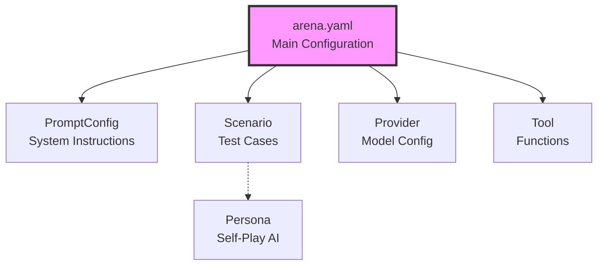

This document provides a comprehensive reference for all PromptArena configuration files, including every field, its purpose, and examples.

## Configuration File Types

PromptArena uses five main types of configuration files:



## Arena Configuration

The main configuration file that orchestrates all testing.

### Complete Structure

```yaml
apiVersion: promptkit.altairalabs.ai/v1alpha1
kind: Arena
metadata:
  name: my-arena                    # Required: Unique identifier
  namespace: default                # Optional: Namespace for organization
  labels:                           # Optional: Key-value labels
    environment: production
    team: ai-engineering
  annotations:                      # Optional: Non-identifying metadata
    description: "Production test suite"
    owner: "alice@company.com"

spec:
  # Prompt configurations
  prompt_configs:
    - id: support                   # Required: Internal reference ID
      file: prompts/support.yaml    # Required: Path to PromptConfig file
      vars:                         # Optional: Template variable overrides
        company_name: "TechCo"
        support_email: "help@techco.com"

    - id: creative
      file: prompts/creative.yaml

  # Provider configurations
  providers:
    - file: providers/openai-gpt4o.yaml
    - file: providers/claude-sonnet.yaml
    - file: providers/gemini-flash.yaml

  # Test scenarios
  scenarios:
    - file: scenarios/smoke-tests.yaml
    - file: scenarios/regression-tests.yaml
    - file: scenarios/edge-cases.yaml

  # Optional: Tool definitions
  tools:
    - file: tools/weather-api.yaml
    - file: tools/database-query.yaml
    - file: tools/calculator.yaml

  # Optional: MCP server configurations
  mcp_servers:
    filesystem:
      command: npx
      args:
        - "@modelcontextprotocol/server-filesystem"
        - "/path/to/data"
      env:
        NODE_ENV: production
        LOG_LEVEL: info

    memory:
      command: python
      args:
        - "-m"
        - "mcp_memory_server"
      env:
        MEMORY_BACKEND: redis
        REDIS_URL: redis://localhost:6379

  # Global defaults
  defaults:
    # LLM parameters
    temperature: 0.7                # Default: 0.7
    top_p: 1.0                      # Default: 1.0
    max_tokens: 1500                # Default: varies by provider
    seed: 42                        # Optional: For reproducibility

    # Execution settings
    concurrency: 3                  # Default: 1 (number of parallel tests)
    timeout: 30s                    # Default: 30s (per test)
    max_retries: 0                  # Default: 0 (retry failed tests)

    # Output configuration
    output:
      dir: out                      # Default: "out"
      formats:                      # Default: ["json"]
        - json
        - html
        - markdown
        - junit

      # Format-specific options
      json:
        file: results.json          # Default: results.json
        pretty: true                # Default: false
        include_raw: false          # Default: false

      html:
        file: report.html           # Default: report.html
        include_metadata: true      # Default: true
        theme: light                # Default: light (or "dark")

      markdown:
        file: report.md             # Default: report.md
        include_details: true       # Default: true

      junit:
        file: junit.xml             # Default: junit.xml
        include_system_out: true    # Default: false

    # Failure behavior
    fail_on:                        # Conditions that cause test failure
      - assertion_failure           # Assertion didn't pass
      - provider_error              # Provider API error
      - timeout                     # Test exceeded timeout
      - validation_error            # Validator/guardrail triggered

    # Optional: State management
    state:
      enabled: true                 # Default: false
      max_history_turns: 10         # Default: 10
      persistence: memory           # Default: memory (or "redis")
      redis_url: redis://localhost:6379  # Required if persistence=redis
```

### Field Descriptions

#### `prompt_configs`

Array of prompt configuration references.

**Fields**:
- `id` (string, required): Internal ID used to reference this prompt in scenarios
- `file` (string, required): Path to PromptConfig YAML file (relative to arena.yaml)
- `vars` (object, optional): Override template variables defined in the prompt

**Example**:
```yaml
prompt_configs:
  - id: support
    file: prompts/support.yaml
    vars:
      company: "ACME Corp"
      hours: "24/7"
```

#### `providers`

Array of provider configuration references.

**Fields**:
- `file` (string, required): Path to Provider YAML file

**Example**:
```yaml
providers:
  - file: providers/openai-gpt4o.yaml
  - file: providers/claude-sonnet.yaml
```

#### `scenarios`

Array of test scenario references.

**Fields**:
- `file` (string, required): Path to Scenario YAML file

**Example**:
```yaml
scenarios:
  - file: scenarios/basic-qa.yaml
  - file: scenarios/tool-calling.yaml
```

#### `tools`

Optional array of tool definition references.

**Fields**:
- `file` (string, required): Path to Tool YAML file

**Example**:
```yaml
tools:
  - file: tools/weather.yaml
  - file: tools/search.yaml
```

#### `mcp_servers`

Optional map of MCP server configurations.

**Key**: Server name (string)
**Value**: Server configuration object

**Server Configuration Fields**:
- `command` (string, required): Executable to run
- `args` (array, optional): Command-line arguments
- `env` (object, optional): Environment variables

**Example**:
```yaml
mcp_servers:
  filesystem:
    command: npx
    args: ["@modelcontextprotocol/server-filesystem", "/data"]
    env:
      NODE_ENV: production
```

#### `defaults.output`

Output configuration for test results.

**Fields**:
- `dir` (string): Output directory path
- `formats` (array): Output formats to generate
  - `json`: JSON results file
  - `html`: Interactive HTML report
  - `markdown`: Markdown report
  - `junit`: JUnit XML (for CI/CD)
- Format-specific options (see structure above)

#### `defaults.fail_on`

Array of conditions that should cause test failure.

**Values**:
- `assertion_failure`: Any assertion fails
- `provider_error`: Provider API returns error
- `timeout`: Test exceeds configured timeout
- `validation_error`: Validator/guardrail triggers

## PromptConfig

Defines a prompt's system instructions, validators, and metadata.

### Complete Structure

```yaml
apiVersion: promptkit.altairalabs.ai/v1alpha1
kind: PromptConfig
metadata:
  name: customer-support
  labels:
    task: support
    version: v2.0
    department: customer-success

spec:
  task_type: support                # Required: Categorization
  version: v2.0.0                   # Optional: Semantic version
  description: |                    # Optional: Human description
    Customer support bot for e-commerce platform.
    Handles orders, returns, and technical support.

  # Main system prompt
  system_template: |                # Required: System instructions
    You are a helpful customer support agent for ShopCo.

    Your capabilities:
    - Answer product questions
    - Track orders
    - Process returns and refunds
    - Troubleshoot technical issues
    - Escalate to humans when needed

    Tone: Professional, empathetic, solution-focused

    Guidelines:
    - Greet warmly
    - Ask clarifying questions
    - Provide clear instructions
    - Acknowledge frustration
    - Offer alternatives

  # Optional: Template variables
  required_vars:
    - company_name
    - support_email
    - hours_of_operation
    - return_policy

  # Optional: Runtime validators/guardrails
  validators:
    - type: banned_words
      params:
        words:
          - guarantee
          - promise
          - definitely
        message: "Avoid absolute promises"

    - type: max_length
      params:
        max_characters: 1000
        max_tokens: 250
        message: "Keep responses concise"

    - type: max_sentences
      params:
        max_sentences: 8
        message: "Maximum 8 sentences"

  # Optional: Voice and personality
  voice_profile:
    tone: professional              # Desired tone
    characteristics:                # Personality traits
      - helpful
      - empathetic
      - clear
      - patient
    avoid:                          # Traits to avoid
      - robotic
      - dismissive
      - overly casual

  # Optional: Model requirements
  model_requirements:
    min_context_window: 8000        # Minimum context tokens
    supports_function_calling: true # Requires tool support
    supports_streaming: true        # Requires streaming
    supports_vision: false          # Requires multimodal
```

### Field Descriptions

#### `task_type`

Categorizes the prompt's purpose.

**Common Values**:
- `general`: General-purpose assistant
- `support`: Customer support
- `creative`: Content generation
- `analysis`: Data/text analysis
- `code`: Code generation/review
- `qa`: Question answering

#### `system_template`

The system prompt sent to the LLM. Supports template variables using `{{variable_name}}` syntax.

**Example with Variables**:
```yaml
system_template: |
  You are a support agent for {{company_name}}.
  Contact us at {{support_email}}.
  Hours: {{hours_of_operation}}
```

#### `validators`

Array of runtime validators/guardrails. See [Validators Reference](./validators-reference.md) for full list.

**Structure**:
```yaml
validators:
  - type: validator_name
    params:
      param1: value1
      param2: value2
    message: "Optional description"
```

#### `voice_profile`

Optional personality and tone guidance.

**Fields**:
- `tone`: Overall tone (professional, casual, formal, friendly)
- `characteristics`: Desired traits (array of strings)
- `avoid`: Traits to avoid (array of strings)

## Scenario

Defines a test case with conversation turns and assertions.

### Complete Structure

```yaml
apiVersion: promptkit.altairalabs.ai/v1alpha1
kind: Scenario
metadata:
  name: order-tracking
  labels:
    category: support
    priority: high
    automated: true

spec:
  task_type: support                # Required: Must match prompt task_type
  description: |                    # Optional: Test description
    Test order tracking conversation flow.
    Verifies proper acknowledgment and assistance.

  # Conversation turns
  turns:
    # User turn
    - role: user                    # Required: "user" or "assistant"
      content: |                    # Required: Turn content
        I want to track my order #12345

      assertions:                   # Optional: Checks for this turn
        - type: content_includes
          params:
            text: "track"
            message: "Should acknowledge tracking request"

        - type: content_matches
          params:
            pattern: "(?i)(order|#12345)"
            message: "Should reference order number"

    # Another user turn
    - role: user
      content: "It says out for delivery but I haven't received it"
      assertions:
        - type: content_matches
          params:
            pattern: "(?i)(understand|help|check)"
            message: "Should offer assistance"

    # Optional: Explicit assistant turn (for context)
    - role: assistant
      content: |
        I understand your concern. Let me check the delivery
        status for you.
      # No assertions on assistant turns

    # Tool calling assertion
    - role: user
      content: "Please check the status"
      assertions:
        - type: tools_called
          params:
            tools:
              - check_order_status
            message: "Should call order status tool"

  # Optional: Context metadata
  context:
    goal: "Verify order tracking flow"     # Test objective
    user_type: "concerned customer"        # User persona
    situation: "delayed delivery"          # Scenario context
    timeline: "immediate"                  # Urgency level

  context_metadata:
    domain: "e-commerce"                   # Domain
    role: "support agent"                  # LLM role
    user_context: "customer waiting"       # User situation
    session_goal: "resolve concern"        # Desired outcome

  # Optional: Constraints
  constraints:
    max_turns: 10                          # Max conversation length
    max_tokens_per_turn: 200               # Max tokens per response
    required_themes:                       # Required themes
      - professional
      - helpful

  # Optional: Self-play mode
  self_play:
    enabled: true                          # Enable self-play
    persona: frustrated-customer           # Persona to use
    max_turns: 8                           # Max self-play turns
    exit_conditions:                       # Stop conditions
      - satisfaction_expressed
      - escalation_requested
```

### Field Descriptions

#### `turns`

Array of conversation turns. Each turn is either a user message (which triggers LLM response) or an assistant message (which provides context).

**Turn Fields**:
- `role` (string, required): Either "user" or "assistant"
- `content` (string, required): Turn content
- `assertions` (array, optional): Checks to run (user turns only)

**User Turn**: Triggers LLM generation, assertions check the response
**Assistant Turn**: Provides context, no LLM generation

#### `assertions`

Array of checks to verify LLM behavior. See [Assertions Reference](./assertions-reference.md) for full list.

**Structure**:
```yaml
assertions:
  - type: assertion_name
    params:
      param1: value1
    message: "Human-readable description"
```

#### `context` and `context_metadata`

Optional metadata about the scenario. Used for documentation and reporting.

#### `self_play`

Optional self-play configuration. When enabled, an AI persona interacts with the prompt instead of scripted turns.

**Fields**:
- `enabled` (bool): Enable self-play mode
- `persona` (string): Reference to Persona configuration
- `max_turns` (int): Maximum conversation length
- `exit_conditions` (array): Conditions to stop conversation

## Provider

Configures an LLM provider for testing.

### Complete Structure

```yaml
apiVersion: promptkit.altairalabs.ai/v1alpha1
kind: Provider
metadata:
  name: openai-gpt4o-mini
  labels:
    provider: openai
    tier: production
    cost: low

spec:
  type: openai                      # Required: Provider type
  model: gpt-4o-mini                # Required: Model name

  # Optional: API endpoint override
  base_url: https://api.openai.com/v1

  # Model parameters
  defaults:
    temperature: 0.7                # Sampling temperature (0.0-2.0)
    top_p: 1.0                      # Nucleus sampling (0.0-1.0)
    max_tokens: 500                 # Max response length
    seed: 42                        # Reproducibility seed (optional)
    frequency_penalty: 0.0          # Frequency penalty (optional)
    presence_penalty: 0.0           # Presence penalty (optional)

  # Optional: Include raw API responses in output
  include_raw_output: false         # Default: false

  # Optional: Cost overrides (defaults from provider)
  pricing:
    input_per_1k: 0.00015           # Cost per 1K input tokens
    output_per_1k: 0.0006           # Cost per 1K output tokens
    cached_per_1k: 0.00001          # Cost per 1K cached tokens (if supported)
```

### Provider Types

#### OpenAI

```yaml
spec:
  type: openai
  model: gpt-4o-mini | gpt-4o | gpt-4 | gpt-3.5-turbo
  # Authentication: OPENAI_API_KEY environment variable
```

**Supported Models**:
- `gpt-4o`: Latest GPT-4 Omni model
- `gpt-4o-mini`: Faster, cheaper GPT-4 variant
- `gpt-4`: GPT-4 (various versions)
- `gpt-3.5-turbo`: GPT-3.5

#### Anthropic

```yaml
spec:
  type: anthropic
  model: claude-3-5-sonnet-20241022 | claude-3-haiku-20240307
  # Authentication: ANTHROPIC_API_KEY environment variable
```

**Supported Models**:
- `claude-3-5-sonnet-20241022`: Claude 3.5 Sonnet
- `claude-3-opus-20240229`: Claude 3 Opus
- `claude-3-haiku-20240307`: Claude 3 Haiku

#### Google Gemini

```yaml
spec:
  type: gemini
  model: gemini-2.0-flash-exp | gemini-1.5-pro
  # Authentication: GOOGLE_API_KEY environment variable
```

**Supported Models**:
- `gemini-2.0-flash-exp`: Gemini 2.0 Flash (experimental)
- `gemini-1.5-pro`: Gemini 1.5 Pro
- `gemini-1.5-flash`: Gemini 1.5 Flash

#### Mock Provider

```yaml
spec:
  type: mock
  model: mock-model
  defaults:
    temperature: 0.7
```

Mock provider for testing without API calls. Returns predefined responses.

### Authentication

Providers authenticate using environment variables:

```bash
export OPENAI_API_KEY="sk-..."
export ANTHROPIC_API_KEY="sk-ant-..."
export GOOGLE_API_KEY="..."
```

## Tool

Defines a function/tool that the LLM can call.

### Complete Structure

```yaml
apiVersion: promptkit.altairalabs.ai/v1alpha1
kind: Tool
metadata:
  name: get-weather

spec:
  name: get_weather                 # Required: Function name
  description: |                    # Required: Function description
    Get current weather for a location

  # JSON Schema for input arguments
  input_schema:                     # Required
    type: object
    properties:
      location:
        type: string
        description: "City name or coordinates"
      units:
        type: string
        enum: ["celsius", "fahrenheit"]
        default: "celsius"
    required:
      - location

  # JSON Schema for output
  output_schema:                    # Optional
    type: object
    properties:
      temperature:
        type: number
      conditions:
        type: string
      humidity:
        type: number

  # Execution mode
  mode: live                        # Required: "mock" | "live" | "mcp"
  timeout_ms: 5000                  # Optional: Execution timeout

  # For mock mode: Static response
  mock_result:                      # Required if mode=mock
    temperature: 72
    conditions: "Sunny"
    humidity: 45

  # For mock mode: Template response
  mock_template: |                  # Alternative to mock_result
    {
      "location": "{{ .location }}",
      "temperature": 72,
      "conditions": "Sunny"
    }

  # For live mode: HTTP configuration
  http:                             # Required if mode=live
    url: https://api.weather.com/v1/current
    method: POST                    # GET | POST | PUT | DELETE
    headers:
      Authorization: "Bearer ${WEATHER_API_KEY}"
      Content-Type: "application/json"
    headers_from_env:               # Load headers from environment
      - WEATHER_API_KEY
    timeout_ms: 5000
    redact:                         # Fields to redact in logs
      - api_key
```

### Tool Modes

#### Mock Mode (Static)

Returns predefined static response:

```yaml
mode: mock
mock_result:
  status: "success"
  data: "mock value"
```

#### Mock Mode (Template)

Returns templated response with variables:


```yaml
mode: mock
mock_template: |
  {
    "input": "{{ .location }}",
    "result": "Mock result for {{ .location }}"
  }
```


#### Live Mode (HTTP)

Makes actual HTTP API calls:

```yaml
mode: live
http:
  url: https://api.example.com/endpoint
  method: POST
  headers:
    Authorization: "Bearer ${API_KEY}"
```

#### MCP Mode

Uses MCP server (auto-discovered, no additional config needed):

```yaml
mode: mcp
# Tool is provided by MCP server configured in arena.yaml
```

## Persona (Self-Play)

Defines an AI character for self-play testing.

### Complete Structure

```yaml
apiVersion: promptkit.altairalabs.ai/v1alpha1
kind: Persona
metadata:
  name: frustrated-customer

spec:
  name: "Frustrated Customer"      # Required: Display name
  description: |                   # Required: Persona description
    A customer who is upset about a delayed order

  # Persona's system prompt
  system_prompt: |                 # Required: Persona instructions
    You are a frustrated customer whose order is late.

    Your situation:
    - Order #12345 was supposed to arrive yesterday
    - You need it for an important event tomorrow
    - Still not delivered despite tracking
    - Upset but trying to be reasonable

    Your personality:
    - Initially frustrated and impatient
    - Want quick solutions
    - Will escalate if not satisfied
    - Appreciate empathy and concrete help

    Behavior:
    - Start with a complaint
    - Ask direct questions
    - Become understanding if helped well
    - Become more frustrated if dismissed

  # Conversation parameters
  max_turns: 8                     # Optional: Max turns (default: 10)
  temperature: 0.8                 # Optional: Sampling temp (default: 0.7)

  # Conversation goal
  goal: |                          # Optional: Persona's objective
    Get reassurance about order delivery and feel heard

  # Exit conditions
  exit_conditions:                 # Optional: When to stop
    - type: satisfaction_expressed
      description: "Express satisfaction with support"

    - type: escalation_requested
      description: "Ask to speak to manager (failure)"

    - type: max_turns_reached
      description: "Conversation timeout"
```

### Exit Conditions

Exit conditions determine when self-play conversations end:

- `satisfaction_expressed`: Persona is satisfied (success)
- `escalation_requested`: Persona wants escalation (failure)
- `max_turns_reached`: Conversation timeout
- Custom conditions can be defined

## Next Steps

- **[Assertions Reference](./assertions-reference.md)** - All available assertions
- **[Validators Reference](./validators-reference.md)** - All validators/guardrails
- **[Output Formats](./output-formats.md)** - Result output details

---

For complete examples, see the `examples/` directory in the repository.
