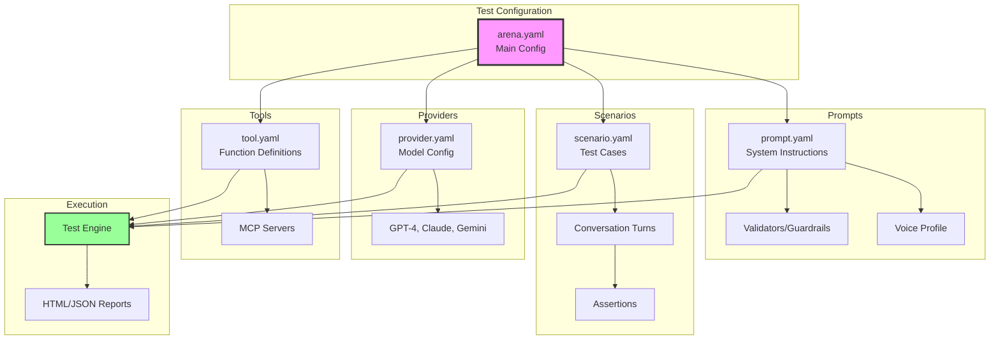

# PromptArena: LLM Testing for Prompt Engineers

PromptArena is a comprehensive testing framework designed specifically for prompt engineers who need to validate, iterate, and optimize LLM applications with confidence. Whether you're building chatbots, content generators, or AI assistants, PromptArena helps you ensure quality and consistency across different models and scenarios.

## What is PromptArena?

PromptArena is a command-line tool that lets you:

- **Test prompts across multiple LLM providers** - Compare GPT-4, Claude, Gemini, and more side-by-side
- **Validate conversational flows** - Ensure multi-turn conversations behave correctly
- **Verify tool calling** - Test that your LLM correctly uses functions and APIs
- **Run self-play simulations** - Let AI personas interact to discover edge cases
- **Generate comprehensive reports** - Get HTML/JSON/Markdown reports with metrics
- **Integrate with CI/CD** - Automate testing in your deployment pipeline

## Why PromptArena?

### The Challenge

As a prompt engineer, you face unique challenges:

- **Model variability**: Different providers behave differently with the same prompt
- **Regression testing**: Changes to prompts can break existing functionality
- **Edge cases**: Users say unexpected things that break your carefully crafted prompts
- **Cost optimization**: Testing across expensive API calls adds up quickly
- **Iteration speed**: Manual testing slows down your development cycle

### The Solution

PromptArena provides:

- **Declarative testing**: Define scenarios once, test everywhere
- **Fast iteration**: Mock mode for rapid development without API calls
- **Comprehensive assertions**: Verify content, tool calls, and behavior
- **Version control**: Track prompt performance over time
- **Cost tracking**: Monitor token usage and costs per test run

## Core Concepts

### PromptPack Format

PromptArena uses the **PromptPack specification** - an open-source, Kubernetes-style format for defining prompts, scenarios, and configurations. The specification is maintained at [PromptPack.org](https://promptpack.org) and is designed to be:

- **Portable**: Use the same format across different tools and platforms
- **Version controlled**: YAML files that work great with Git
- **Modular**: Separate concerns (prompts, scenarios, providers, tools)
- **Human-readable**: Easy to read, write, and review

### Key Components



## Quick Start Example

Here's a simple example to get you started:

### 1. Create a Prompt

```yaml
# prompts/assistant.yaml
apiVersion: promptkit.altairalabs.ai/v1alpha1
kind: PromptConfig
metadata:
  name: assistant
spec:
  task_type: general
  version: v1.0.0
  description: A helpful AI assistant

  system_template: |
    You are a helpful AI assistant.
    Be concise and friendly.
```

### 2. Create a Scenario

```yaml
# scenarios/basic-test.yaml
apiVersion: promptkit.altairalabs.ai/v1alpha1
kind: Scenario
metadata:
  name: basic-test
spec:
  task_type: general

  turns:
    - role: user
      content: "What is 2+2?"
      assertions:
        - type: content_includes
          params:
            text: "4"
            message: "Should answer correctly"
```

### 3. Configure a Provider

```yaml
# providers/openai.yaml
apiVersion: promptkit.altairalabs.ai/v1alpha1
kind: Provider
metadata:
  name: openai-gpt4o-mini
spec:
  type: openai
  model: gpt-4o-mini
  defaults:
    temperature: 0.7
    max_tokens: 500
```

### 4. Create Arena Configuration

```yaml
# arena.yaml
apiVersion: promptkit.altairalabs.ai/v1alpha1
kind: Arena
metadata:
  name: my-first-arena
spec:
  prompt_configs:
    - id: assistant
      file: prompts/assistant.yaml

  providers:
    - file: providers/openai.yaml

  scenarios:
    - file: scenarios/basic-test.yaml

  defaults:
    output:
      dir: out
      formats: ["html", "json"]
```

### 5. Run Tests

```bash
promptarena run arena.yaml
```

View results in `out/report.html`!

## What's Next?

Explore the documentation to learn more:

- **[Getting Started](./getting-started.md)** - Detailed installation and first project
- **[PromptPack Specification](./promptpack-spec.md)** - Understanding the format
- **[Writing Scenarios](./writing-scenarios.md)** - Creating effective test cases
- **[Assertions & Validation](./assertions.md)** - Verifying LLM behavior
- **[Multi-Provider Testing](./providers.md)** - Testing across models
- **[Tool Integration](./tools.md)** - Testing function calling
- **[Self-Play Testing](./selfplay.md)** - AI-driven test generation
- **[Best Practices](./best-practices.md)** - Tips from the field

## Community & Support

- **PromptPack Specification**: [promptpack.org](https://promptpack.org)
- **GitHub Issues**: [Report bugs or request features](https://github.com/AltairaLabs/PromptKit/issues)
- **Examples**: See the `examples/` directory in the repository

## Philosophy

PromptArena embodies several key principles:

1. **Test-Driven Prompt Engineering**: Write tests first, iterate on prompts
2. **Version Control Everything**: Prompts, scenarios, and configs are all YAML
3. **Portability**: Use standard formats that work across tools
4. **Transparency**: See exactly what the LLM received and returned
5. **Efficiency**: Mock mode for development, real APIs for validation

---

Ready to start testing? Head to [Getting Started](./getting-started.md)!
