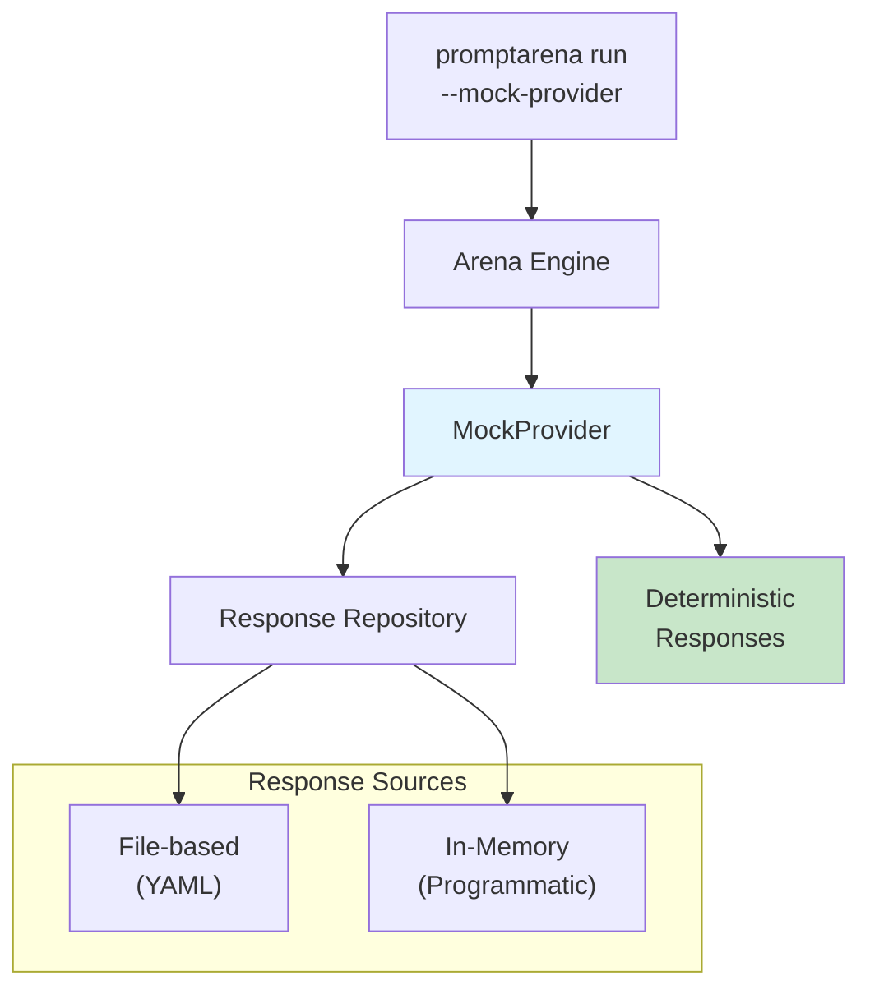
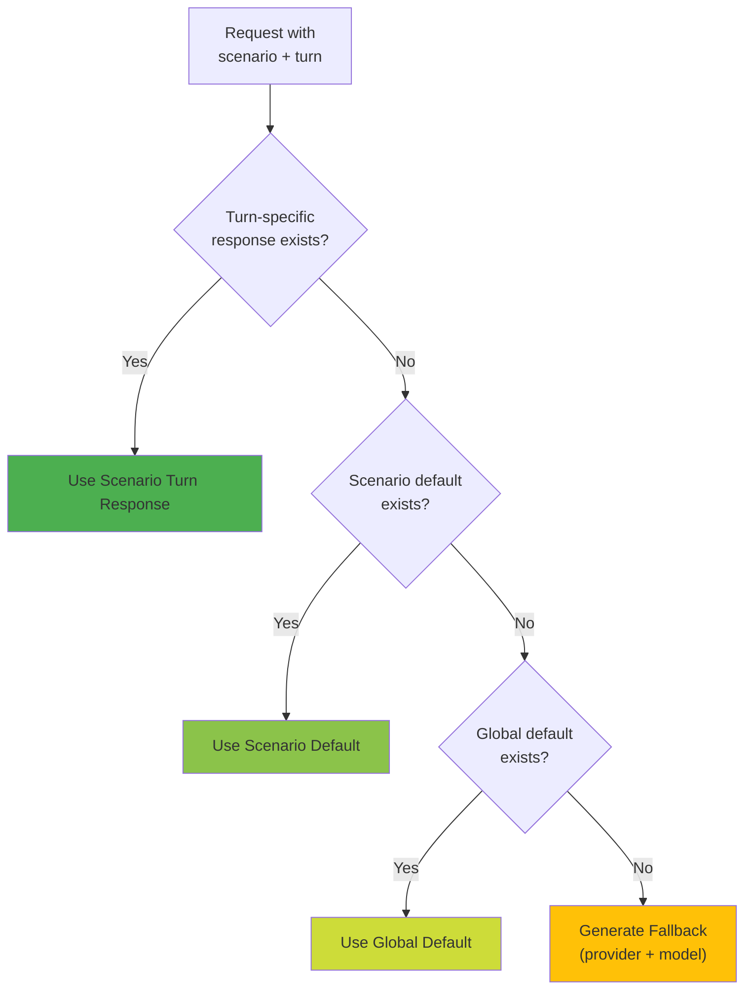

MockProvider enables running PromptArena tests without making actual API calls. It returns deterministic responses based on configuration, making it perfect for CI/CD pipelines, local development, and reproducible testing.

## Overview



**Benefits**:
- ✅ Zero API costs
- ✅ Fast execution (< 1ms per request)
- ✅ Deterministic results
- ✅ No API keys required
- ✅ Supports streaming and tool calls
- ✅ Scenario and turn-specific responses

## Quick Start

### Basic Usage

Replace all providers with MockProvider using the `--mock-provider` flag:

```bash
# Run all scenarios with mock provider
promptarena run --mock-provider

# Run specific scenarios
promptarena run --mock-provider --scenario customer-support

# CI mode with mock provider
promptarena run --mock-provider --ci --format junit,json
```

**Default Behavior**: Returns generic responses like "Mock response from provider-id model-name"

### With Configuration File

For realistic responses, provide a mock configuration file:

```bash
promptarena run --mock-provider --mock-config mock-responses.yaml
```

## Configuration Format

Mock configurations use YAML to define scenario and turn-specific responses:

### Basic Structure

```yaml
# Global default (fallback response)
defaultResponse: "This is a mock response from the configured provider."

# Scenario-specific configurations
scenarios:
  scenario-id:
    # Default for this scenario
    defaultResponse: "Scenario-specific default response"

    # Turn-by-turn responses
    turns:
      1: "Response for turn 1"
      2: "Response for turn 2"
      3: "Response for turn 3"
```

### Response Priority

MockProvider uses this priority order when selecting responses:



**Priority Order**:
1. **Scenario + Turn** (`scenarios.my-scenario.turns.1`) - Most specific
2. **Scenario Default** (`scenarios.my-scenario.defaultResponse`)
3. **Global Default** (`defaultResponse`)
4. **Built-in Fallback** (generated from provider/model names) - Least specific

## Simple Text Responses

For basic testing, configure simple text responses:

### Example: Customer Support

```yaml
defaultResponse: "Thank you for contacting support."

scenarios:
  customer-support:
    defaultResponse: "Hello! How can I help you today?"
    turns:
      1: "Thank you for reaching out. I understand you're having an issue. Could you provide more details?"
      2: "I've reviewed your account and can see the problem. Let me help you resolve this."
      3: "The issue has been resolved. Is there anything else I can assist you with?"
      4: "You're welcome! Have a great day."

  billing-inquiry:
    turns:
      1: "I'd be happy to help with your billing question. Let me look up your account."
      2: "I can see your subscription is active. Your next payment of $49.99 is due on November 15th."
      3: "I'll create a support ticket to investigate the duplicate charge you mentioned."
```

### Example: Multi-Scenario Testing

```yaml
defaultResponse: "Mock response"

scenarios:
  # Quick Q&A
  quick-question:
    defaultResponse: "The answer to your question is: 42."

  # Technical discussion
  code-review:
    turns:
      1: "This code looks good overall. I have a few suggestions for improvement."
      2: "Here's a refactored version that addresses the performance concerns."
      3: "The error handling could be more robust. Consider adding try-catch blocks."

  # Interview simulation
  interview:
    turns:
      1: "Tell me about yourself."
      2: "What are your strengths and weaknesses?"
      3: "Where do you see yourself in 5 years?"
      4: "Do you have any questions for me?"
```

## Tool Call Simulation

MockProvider supports simulating tool/function calls for testing tool-enabled scenarios:

### Structured Turn Format

Use the structured format to specify tool calls:

```yaml
scenarios:
  order-lookup:
    turns:
      1:
        # First turn: LLM decides to call tools
        type: tool_calls
        tool_calls:
          - name: get_customer_info
            arguments:
              email: "user@example.com"
          - name: get_order_history
            arguments:
              email: "user@example.com"
              limit: 5

      2:
        # Second turn: LLM responds with tool results
        type: text
        content: "I found your account! You have 3 recent orders. Your most recent order #12345 was delivered on October 15th."
```

### Tool Call Fields

**Turn Structure**:
```yaml
turns:
  1:
    type: tool_calls              # "text" or "tool_calls"
    content: "Optional text"      # Text content (if any)
    tool_calls:                   # Array of tool calls
      - name: tool_name           # Tool function name
        arguments:                # Tool arguments (map)
          param1: value1
          param2: value2
```

### Example: Customer Support with Tools

```yaml
scenarios:
  billing-question:
    turns:
      1:
        # Turn 1: Look up customer info
        tool_calls:
          - name: get_customer_info
            arguments:
              email: "customer@email.com"

      2:
        # Turn 2: Acknowledge and continue
        content: "I can see your account, John Doe. Let me check your subscription status."

      3:
        # Turn 3: Check subscription
        tool_calls:
          - name: check_subscription_status
            arguments:
              email: "customer@email.com"

      4:
        # Turn 4: Provide resolution
        content: "You have an active Pro subscription. Let me create a support ticket for the duplicate charge."

      5:
        # Turn 5: Create ticket
        tool_calls:
          - name: create_support_ticket
            arguments:
              email: "customer@email.com"
              issue_type: "billing"
              priority: "high"
              description: "Duplicate billing charge"

      6:
        # Turn 6: Confirm ticket creation
        content: "I've created support ticket TICKET-98765 for your billing issue. Our team will investigate and contact you within 24 hours."
```

### Tool Response Simulation

Configure tool execution results:

```yaml
# Tool responses for simulating tool execution
tool_responses:
  get_customer_info:
    - call_args:
        email: "customer@email.com"
      result:
        customer_id: "CUST-12345"
        name: "John Doe"
        email: "customer@email.com"
        tier: "premium"

    - call_args:
        email: "user@example.com"
      result:
        customer_id: "CUST-67890"
        name: "Jane Smith"
        email: "user@example.com"
        tier: "standard"

  check_subscription_status:
    - call_args:
        email: "customer@email.com"
      result:
        subscription_id: "SUB-5432"
        plan: "Pro"
        status: "active"
        next_billing_date: "2024-11-20"
        amount: 49.99

    - call_args:
        email: "user@example.com"
      error:
        type: "NotFound"
        message: "No active subscription found"
```

**Matching Logic**:
- Tool responses match based on `call_args`
- Arguments must match exactly
- Returns `result` on success
- Returns `error` on failure

## Complete Example

### Mock Configuration File

`mock-config.yaml`:
```yaml
# Global fallback
defaultResponse: "I'm here to help. What can I do for you?"

scenarios:
  # Customer support with tools
  customer-support:
    turns:
      1:
        tool_calls:
          - name: get_customer_info
            arguments:
              email: "user@example.com"
          - name: check_subscription_status
            arguments:
              email: "user@example.com"

      2:
        content: "Hello Jane Smith! I can see you have an active Standard subscription. How can I help you today?"

      3:
        tool_calls:
          - name: get_order_history
            arguments:
              email: "user@example.com"
              limit: 3

      4:
        content: "I can see your recent orders. Your last order (#12345) was delivered on October 15th. Are you having an issue with this order?"

      5:
        tool_calls:
          - name: create_support_ticket
            arguments:
              email: "user@example.com"
              issue_type: "shipping"
              priority: "medium"
              description: "Customer reports order not received"

      6:
        content: "I've created ticket TICKET-98765 to investigate your missing package. Our team will contact you within 48 hours."

  # Simple Q&A without tools
  general-questions:
    turns:
      1: "Thank you for your question! Let me help you with that."
      2: "Based on your follow-up, here's what you need to know..."
      3: "Is there anything else I can help clarify?"

# Tool response configurations
tool_responses:
  get_customer_info:
    - call_args:
        email: "user@example.com"
      result:
        customer_id: "CUST-67890"
        name: "Jane Smith"
        email: "user@example.com"
        tier: "standard"

  check_subscription_status:
    - call_args:
        email: "user@example.com"
      result:
        plan: "Standard"
        status: "active"
        next_billing_date: "2024-11-15"
        amount: 19.99

  get_order_history:
    - call_args:
        email: "user@example.com"
        limit: 3
      result:
        orders:
          - order_id: "ORD-12345"
            date: "2024-10-15"
            status: "delivered"
            total: 99.99

  create_support_ticket:
    - call_args:
        email: "user@example.com"
        issue_type: "shipping"
        priority: "medium"
      result:
        ticket_id: "TICKET-98765"
        status: "open"
        created_at: "2024-10-23T10:30:00Z"
```

### Running the Tests

```bash
# Run with mock configuration
promptarena run \
  --mock-provider \
  --mock-config mock-config.yaml \
  --scenario customer-support

# CI mode with specific output
promptarena run \
  --mock-provider \
  --mock-config mock-config.yaml \
  --ci \
  --format junit,json \
  --out test-results
```

## Use Cases

### 1. CI/CD Pipelines

Run fast, deterministic tests without API keys:

```yaml
# .github/workflows/test.yml
name: Arena Tests

on: [push, pull_request]

jobs:
  test:
    runs-on: ubuntu-latest
    steps:
      - uses: actions/checkout@v3

      - name: Run Arena Tests
        run: |
          promptarena run \
            --mock-provider \
            --mock-config .github/mock-config.yaml \
            --ci \
            --format junit,json

      - name: Publish Results
        uses: EnricoMi/publish-unit-test-result-action@v2
        if: always()
        with:
          files: out/junit.xml
```

**Benefits**:
- No secrets management
- Fast execution (seconds instead of minutes)
- No API costs
- Consistent results

### 2. Local Development

Test scenarios without API keys during development:

```bash
# Quick test during development
promptarena run --mock-provider --scenario new-feature

# Test specific turn sequence
promptarena run \
  --mock-provider \
  --mock-config dev-mocks.yaml \
  --scenario complex-conversation \
  --verbose
```

### 3. Regression Testing

Ensure consistent behavior across code changes:

```bash
# Run with fixed seed for reproducibility
promptarena run \
  --mock-provider \
  --mock-config regression-mocks.yaml \
  --seed 42 \
  --format json

# Compare results with baseline
diff out/results.json baseline-results.json
```

### 4. Tool Integration Testing

Test tool calling logic without external dependencies:

```bash
# Test tool scenarios
promptarena run \
  --mock-provider \
  --mock-config tool-mocks.yaml \
  --scenario tool-test
```

## Advanced Usage

### Programmatic Configuration (SDK)

For unit tests or programmatic use, configure responses in code:

```go
import "github.com/AltairaLabs/PromptKit/runtime/providers/mock"

// Create in-memory repository
repo := mock.NewInMemoryMockRepository("default response")

// Configure scenario-specific responses
repo.SetResponse("scenario1", 1, "First turn response")
repo.SetResponse("scenario1", 2, "Second turn response")
repo.SetResponse("scenario1", 3, "Third turn response")

// Set scenario default (turn 0)
repo.SetResponse("scenario1", 0, "Default response for scenario1")

// Set global default (empty scenario, turn -1)
repo.SetResponse("", -1, "Global default response")

// Create mock provider with repository
mockProvider := mock.NewMockProviderWithRepository(
    "my-provider",
    "gpt-4",
    false, // includeRawOutput
    repo,
)
```

### File-Based Repository (SDK)

Load responses from YAML files programmatically:

```go
import "github.com/AltairaLabs/PromptKit/runtime/providers/mock"

// Load from file
repo, err := mock.NewFileMockRepository("mock-config.yaml")
if err != nil {
    log.Fatal(err)
}

// Create provider
mockProvider := mock.NewMockProviderWithRepository(
    "my-provider",
    "gpt-4",
    false,
    repo,
)

// Use in pipeline
result, err := mockProvider.Chat(ctx, chatRequest)
```

### Provider Configuration (arena.yaml)

Configure mock provider directly in provider configuration:

```yaml
# providers/mock.yaml
apiVersion: promptkit.altairalabs.ai/v1alpha1
kind: Provider
metadata:
  name: mock-gpt-4
spec:
  type: mock
  model: gpt-4
  config:
    mock_config: mock-responses.yaml  # Path to mock configuration
```

Then use normally:

```bash
promptarena run --provider mock-gpt-4
```

## Cost Simulation

MockProvider simulates token usage and costs for realistic reporting:

**Token Estimation**:
- Input tokens: `len(content) / 4` (rough approximation)
- Output tokens: `len(response) / 4`
- Minimum: 10 input tokens, 20 output tokens

**Cost Calculation**:
- Input cost: $0.01 per 1K tokens
- Output cost: $0.01 per 1K tokens
- Cached tokens: $0.005 per 1K tokens (50% discount)

**Example Cost Info**:
```json
{
  "input_tokens": 125,
  "output_tokens": 87,
  "cached_tokens": 0,
  "input_cost_usd": 0.00125,
  "output_cost_usd": 0.00087,
  "total_cost": 0.00212
}
```

## Performance Comparison

### Real API vs Mock Provider

| Metric | Real API | Mock Provider |
|--------|----------|---------------|
| **Response Time** | 1-3 seconds | < 1ms |
| **Cost per Request** | $0.001-0.01 | $0.00 |
| **Throughput** | ~10 req/min | Unlimited |
| **Reproducibility** | Variable | 100% consistent |
| **Setup Required** | API keys | Config file |

### Example Timings

```bash
# Real API (3 scenarios, 5 turns each)
promptarena run --scenario all
# Time: 45 seconds
# Cost: $0.15

# Mock Provider (same scenarios)
promptarena run --mock-provider --mock-config mocks.yaml --scenario all
# Time: 1.2 seconds
# Cost: $0.00
```

**Speedup**: ~37x faster, 100% cost savings

## Best Practices

### 1. Organize by Scenario

Structure mock configurations to mirror your test scenarios:

```yaml
scenarios:
  # Match scenario IDs from scenarios/*.yaml
  customer-onboarding:
    turns:
      # ...

  billing-support:
    turns:
      # ...

  technical-support:
    turns:
      # ...
```

### 2. Use Realistic Responses

Make mock responses representative of real LLM behavior:

```yaml
# ❌ Too simple
turns:
  1: "ok"
  2: "done"

# ✅ Realistic
turns:
  1: "Thank you for reaching out! I'd be happy to help you with that. Let me look up your account information."
  2: "I've reviewed your account and can see the issue you're experiencing. Here's what we can do to resolve it..."
```

### 3. Test Both Success and Failure

Include error scenarios in mock configurations:

```yaml
scenarios:
  tool-error-handling:
    turns:
      1:
        tool_calls:
          - name: get_customer_info
            arguments:
              email: "invalid@email.com"

      2:
        content: "I apologize, but I couldn't find an account with that email address. Could you double-check the email or try another method?"

tool_responses:
  get_customer_info:
    - call_args:
        email: "invalid@email.com"
      error:
        type: "NotFound"
        message: "Customer not found"
```

### 4. Version Control Mock Configs

```bash
# Commit mock configurations
git add mock-config.yaml .github/mock-ci.yaml

# Use different configs for different environments
promptarena run --mock-config mock-dev.yaml   # Development
promptarena run --mock-config mock-ci.yaml    # CI/CD
promptarena run --mock-config mock-test.yaml  # Staging
```

### 5. Document Response Scenarios

Add comments to explain mock response logic:

```yaml
scenarios:
  edge-case-testing:
    # Test 1: Customer with expired subscription
    turns:
      1:
        tool_calls:
          - name: check_subscription_status
            arguments:
              email: "expired@example.com"

      2:
        # Should handle gracefully and offer renewal
        content: "I see your subscription expired on October 1st. Would you like to renew it today?"
```

## Limitations

### Current Limitations

- ❌ **Tool results must be predefined**: Cannot execute real tools
- ❌ **No dynamic response generation**: Responses are static
- ⚠️ **Turn detection requires metadata**: Best with Arena test harness

### Planned Enhancements

- 🔄 **Dynamic tool result generation**: Execute lightweight tools
- 🔄 **Response templates**: Variable substitution in responses
- 🔄 **Conditional responses**: Choose response based on input patterns

See [GitHub Issues](https://github.com/AltairaLabs/PromptKit/labels/mock-provider) for enhancement tracking.

## Troubleshooting

### Mock Configuration Not Loaded

**Symptom**: Generic "Mock response" returned instead of configured responses

**Check**:
1. File path is correct: `--mock-config path/to/config.yaml`
2. YAML is valid: `yamllint mock-config.yaml`
3. Scenario IDs match: Check `spec.id` in scenario files

```bash
# Verify configuration loads
promptarena config-inspect --verbose

# Check scenario IDs
grep "id:" scenarios/*.yaml
```

### Turn-Specific Response Not Used

**Symptom**: Scenario default used instead of turn-specific response

**Check**:
1. Turn numbers are correct (1-indexed)
2. Scenario ID matches exactly
3. Using `--mock-config` flag

```yaml
# ❌ Wrong: 0-indexed turns
turns:
  0: "First turn"
  1: "Second turn"

# ✅ Correct: 1-indexed turns
turns:
  1: "First turn"
  2: "Second turn"
```

### Tool Calls Not Simulated

**Symptom**: Tool calls not appearing in mock responses

**Check**:
1. Using structured turn format with `tool_calls`
2. Tool names match exactly
3. Using recent version of MockProvider

```yaml
# ❌ Wrong: Missing tool_calls structure
turns:
  1: "Call get_customer_info"

# ✅ Correct: Structured tool call
turns:
  1:
    tool_calls:
      - name: get_customer_info
        arguments:
          email: "user@example.com"
```

### Verbose Debug Mode

Enable verbose logging to troubleshoot:

```bash
promptarena run \
  --mock-provider \
  --mock-config mock-config.yaml \
  --verbose
```

Look for debug messages:
```
MockProvider using scenario+turn specific response
scenario_id=customer-support turn_number=1
```

## Next Steps

- **[Configuration Reference](./config-reference.md)** - Provider configuration details
- **[Assertions Reference](./assertions-reference.md)** - Test verification
- **[CI/CD Integration](./ci-cd-integration.md)** - Pipeline integration
- **[Writing Scenarios](./writing-scenarios.md)** - Scenario authoring

---

**Examples**: See `examples/*/MOCK_PROVIDER_USAGE.md` for real-world usage patterns.
