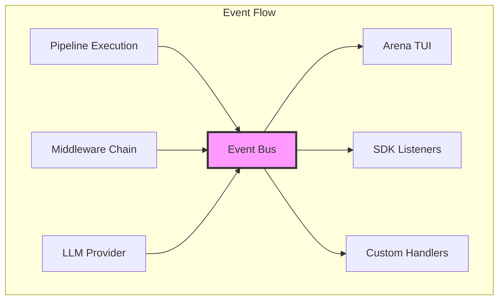

The PromptKit runtime event system provides comprehensive observability into pipeline execution through a unified pub/sub architecture. This enables real-time monitoring, debugging, and integration with external observability platforms.

## Overview

The event system emits detailed lifecycle events for every stage of pipeline execution, from initial request through final response. Unlike content streaming (which forwards LLM response chunks), events provide metadata about execution progress, performance metrics, and errors.



## Core Components

### Event Bus

The `EventBus` is a thread-safe pub/sub system that distributes events to registered listeners:

```go
// Create an event bus
bus := events.NewEventBus()

// Subscribe to specific event types
bus.Subscribe(events.EventPipelineStarted, func(e events.Event) {
    log.Printf("Pipeline started: %s", e.ConversationID)
})

// Subscribe to all events
bus.SubscribeAll(func(e events.Event) {
    metrics.RecordEvent(e.Type)
})
```

**Key Features:**
- **Asynchronous Delivery**: Events are delivered in goroutines to avoid blocking pipeline execution
- **Type-Safe Subscriptions**: Subscribe to specific event types or all events
- **Panic Recovery**: Listener panics are caught to prevent cascading failures
- **Thread-Safe**: Safe for concurrent use across multiple goroutines

### Event Emitter

The `Emitter` provides convenient methods for emitting events with consistent metadata:

```go
// Create an emitter with context identifiers
emitter := events.NewEmitter(bus, runID, sessionID, conversationID)

// Emit typed events
emitter.EmitPipelineStarted(middlewareCount)
emitter.EmitProviderCallCompleted(provider, model, duration, tokens, cost)
emitter.EmitMiddlewareFailed(name, index, err, duration)
```

The emitter automatically populates:
- `Timestamp`: When the event occurred
- `RunID`, `SessionID`, `ConversationID`: Context identifiers
- `Type`: Specific event type
- `Data`: Type-specific payload
- `Metadata`: Additional context (extensible)

### Event Types

Events are organized into several categories:

#### Pipeline Lifecycle

- `pipeline.started` - Pipeline execution begins
- `pipeline.completed` - Pipeline execution succeeds
- `pipeline.failed` - Pipeline execution fails

#### Middleware Execution

- `middleware.started` - Middleware begins processing
- `middleware.completed` - Middleware finishes successfully  
- `middleware.failed` - Middleware encounters an error

#### Provider Operations

- `provider.call.started` - LLM API call begins
- `provider.call.completed` - LLM API call succeeds (includes tokens, cost, duration)
- `provider.call.failed` - LLM API call fails

#### Tool Execution

- `tool.call.started` - Tool execution begins
- `tool.call.completed` - Tool execution succeeds
- `tool.call.failed` - Tool execution fails

#### Validation

- `validation.started` - Validation begins
- `validation.passed` - Validation succeeds
- `validation.failed` - Validation fails (includes violations)

#### Context & State

- `context.built` - Message context assembled (includes token counts)
- `context.token_budget_exceeded` - Token budget exceeded
- `state.loaded` - Conversation state loaded
- `state.saved` - Conversation state saved

#### Streaming

- `stream.interrupted` - Stream was interrupted (includes reason)

#### Conversation Lifecycle

- `conversation.started` - New conversation started (includes assembled system prompt)

#### Message Events

- `message.created` - New message added to conversation (includes role, content, index, tool calls/results)
- `message.updated` - Message metadata updated (includes latency, token counts, cost after completion)

#### Custom Events

Middleware can emit custom events for domain-specific observability:

```go
emitter.EmitCustom("middleware.cache.hit", events.CustomEventData{
    MiddlewareName: "cache",
    EventName: "cache_hit",
    Data: map[string]interface{}{
        "cache_key": key,
        "response_size": size,
    },
    Message: "Response retrieved from cache",
})
```

## Integration Points

### Pipeline Integration

The pipeline automatically creates an emitter and passes it through the execution context:

```go
// Pipeline creates emitter
emitter := events.NewEmitter(p.eventBus, runID, sessionID, conversationID)
ctx := &pipeline.ExecutionContext{
    EventEmitter: emitter,
    // ... other fields
}

// Emits lifecycle events
emitter.EmitPipelineStarted(len(p.middleware))
// ... execute middleware
emitter.EmitPipelineCompleted(duration, cost, tokens, messageCount)
```

### Middleware Integration

All built-in middleware emit lifecycle events:

```go
func (m *ContextBuilderMiddleware) Execute(ctx *ExecutionContext, next NextFunc) error {
    if ctx.EventEmitter != nil {
        ctx.EventEmitter.EmitMiddlewareStarted("context_builder", m.index)
    }
    
    start := time.Now()
    err := m.buildContext(ctx)
    duration := time.Since(start)
    
    if err != nil {
        if ctx.EventEmitter != nil {
            ctx.EventEmitter.EmitMiddlewareFailed("context_builder", m.index, err, duration)
        }
        return err
    }
    
    if ctx.EventEmitter != nil {
        ctx.EventEmitter.EmitMiddlewareCompleted("context_builder", m.index, duration)
    }
    
    return next(ctx)
}
```

### SDK Integration

The SDK exposes event listeners on conversations:

```go
// Create manager with event bus
manager, _ := sdk.NewConversationManager(
    sdk.WithProvider(provider),
    sdk.WithEventBus(eventBus),
)

// Add listener to conversation
conversation.AddEventListener(func(e *events.Event) {
    fmt.Printf("[%s] %s\n", e.Type, e.Timestamp)
})
```

### Arena TUI Integration

The Arena TUI uses an event adapter to convert events to bubbletea messages:

```go
// Subscribe to events and convert to TUI messages
adapter := tui.NewEventAdapter(bus, program)
adapter.Start()
```

## Use Cases

### Production Monitoring

Integrate with observability platforms:

```go
bus.SubscribeAll(func(e events.Event) {
    // Send to Datadog, New Relic, etc.
    datadog.SendEvent(map[string]interface{}{
        "type": string(e.Type),
        "timestamp": e.Timestamp,
        "conversation_id": e.ConversationID,
        "data": e.Data,
    })
})
```

### Cost Tracking

Monitor LLM costs in real-time:

```go
var totalCost float64
var mu sync.Mutex

bus.Subscribe(events.EventProviderCallCompleted, func(e events.Event) {
    data := e.Data.(events.ProviderCallCompletedData)
    mu.Lock()
    totalCost += data.Cost
    mu.Unlock()
    
    log.Printf("Call cost: $%.4f | Total: $%.4f", data.Cost, totalCost)
})
```

### Performance Profiling

Track middleware execution times:

```go
type MiddlewareStats struct {
    Name string
    TotalDuration time.Duration
    CallCount int
}

stats := make(map[string]*MiddlewareStats)

bus.Subscribe(events.EventMiddlewareCompleted, func(e events.Event) {
    data := e.Data.(events.MiddlewareCompletedData)
    
    if _, ok := stats[data.Name]; !ok {
        stats[data.Name] = &MiddlewareStats{Name: data.Name}
    }
    
    stats[data.Name].TotalDuration += data.Duration
    stats[data.Name].CallCount++
})
```

### Debug Tracing

Capture execution traces for debugging:

```go
var trace []events.Event

bus.SubscribeAll(func(e events.Event) {
    trace = append(trace, e)
})

// On error, dump trace
if err != nil {
    log.Printf("Execution trace:")
    for _, e := range trace {
        log.Printf("  [%s] %s: %+v", e.Timestamp, e.Type, e.Data)
    }
}
```

## Design Principles

### Asynchronous by Default

Events are delivered asynchronously to avoid impacting pipeline performance:

```go
func (eb *EventBus) Publish(event Event) {
    // Copy listeners while holding lock
    eb.mu.RLock()
    listeners := make([]Listener, len(eb.listeners[event.Type]))
    copy(listeners, eb.listeners[event.Type])
    eb.mu.RUnlock()
    
    // Execute asynchronously
    go func() {
        for _, listener := range listeners {
            safeInvoke(listener, event)
        }
    }()
}
```

### Lightweight Payloads

Events contain metadata and metrics, not full message payloads, to minimize memory overhead.

### Fail-Safe

Listener panics are caught to prevent cascading failures:

```go
func safeInvoke(listener Listener, event Event) {
    defer func() {
        if r := recover(); r != nil {
            log.Printf("Event listener panic: %v", r)
        }
    }()
    listener(event)
}
```

### Opt-In

The event system is optional - if no `EventEmitter` is provided, no events are emitted (zero overhead).

## Performance Considerations

- **Memory**: Events are ephemeral - not persisted by default
- **Concurrency**: Event bus uses read-write locks for optimal performance
- **Overhead**: Minimal when no listeners registered (~0ns per event)
- **Throughput**: Tested at >100k events/sec on modern hardware

## Future Enhancements

Potential future additions include:

1. **Event Filtering**: Predicate-based filtering at bus level
2. **Event Replay**: Capture and replay for debugging
3. **Event Persistence**: Optional logging to structured storage
4. **Event Aggregation**: Built-in metrics aggregation
5. **Remote Streaming**: OpenTelemetry, StatsD integration
6. **Event-driven Automation**: Circuit breakers, rate limiting

## References

- **Implementation**: `runtime/events/` package
- **Pipeline Integration**: `runtime/pipeline/pipeline.go`
- **Middleware Examples**: `runtime/pipeline/middleware/`
- **SDK Integration**: `sdk/conversation.go`
- **Example Program**: `sdk/examples/events/`