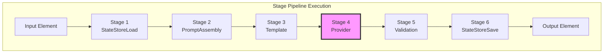
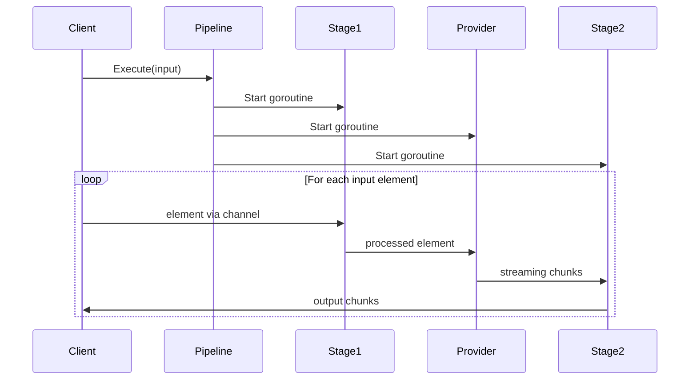
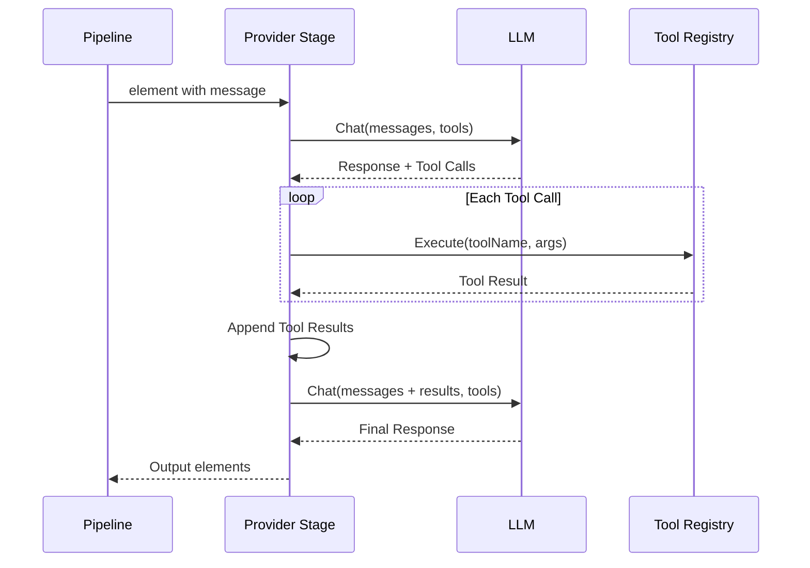
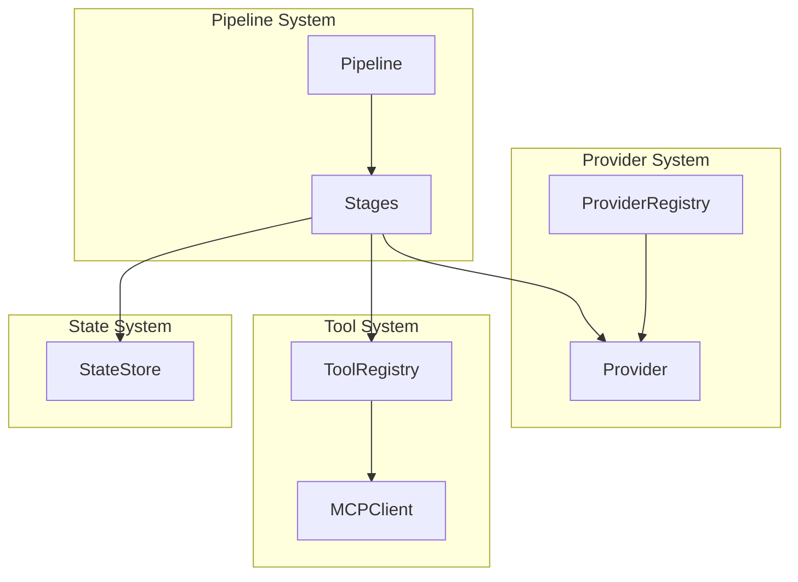

The PromptKit runtime pipeline is a stage-based streaming execution engine that processes LLM interactions through a composable DAG (Directed Acyclic Graph) of processing stages. This architecture provides flexibility, extensibility, true streaming execution, and concurrent processing.

## Overview

The pipeline system uses a reactive streams pattern where data flows through stages as `StreamElement` objects. Each stage runs in its own goroutine and communicates via channels, enabling true streaming with backpressure support.



## Core Concepts

### StreamElement

The fundamental unit of data flowing through the pipeline. Each element can carry multiple content types:

```go
type StreamElement struct {
    // Content types (mutually optional)
    Text     *string
    Audio    *AudioData
    Video    *VideoData
    Image    *ImageData
    Message  *types.Message
    ToolCall *types.ToolCall
    Parts    []types.ContentPart

    // Metadata for passing state between stages
    Metadata map[string]interface{}

    // Priority for QoS-aware scheduling
    Priority Priority  // Low, Normal, High, Critical

    // Control signals
    Error     error
    Timestamp time.Time
}
```

Helper functions for creating elements:

```go
textElem := stage.NewTextElement("Hello")
msgElem := stage.NewMessageElement(types.Message{Role: "user", Content: "Hello"})
audioElem := stage.NewAudioElement(&stage.AudioData{
    Samples:    audioBytes,
    SampleRate: 16000,
    Format:     stage.AudioFormatPCM16,
})
errorElem := stage.NewErrorElement(err)
```

### Stage Interface

A stage is a processing unit that transforms streaming elements:

```go
type Stage interface {
    Name() string
    Type() StageType
    Process(ctx context.Context, input <-chan StreamElement, output chan<- StreamElement) error
}
```

**Stage Types:**
- `Transform`: 1:1 or 1:N transformation (validation, enrichment)
- `Accumulate`: N:1 accumulation (VAD buffering, message collection)
- `Generate`: 0:N generation (LLM streaming, TTS)
- `Sink`: N:0 terminal stage (state store save, metrics)
- `Bidirectional`: Full duplex (WebSocket session)

Each stage:
- Runs in its own goroutine
- Receives elements from input channel
- Sends processed elements to output channel
- Must close output channel when done

### PipelineBuilder

Constructs the pipeline DAG using a fluent API:

```go
pipeline := stage.NewPipelineBuilder().
    Chain(
        stage.NewStateStoreLoadStage(stateConfig),
        stage.NewPromptAssemblyStage(registry, taskType, vars),
        stage.NewProviderStage(provider, toolRegistry, toolPolicy, config),
        stage.NewStateStoreSaveStage(stateConfig),
    ).
    Build()
```

### StreamPipeline

The executable pipeline that:
- Manages goroutine lifecycle
- Creates channels between stages
- Handles errors and shutdown
- Emits events for observability

```go
// Streaming execution
output, err := pipeline.Execute(ctx, input)
for elem := range output {
    // Process elements as they arrive
}

// Synchronous execution (convenience wrapper)
result, err := pipeline.ExecuteSync(ctx, elements...)
```

## Standard Stages

### Core Stages

#### 1. StateStoreLoadStage

**Purpose**: Loads conversation history from persistent storage.

**Behavior**:
- Retrieves previous messages for the conversation ID
- Marks historical messages with `from_history` metadata
- Prepends history to current conversation

**Configuration**:
```go
stateConfig := &pipeline.StateStoreConfig{
    Store:          stateStore,
    ConversationID: "session-123",
}
loadStage := stage.NewStateStoreLoadStage(stateConfig)
```

#### 2. PromptAssemblyStage

**Purpose**: Loads and assembles prompts from the registry with variable substitution.

**Behavior**:
- Loads prompt configuration by task type
- Applies variable substitution to templates
- Extracts validator configurations
- Sets `system_prompt` and `allowed_tools` in metadata

**Configuration**:
```go
assemblyStage := stage.NewPromptAssemblyStage(
    promptRegistry,
    "customer-support",  // task type
    map[string]string{   // variables
        "customer_name": "Alice",
    },
)
```

#### 3. TemplateStage

**Purpose**: Processes template variables in content.

**Behavior**:
- Substitutes `{{variable}}` patterns with values
- Processes both system prompt and message content
- Reads variables from element metadata

#### 4. ProviderStage

**Purpose**: Executes LLM calls with streaming and tool support.

**Behavior**:
- Calls the configured LLM provider
- Handles multi-round tool execution loops
- Supports both streaming and non-streaming modes
- Enforces tool policies (blocklist, ToolChoice)
- Tracks token usage and latency

**Configuration**:
```go
providerConfig := &stage.ProviderConfig{
    MaxTokens:   1000,
    Temperature: 0.7,
}
providerStage := stage.NewProviderStage(
    provider,
    toolRegistry,
    toolPolicy,
    providerConfig,
)
```

#### 5. ValidationStage

**Purpose**: Validates responses against schemas and constraints.

**Behavior**:
- Runs validators specified in metadata
- Supports multiple validators in sequence
- Can suppress or propagate validation errors

#### 6. StateStoreSaveStage

**Purpose**: Persists conversation state after processing.

**Behavior**:
- Saves new messages to the state store
- Merges metadata from the conversation
- Updates conversation state for continuity

### Streaming/Speech Stages

#### VADAccumulatorStage

**Purpose**: Voice activity detection and audio buffering.

**Behavior**:
- Buffers audio chunks until speech ends
- Detects speech start/stop using VAD
- Transcribes buffered audio to text

#### AudioTurnStage

**Purpose**: Comprehensive turn detection for voice applications.

**Behavior**:
- Voice activity detection (VAD)
- Turn boundary detection
- Audio accumulation
- Interruption detection (shared with TTS)

**Configuration**:
```go
config := stage.AudioTurnConfig{
    SilenceDuration:   800 * time.Millisecond,
    MinSpeechDuration: 200 * time.Millisecond,
    MaxTurnDuration:   30 * time.Second,
    SampleRate:        16000,
}
turnStage, _ := stage.NewAudioTurnStage(config)
```

#### STTStage

**Purpose**: Speech-to-text transcription.

**Behavior**:
- Transcribes audio elements to text
- Configurable language and minimum audio length
- Skips empty or too-short audio

#### TTSStage / TTSStageWithInterruption

**Purpose**: Text-to-speech synthesis.

**Behavior**:
- Synthesizes audio for text elements
- `TTSStageWithInterruption` supports barge-in detection
- Configurable voice and speed

#### DuplexProviderStage

**Purpose**: Bidirectional WebSocket streaming for native audio LLMs.

**Behavior**:
- Concurrent input/output forwarding
- StreamElement to StreamChunk conversion
- Used with Gemini Live API and similar

### Advanced Stages

#### RouterStage

**Purpose**: Dynamic routing to multiple output paths.

**Behavior**:
- Routes elements based on configurable functions
- Multiple output channel support
- Thread-safe output management

#### MergeStage

**Purpose**: Fan-in pattern for combining multiple streams.

**Behavior**:
- Merges N input channels to 1 output
- Adds `merge_input_index` metadata
- Concurrent processing of inputs

#### MetricsStage

**Purpose**: Per-stage performance monitoring.

**Behavior**:
- Tracks latency (min/max/avg)
- Tracks throughput and error counts
- Transparent wrapper pattern

#### TracingStage

**Purpose**: Distributed tracing support.

**Behavior**:
- Generates trace IDs
- Records per-stage timing
- Propagates trace context through pipeline

### Utility Stages

#### DebugStage

**Purpose**: Pipeline debugging and inspection.

**Behavior**:
- Logs element details as JSON
- Configurable output destination
- Useful for development

#### VariableProviderStage

**Purpose**: Dynamic variable resolution.

**Behavior**:
- Resolves variables from multiple providers
- Adds resolved values to metadata
- Supports async variable sources

#### MediaExternalizerStage

**Purpose**: External storage for large media content.

**Behavior**:
- Uploads large media to external storage
- Replaces inline data with URLs
- Configurable size thresholds

#### ContextBuilderStage

**Purpose**: Token budget management.

**Behavior**:
- Enforces token limits on conversation context
- Supports truncation strategies (sliding window, summarization)
- Prevents context overflow

## Pipeline Modes

The SDK supports three pipeline configurations for different use cases:

### Text Mode

Standard HTTP-based LLM interactions:

```
Input → StateStoreLoad → VariableProvider → PromptAssembly → Template → Provider → Validation → StateStoreSave → Output
```

**Use Cases**: Chat applications, content generation, text processing

### VAD Mode (Voice Activity Detection)

For voice applications without native audio LLM support:

```
Input → StateStoreLoad → VariableProvider → PromptAssembly → Template → AudioTurn → STT → Provider → TTS → Validation → StateStoreSave → Output
```

**Use Cases**: Voice assistants using text-based LLMs, telephony integrations

### ASM Mode (Audio Streaming Mode)

For native multimodal LLMs with real-time audio:

```
Input → StateStoreLoad → VariableProvider → PromptAssembly → Template → DuplexProvider → Validation → StateStoreSave → Output
```

**Use Cases**: Gemini Live API, real-time voice conversations

## Execution Modes

### Streaming Execution

Elements flow through the pipeline as they're produced:



**Use Cases**: Interactive chat, real-time applications, progressive display

### Synchronous Execution

Convenience wrapper that collects all output:

```go
result, err := pipeline.ExecuteSync(ctx, inputElement)
// result.Response contains the final response
// result.Messages contains all messages
```

**Use Cases**: Batch processing, testing, simple request/response

## Multi-Round Tool Execution

The ProviderStage handles complex tool calling scenarios:



**Features**:
- Automatic tool call detection
- Parallel tool execution
- Round limit enforcement (default: 10 rounds)
- Tool policy enforcement

## Configuration

### Pipeline Configuration

```go
config := stage.DefaultPipelineConfig().
    WithChannelBufferSize(32).           // Larger buffers for throughput
    WithPriorityQueue(true).             // Enable priority scheduling
    WithExecutionTimeout(60 * time.Second).
    WithMetrics(true).                   // Enable per-stage metrics
    WithTracing(true)                    // Enable element-level tracing

pipeline := stage.NewPipelineBuilderWithConfig(config).
    Chain(stages...).
    Build()
```

### Default Configuration Values

| Setting | Default | Description |
|---------|---------|-------------|
| ChannelBufferSize | 16 | Buffer size for inter-stage channels |
| ExecutionTimeout | 30s | Maximum pipeline execution time |
| GracefulShutdownTimeout | 10s | Timeout for graceful shutdown |
| PriorityQueue | false | Enable priority-based scheduling |
| Metrics | false | Enable per-stage metrics collection |
| Tracing | false | Enable distributed tracing |

## Error Handling

### Error Propagation

Errors can be sent as error elements or returned from Process:

```go
func (s *MyStage) Process(ctx context.Context, input <-chan StreamElement, output chan<- StreamElement) error {
    defer close(output)

    for elem := range input {
        if err := s.process(elem); err != nil {
            // Option 1: Send error element and continue
            output <- stage.NewErrorElement(err)
            continue

            // Option 2: Return error to stop pipeline
            // return err
        }
        output <- elem
    }
    return nil
}
```

### Context Cancellation

All stages should respect context cancellation:

```go
select {
case output <- elem:
    // Element sent successfully
case <-ctx.Done():
    return ctx.Err()  // Pipeline cancelled
}
```

## Creating Custom Stages

### Basic Pattern

```go
type MyStage struct {
    stage.BaseStage
    config MyConfig
}

func NewMyStage(config MyConfig) *MyStage {
    return &MyStage{
        BaseStage: stage.NewBaseStage("my_stage", stage.StageTypeTransform),
        config:    config,
    }
}

func (s *MyStage) Process(
    ctx context.Context,
    input <-chan stage.StreamElement,
    output chan<- stage.StreamElement,
) error {
    defer close(output)  // Always close output when done

    for elem := range input {
        // Transform the element
        if elem.Text != nil {
            transformed := strings.ToUpper(*elem.Text)
            elem.Text = &transformed
        }

        // Send to output with cancellation check
        select {
        case output <- elem:
        case <-ctx.Done():
            return ctx.Err()
        }
    }

    return nil
}
```

### Stage Type Guidelines

| Stage Type | Input | Output | Use When |
|------------|-------|--------|----------|
| Transform | 1 | 1 or more | Modifying or enriching elements |
| Accumulate | Many | 1 | Buffering until condition met |
| Generate | 0 or 1 | Many | Producing streaming output |
| Sink | Many | 0 | Terminal processing (save, log) |
| Bidirectional | Varies | Varies | Full duplex communication |

## Performance Considerations

### Optimization Strategies

1. **Stage Ordering**: Place fast-failing stages early
2. **Channel Buffer Sizing**: Balance memory vs. throughput
3. **Concurrent Execution**: Stages run in parallel by default
4. **Backpressure**: Slow consumers naturally slow producers

### Monitoring Metrics

Key metrics to track:
- **Stage Duration**: Time spent in each stage
- **Element Throughput**: Elements per second
- **Error Rates**: Failures by stage and type
- **Channel Utilization**: Buffer fill levels

## Integration with Other Components



The pipeline integrates with:
- **Provider System**: For LLM interactions (see [Provider Architecture](./runtime-providers))
- **Tool System**: For tool execution (see [Tool & MCP Architecture](./runtime-tools-mcp))
- **State System**: For conversation persistence
- **Validation System**: For response validation

## Best Practices

1. **Always Close Output**: Use `defer close(output)` at the start of Process
2. **Respect Context**: Check `ctx.Done()` in long-running operations
3. **Use Metadata**: Pass state between stages via element metadata
4. **Handle Errors Gracefully**: Decide between error elements and fatal errors
5. **Keep Stages Focused**: Each stage should have a single responsibility
6. **Test Independently**: Unit test each stage with mock channels

---

**Related Documentation**:
- [Provider System Architecture](./runtime-providers)
- [Tool & MCP Integration Architecture](./runtime-tools-mcp)
- [System Overview](./system-overview)
