# CI/CD Architecture Diagram

Visual overview of the PromptKit CI/CD pipeline structure.

## Pipeline Flow

## Trigger Paths

```mermaid
graph LR
    A[Git Events] --> B{File Changed?}
    
    B -->|*.go, go.mod| C[CI Pipeline]
    B -->|docs/**| D[Docs Pipeline]
    B -->|release-test/*| E[Release Test]
    
    C --> F[All Jobs in Parallel]
    D --> G[Build → Deploy]
    E --> H[Validation Only]
    
    I[Manual Workflow Dispatch] -.-> D
    I -.-> E
    
    style A fill:#e1f5ff
    style C fill:#ffe1e1
    style D fill:#e1ffe1
    style E fill:#fff4e1
```

## Job Dependencies

## Coverage Flow

## Release Test Flow

## Secret & Permission Flow

## Deployment Architecture

## Quality Gate Flow

## Legend

### Node Colors

- 🔵 **Light Blue** - Triggers/Inputs
- 🔴 **Light Red** - External Services
- 🟢 **Light Green** - Outputs/Success
- 🟡 **Light Yellow** - Important/Decision Points

### Line Styles

- **Solid Line** (→) - Direct flow/dependency
- **Dashed Line** (⇢) - Optional/manual trigger
- **Dotted Line** (···>) - No dependency (parallel)

## Diagram Usage

These diagrams can be:
- Viewed in GitHub (Mermaid support built-in)
- Rendered in VS Code (with Mermaid extension)
- Exported to PNG/SVG for presentations
- Embedded in documentation sites

## Updating Diagrams

When workflows change, update the relevant diagram:

1. Edit the Mermaid code block
2. Test rendering locally or on GitHub
3. Update corresponding pipeline documentation
4. Commit changes together

## Tools

- **Mermaid Live Editor:** https://mermaid.live/
- **VS Code Extension:** Markdown Preview Mermaid Support
- **GitHub:** Native Mermaid rendering in markdown files

---

*Last Updated: 2 November 2025*
