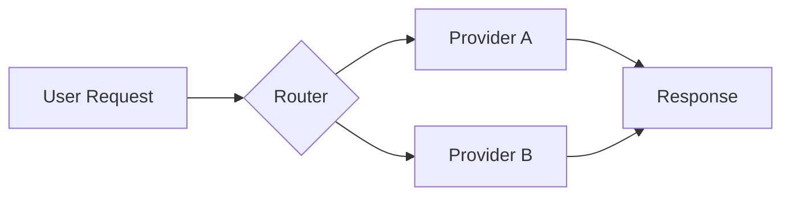
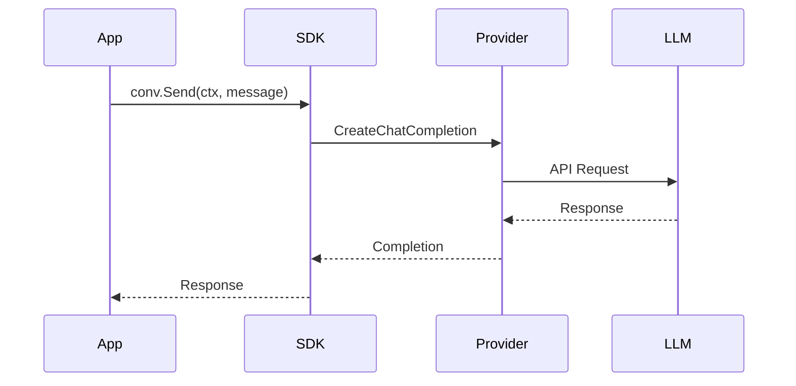
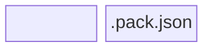

This page demonstrates the diagramming options available for PromptKit documentation.

## Mermaid Diagrams

Mermaid is great for flowcharts, sequence diagrams, and state diagrams.

### Flowchart



### Sequence Diagram



### Block Diagram (Beta)



## D2 Diagrams

D2 excels at architecture and block diagrams with nested containers.

### Simple Flow

```d2
YAML Sources -> PackC -> ".pack.json"
```

### Layered Architecture

```d2
direction: down

Application: {
  Code: "conv.Send(ctx, msg)"
}

SDK Layer: {
  PackLoader
  Conversation
  Hooks
}

Runtime Layer: {
  Providers
  Pipeline
  Tools
}

Application -> SDK Layer -> Runtime Layer
```

### Component Diagram

```d2
PromptKit: {
  Arena: Testing Framework {
    Tests
    Assertions
    Reporters
  }

  SDK: Go Library {
    PackLoader
    Conversation
    Hooks
  }

  PackC: Compiler {
    Parser
    Validator
    Bundler
  }

  Runtime: Core Engine {
    Pipeline
    Providers
    Tools
  }
}

User -> PromptKit.Arena: Test prompts
User -> PromptKit.SDK: Build apps
PromptKit.PackC -> PromptKit.SDK: .pack.json
PromptKit.SDK -> PromptKit.Runtime: Execute
```

### With Styling

```d2
direction: right

sources: YAML Sources {
  style.fill: "#e1f5fe"
}

compiler: PackC {
  style.fill: "#fff3e0"
}

output: .pack.json {
  style.fill: "#e8f5e9"
}

sources -> compiler -> output
```

## When to Use Each

| Diagram Type | Best For |
|--------------|----------|
| **Mermaid Flowchart** | Simple process flows, decision trees |
| **Mermaid Sequence** | API interactions, message passing |
| **Mermaid State** | State machines, lifecycle diagrams |
| **D2 Block** | Layered architecture, nested components |
| **D2 Component** | System overviews, module relationships |

## Syntax Reference

- **Mermaid**: [mermaid.js.org](https://mermaid.js.org/)
- **D2**: [d2lang.com](https://d2lang.com/)
