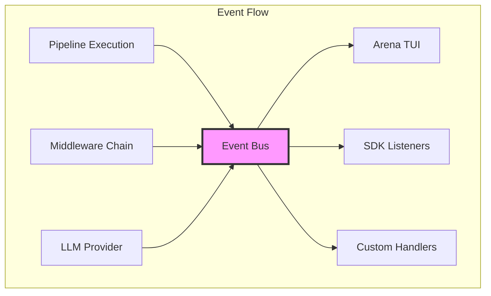

The PromptKit runtime event system provides comprehensive observability into pipeline execution through a unified pub/sub architecture. This enables real-time monitoring, debugging, and integration with external observability platforms.

## Overview

The event system emits detailed lifecycle events for every stage of pipeline execution, from initial request through final response. Unlike content streaming (which forwards LLM response chunks), events provide metadata about execution progress, performance metrics, and errors.



## Core Components

### Event Bus

The `EventBus` is a thread-safe pub/sub system that distributes events to registered listeners:

```go
// Create an event bus
bus := events.NewEventBus()

// Subscribe to specific event types
bus.Subscribe(events.EventPipelineStarted, func(e *events.Event) {
    log.Printf("Pipeline started: %s", e.ConversationID)
})

// Subscribe to all events
bus.SubscribeAll(func(e *events.Event) {
    metrics.RecordEvent(e.Type)
})
```

**Key Features:**
- **Asynchronous Delivery**: Events are delivered in goroutines to avoid blocking pipeline execution
- **Type-Safe Subscriptions**: Subscribe to specific event types or all events
- **Panic Recovery**: Listener panics are caught to prevent cascading failures
- **Thread-Safe**: Safe for concurrent use across multiple goroutines

### Event Emitter

The `Emitter` provides convenient methods for emitting events with consistent metadata:

```go
// Create an emitter with context identifiers
emitter := events.NewEmitter(bus, runID, sessionID, conversationID)

// Emit typed events
emitter.EmitPipelineStarted(middlewareCount)
emitter.EmitProviderCallCompleted(provider, model, duration, tokens, cost)
emitter.EmitMiddlewareFailed(name, index, err, duration)
```

The emitter automatically populates:
- `Timestamp`: When the event occurred
- `Sequence`: Monotonic counter assigned at publish time (for consumer-side ordering)
- `RunID`, `SessionID`, `ConversationID`: Context identifiers
- `UserID`: Pseudonymous user identifier (set via `emitter.WithUserID()`)
- `Type`: Specific event type
- `Data`: Type-specific payload

### Event Types

Events are organized into several categories:

#### Pipeline Lifecycle

- `pipeline.started` - Pipeline execution begins
- `pipeline.completed` - Pipeline execution succeeds
- `pipeline.failed` - Pipeline execution fails

#### Middleware Execution

- `middleware.started` - Middleware begins processing
- `middleware.completed` - Middleware finishes successfully  
- `middleware.failed` - Middleware encounters an error

#### Provider Operations

- `provider.call.started` - LLM API call begins
- `provider.call.completed` - LLM API call succeeds (includes tokens, cost, duration)
- `provider.call.failed` - LLM API call fails

#### Tool Execution

- `tool.call.started` - Tool execution begins
- `tool.call.completed` - Tool execution succeeds (status: `"complete"`, `"pending"`, etc.)
- `tool.call.failed` - Tool execution fails

#### Client Tool Lifecycle

Client-mode tools (fulfilled on the caller's device) emit additional events to track the deferred execution lifecycle:

- `tool.client.request` - Client tool awaiting caller fulfillment (emitted when the tool returns `ToolStatusPending`)
- `tool.client.resolved` - Client tool resolved by the caller (emitted during `Resume`/`ResumeStream`)

The full lifecycle for a deferred client tool:

1. `tool.call.started` — tool execution begins
2. `tool.client.request` — tool is pending, awaiting caller (includes consent message, categories)
3. `tool.call.completed` (status: `"pending"`) — matches the started event
4. *(Caller fulfills via `SendToolResult` / `RejectClientTool`)*
5. `tool.client.resolved` (status: `"fulfilled"` | `"rejected"` | `"error"`) — emitted during `Resume`

For synchronous client tools (handler registered via `OnClientTool`), only `tool.call.started` and `tool.call.completed` (status: `"complete"`) are emitted — no client-specific events.

#### Validation

- `validation.started` - Validation begins
- `validation.passed` - Validation succeeds
- `validation.failed` - Validation fails (includes violations, enforcement status, score)

Guardrail hooks in the provider stage emit `validation.passed` or `validation.failed` events automatically. The `ValidationEventData` payload includes:

- `Direction` — `"input"` (pre-call) or `"output"` (post-call)
- `Enforced` — whether content was modified (truncated or replaced) or the call was blocked
- `Score` — evaluation score (0.0–1.0)

#### Eval Results

- `eval.completed` - An eval, assertion or guardrail produced a result
- `eval.failed` - The handler errored

`EvalEventData` carries three things a consumer must not conflate:

| Field | Meaning |
|-------|---------|
| `Kind` | The ROLE: `eval`, `assertion` or `guardrail` |
| `Passed` | The boolean — **only** ever set for an assertion or a guardrail |
| `Value` / `MetricValue` / `Score` | What the eval measured |

An **eval** measures and returns a value; it does not pass or fail, and its
`Passed` is always nil. Only a role that coerces that measurement to a
boolean — an **assertion** (score against thresholds) or a **guardrail** (the
same shape, used to gate rather than to report) — states one.

Do not derive the boolean yourself. `Passed` was once computed from
`score >= 1.0`, which reported an `llm_judge` scoring 0.9 as FAILED: that
threshold is the *assertion's default*, applied to something nobody asserted on.
A nil `Passed` on `Kind: eval` means "this kind of thing has no pass/fail", not
"it failed" and not "we don't know".

`Value` is the handler's own output — a rubric's per-criterion map, a
classifier's label, a reasoning service's JSON. It is bounded by
`events.MaxEvalValueBytes`; a value too large to carry is dropped and
`ValueOmitted` is set, so a consumer can tell that from an eval that produced
none. Producers set it with `SetValue`, never by assignment.

#### Prompt Template

- `prompt.template.started` - Template rendering begins (includes raw template, variable count, model override)
- `prompt.template.rendered` - Template rendering succeeds (includes rendered prompt, prompt hash, variables used/unused, fragments, render passes)
- `prompt.template.failed` - Template rendering fails (includes error, unresolved placeholders)

The `TemplateRenderedData` payload includes:

- `TaskType` — which prompt was rendered
- `SystemPrompt` — the final rendered system prompt
- `PromptHash` — SHA-256 hash for deduplication/comparison
- `VariablesUsed` — variables that were actually substituted (key→value)
- `UnusedVariables` — variables available but not referenced in the template
- `FragmentsUsed` — fragment names that contributed variables
- `RenderPasses` — number of recursive substitution passes needed

```go
bus.Subscribe(events.EventTemplateRendered, func(e *events.Event) {
    data := e.Data.(*events.TemplateRenderedData)
    log.Printf("Prompt rendered: task=%s hash=%s vars_used=%d passes=%d",
        data.TaskType, data.PromptHash[:8], len(data.VariablesUsed), data.RenderPasses)
})
```

#### Context & State

- `context.built` - Message context assembled (includes token counts)
- `context.token_budget_exceeded` - Token budget exceeded
- `context.compacted` - Context compactor folded stale tool results during a tool loop round. Payload: `ContextCompactionData` with `Round`, `OriginalTokens`, `CompactedTokens`, `MessagesFolded`, `BudgetTokens`.
- `state.loaded` - Conversation state loaded
- `state.saved` - Conversation state saved

#### Streaming

- `stream.interrupted` - Stream was interrupted (includes reason)

#### Conversation Lifecycle

- `conversation.started` - New conversation started (includes assembled system prompt)

#### Message Events

- `message.created` - New message added to conversation (includes role, content, index, tool calls/results)
- `message.updated` - Message metadata updated (includes latency, token counts, cost after completion)

`message.created` is carried by **two routes with different guarantees**, and
which one a consumer is on changes what it receives:

| Producer | Delivery | Binary content parts | Requires |
|----------|----------|----------------------|----------|
| `MessageBroadcastStage` → EventBus | async, worker-pooled, **lossy** | stripped to metadata | an event bus |
| `RecordingStage` → `EventStore.Append` | synchronous, **lossless** | retained in full | `WithRecording()` + an `EventStore` |

Both build the payload with `events.NewMessageCreatedData`, so `Parts` is the
only difference. `Index` is transcript-absolute on both. Because the bus makes
no ordering promise — it dispatches through a worker pool — subscribers should
order by `Index` rather than by arrival.

:::tip[Read `GetContent()`, not `.Content`]
A user message carries its text in `Parts` with `Content` empty; an assistant
reply is the reverse. `GetContent()` applies the canonical precedence — tool
result, then text parts, then `Content`.
:::

:::note[Fragments have their own types]
`message.created` once doubled as the carrier for things that are not messages.
Those now have dedicated types on the recording route:

| Recorded thing | Event |
|---|---|
| streaming text fragment | `message.text.delta` |
| image | `image.input` / `image.output` |
| video frame | `video.frame` |

Recordings written before this change still hold the old shapes, so a reader
that must handle historical sessions should tolerate both.
:::

#### Custom Events

Middleware can emit custom events for domain-specific observability:

```go
emitter.EmitCustom("middleware.cache.hit", events.CustomEventData{
    MiddlewareName: "cache",
    EventName: "cache_hit",
    Data: map[string]interface{}{
        "cache_key": key,
        "response_size": size,
    },
    Message: "Response retrieved from cache",
})
```

### Ordering and nesting

This page lists event *types*; it deliberately does not restate their order. Provider and
tool events are emitted inside a round loop that can repeat many times per turn, and a
turn can run several provider stages. See [The Hook System](/sdk/explanation/hooks/#execution-ordering)
for the canonical timeline showing where each event sits relative to the hooks.

## Integration Points

### Pipeline Integration

The pipeline automatically creates an emitter and passes it through the execution context:

```go
// Pipeline creates emitter
emitter := events.NewEmitter(p.eventBus, runID, sessionID, conversationID)
ctx := &pipeline.ExecutionContext{
    EventEmitter: emitter,
    // ... other fields
}

// Emits lifecycle events
emitter.EmitPipelineStarted(len(p.middleware))
// ... execute middleware
emitter.EmitPipelineCompleted(duration, cost, tokens, messageCount)
```

### Middleware Integration

All built-in middleware emit lifecycle events:

```go
func (m *ContextBuilderMiddleware) Execute(ctx *ExecutionContext, next NextFunc) error {
    if ctx.EventEmitter != nil {
        ctx.EventEmitter.EmitMiddlewareStarted("context_builder", m.index)
    }
    
    start := time.Now()
    err := m.buildContext(ctx)
    duration := time.Since(start)
    
    if err != nil {
        if ctx.EventEmitter != nil {
            ctx.EventEmitter.EmitMiddlewareFailed("context_builder", m.index, err, duration)
        }
        return err
    }
    
    if ctx.EventEmitter != nil {
        ctx.EventEmitter.EmitMiddlewareCompleted("context_builder", m.index, duration)
    }
    
    return next(ctx)
}
```

### SDK Integration

The SDK exposes event listeners via the `hooks` package:

```go
conv, _ := sdk.Open("./assistant.pack.json", "chat",
    sdk.WithModel("gpt-4o-mini"),
)
defer conv.Close()

// Subscribe to all events
hooks.OnEvent(conv, func(e *events.Event) {
    fmt.Printf("[%s] %s\n", e.Type, e.Timestamp)
})

// Subscribe to a specific event type
hooks.On(conv, events.EventToolCallStarted, func(e *events.Event) {
    fmt.Printf("Tool call: %+v\n", e.Data)
})
```

### Arena TUI Integration

The Arena TUI uses an event adapter to convert events to bubbletea messages:

```go
// Subscribe to events and convert to TUI messages
adapter := tui.NewEventAdapter(bus, program)
adapter.Start()
```

## Use Cases

### Production Monitoring

Integrate with observability platforms:

```go
bus.SubscribeAll(func(e *events.Event) {
    // Send to Datadog, New Relic, etc.
    datadog.SendEvent(map[string]interface{}{
        "type": string(e.Type),
        "timestamp": e.Timestamp,
        "conversation_id": e.ConversationID,
        "data": e.Data,
    })
})
```

### Cost Tracking

Monitor LLM costs in real-time:

```go
var totalCost float64
var mu sync.Mutex

bus.Subscribe(events.EventProviderCallCompleted, func(e *events.Event) {
    data := e.Data.(events.ProviderCallCompletedData)
    mu.Lock()
    totalCost += data.Cost
    mu.Unlock()

    log.Printf("Call cost: $%.4f | Total: $%.4f", data.Cost, totalCost)
})
```

### Performance Profiling

Track middleware execution times:

```go
type MiddlewareStats struct {
    Name string
    TotalDuration time.Duration
    CallCount int
}

stats := make(map[string]*MiddlewareStats)

bus.Subscribe(events.EventMiddlewareCompleted, func(e *events.Event) {
    data := e.Data.(events.MiddlewareCompletedData)
    
    if _, ok := stats[data.Name]; !ok {
        stats[data.Name] = &MiddlewareStats{Name: data.Name}
    }
    
    stats[data.Name].TotalDuration += data.Duration
    stats[data.Name].CallCount++
})
```

### Debug Tracing

Capture execution traces for debugging:

```go
var trace []*events.Event

bus.SubscribeAll(func(e *events.Event) {
    trace = append(trace, e)
})

// On error, dump trace
if err != nil {
    log.Printf("Execution trace:")
    for _, e := range trace {
        log.Printf("  [%s] %s: %+v", e.Timestamp, e.Type, e.Data)
    }
}
```

## Design Principles

### Asynchronous, and lossy on purpose

`Publish` hands the event to a buffered channel drained by a worker pool. It
never blocks the pipeline, and it **returns `false` when the event was dropped**
because the buffer was full:

```go
func (eb *EventBus) Publish(event *Event) bool {
    event.Sequence = eb.seq.Add(1)

    select {
    case eb.eventCh <- event:
        return true
    default:
        // Buffer full: drop rather than block the caller. Logged, rate-limited.
        return false
    }
}
```

Two consequences a consumer must design around:

- **Delivery is not guaranteed.** Under burst, events are dropped so
  observability never stalls the pipeline. Anything that must be complete —
  a transcript, an audit trail — reads the state store or a recording, not the
  bus.
- **Arrival order is not publish order.** A pool of workers drains the channel,
  so listeners can receive out of order. `Event.Sequence` is a monotonic
  per-bus counter for reassembling that; for conversation position use
  `MessageCreatedData.Index`, which is transcript-absolute.

### No BINARY on the bus, ever

Events never carry binary payloads — audio samples, image and video bytes,
base64 blobs. This is a hard rule, not a preference: a megabyte of base64 per
turn would swamp a bus whose whole job is to stay out of the pipeline's way.

**Text and structured content are a different matter.** Message content, an
eval's structured value, a judge's reasoning — these are the substance a live
consumer needs, and withholding them would make the bus useless for the things
it exists to serve. They travel, subject to two conditions: a size bound, so one
pathological payload cannot swamp the channel, and redaction, because they carry
customer data. An omitted-because-too-large payload always says so, so a
consumer can tell it from one that was never there.

Handling binary is precisely what the **opt-in recording route** exists for.
`RecordingStage` writes straight to an `EventStore` and never publishes, so
turning recording on does not start putting payloads on the bus.

The API enforces it structurally: `events.Emitter` — the only thing that
publishes — has no method that accepts raw bytes, and `BinaryPayload` is
constructed only by the recording stage and the blob store. A bus subscriber
sees MIME type, dimensions, size and URL references; never the bytes.

Guarded by `TestMessageBroadcastStage_NeverPutsBinaryOnTheBus`, its
recording-side sibling, and `TestAudioTelemetry_NeverPublishesToBus`.

### Fail-Safe

Listener panics are caught to prevent cascading failures:

```go
func safeInvoke(listener Listener, event *Event) {
    defer func() {
        if r := recover(); r != nil {
            log.Printf("Event listener panic: %v", r)
        }
    }()
    listener(event)
}
```

### Opt-In

The event system is optional - if no `EventEmitter` is provided, no events are emitted (zero overhead).

## Adding a new event

Four decisions, in order. Each of them has been got wrong at least once, and
each mistake was silent — the code compiled, the tests passed, and a consumer
received nothing or the wrong thing.

### 1. Which route does it take?

| | Bus (`Emitter` → `EventBus`) | Recording (`RecordingStage` → `EventStore`) |
|---|---|---|
| Delivery | async, worker-pooled, **lossy** | synchronous, **lossless** |
| Payload | metadata only | full binary retained |
| Availability | wherever an emitter is configured | opt-in: `WithRecording` + an `EventStore` |
| Purpose | observability, live views | replay, audit |

An event may take **both** — `message.created` does — but then both producers
must build the payload through **one shared constructor**, so the two cannot
drift. `events.NewMessageCreatedData` is the worked example; before it existed,
the recording route silently omitted `Index` while the bus route set it.

### 2. Does it carry binary?

Then it does not go on the bus — see *No binary on the bus* above. Text and
structured content may, bounded and redactable; raw bytes may not, and the
recording route exists for them.

### 3. Is it actually the thing the type name says?

A fragment is not a message. `message.created` once carried a streaming token,
and JSON blobs of image and video metadata, alongside real messages — so a
consumer reading `Content` got message text, half a word, or a description of a
JPEG, with no way to tell which. Worse, `media_timeline` filters on
`video.frame`, so frames recorded under the wrong type were invisible to it.

Give it its own type. `message.text.delta`, `image.input` / `image.output` and
`video.frame` exist for exactly this reason.

### 4. Who can actually receive it?

`runtime/pipeline/stage/event_route_boundary_test.go` holds two lists: the types
an ordinary consumer receives, and the types that reach only a store. Adding a
type without listing it, or listing it on the wrong side, fails that test.

Check the list before assuming a consumer can subscribe to your event. And note
that "nothing in this repo calls it" is **not** evidence a producer or consumer
is unused — PromptKit ships libraries, and its largest consumer is a separate
repository.

## Performance Considerations

- **Memory**: Events are ephemeral - not persisted by default
- **Concurrency**: Event bus uses read-write locks for optimal performance
- **Overhead**: Minimal when no listeners registered (~0ns per event)
- **Throughput**: Tested at >100k events/sec on modern hardware

## Future Enhancements

Potential future additions include:

1. **Event Filtering**: Predicate-based filtering at bus level
2. **Event Replay**: Capture and replay for debugging
3. **Event Persistence**: Optional logging to structured storage
4. **Event Aggregation**: Built-in metrics aggregation
5. **Remote Streaming**: OpenTelemetry, StatsD integration
6. **Event-driven Automation**: Circuit breakers, rate limiting

## References

- **Implementation**: `runtime/events/` package
- **Pipeline Integration**: `runtime/pipeline/pipeline.go`
- **Middleware Examples**: `runtime/pipeline/middleware/`
- **SDK Integration**: `sdk/conversation.go`
- **Example Program**: `sdk/examples/events/`