The PromptKit tool system enables LLMs to interact with external systems through a flexible, extensible architecture. Native support for the Model Context Protocol (MCP) allows integration with a growing ecosystem of tool servers while maintaining backward compatibility with standalone tool definitions.

## Overview

The tool system bridges the gap between LLM reasoning and real-world actions. It provides:

- **Unified Tool Interface**: Consistent abstraction across different execution modes
- **MCP Integration**: Native support for Model Context Protocol servers
- **Flexible Execution**: Mock, HTTP, and MCP-based executors
- **Schema Validation**: JSON Schema-based argument and result validation
- **Kubernetes-Style Configuration**: Familiar YAML manifest format

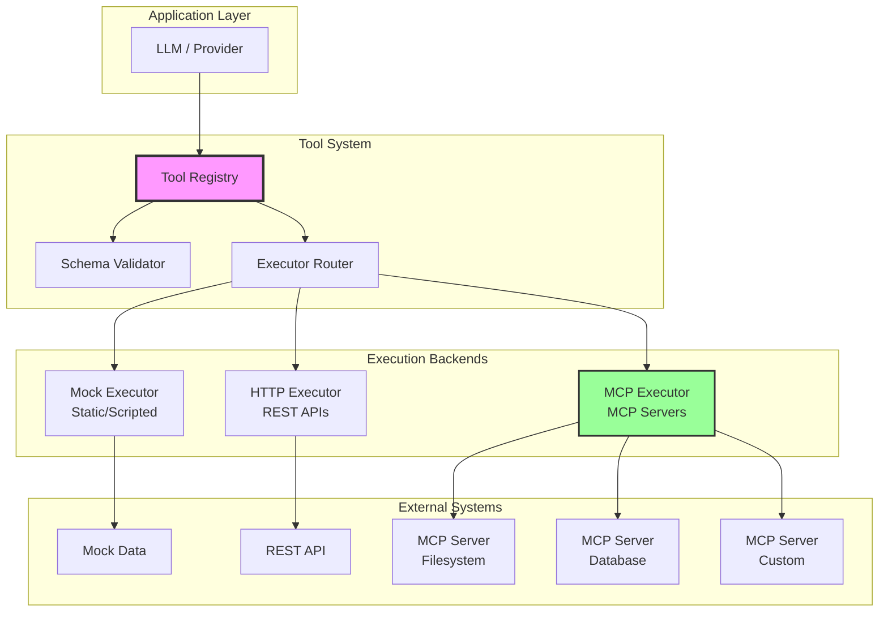

## Core Components

### Tool Descriptor

The `ToolDescriptor` is the central data structure representing a tool:

```go
type ToolDescriptor struct {
    Name         string          // Unique tool identifier
    Description  string          // Human-readable description
    InputSchema  json.RawMessage // JSON Schema for arguments
    OutputSchema json.RawMessage // JSON Schema for results
    Mode         string          // "mock" | "live" | "mcp"
    TimeoutMs    int             // Execution timeout

    // Mode-specific configuration
    MockResult   json.RawMessage // For static mocks
    MockTemplate string          // For dynamic mocks
    HTTPConfig   *HTTPConfig     // For HTTP execution
}
```

**Kubernetes-Style Manifest**:

```yaml
apiVersion: promptkit.altairalabs.ai/v1
kind: Tool
metadata:
  name: get-weather
  namespace: tools
spec:
  name: get-weather
  description: Get current weather for a location
  mode: live
  timeout_ms: 5000
  input_schema:
    type: object
    properties:
      location:
        type: string
        description: City name or coordinates
    required: [location]
  output_schema:
    type: object
    properties:
      temperature:
        type: number
      conditions:
        type: string
  http:
    url: https://api.weather.com/v1/current
    method: POST
    headers:
      Authorization: Bearer ${WEATHER_API_KEY}
```

### Tool Registry

The `Registry` manages tool lifecycle and execution:

```go
type Registry struct {
    repository ToolRepository            // Persistence backend
    tools      map[string]*ToolDescriptor // Cached descriptors
    validator  *SchemaValidator           // JSON Schema validator
    executors  map[string]Executor        // Execution backends
}
```

**Key Operations**:

```go
// Register a tool
registry.Register(descriptor)

// Get a tool by name (with repository fallback)
tool := registry.Get("get-weather")

// Execute a tool with validation
result, err := registry.Execute(ctx, "get-weather", args)

// List all available tools
tools := registry.List()
```

### Executor Interface

All execution backends implement the `Executor` interface:

```go
type Executor interface {
    Execute(descriptor *ToolDescriptor, args json.RawMessage) (json.RawMessage, error)
    Name() string
}
```

**Built-in Executors**:
- **MockStaticExecutor**: Returns pre-defined static responses
- **MockScriptedExecutor**: Template-based dynamic responses
- **HTTPExecutor**: Makes HTTP API calls
- **MCPExecutor**: Delegates to MCP servers

## Tool Execution Flow

### Standard Execution Pipeline

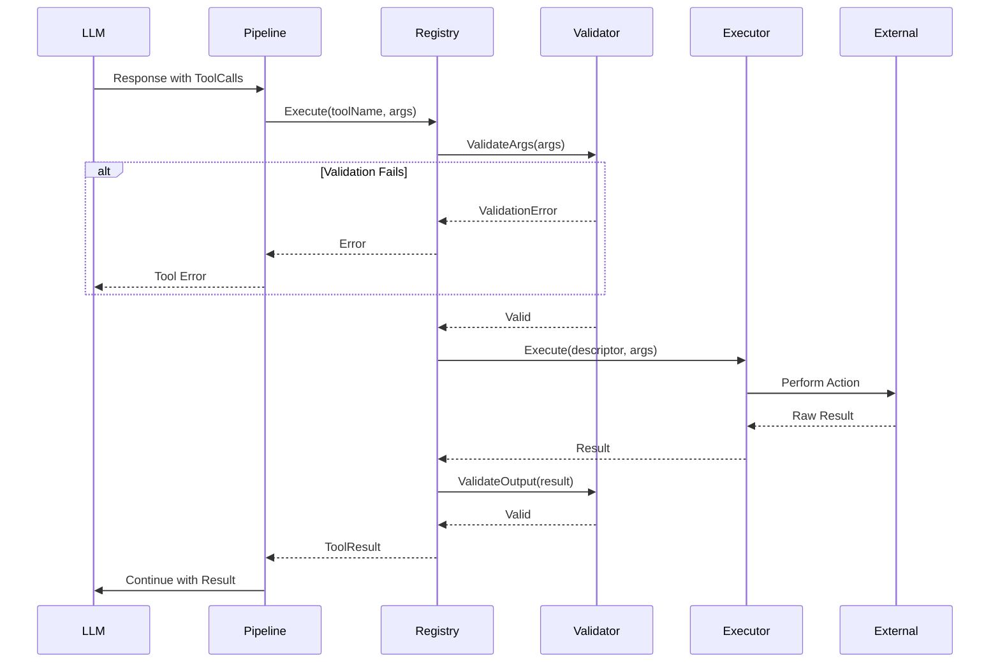

### Multi-Tool Execution

The Provider Middleware handles parallel tool execution:

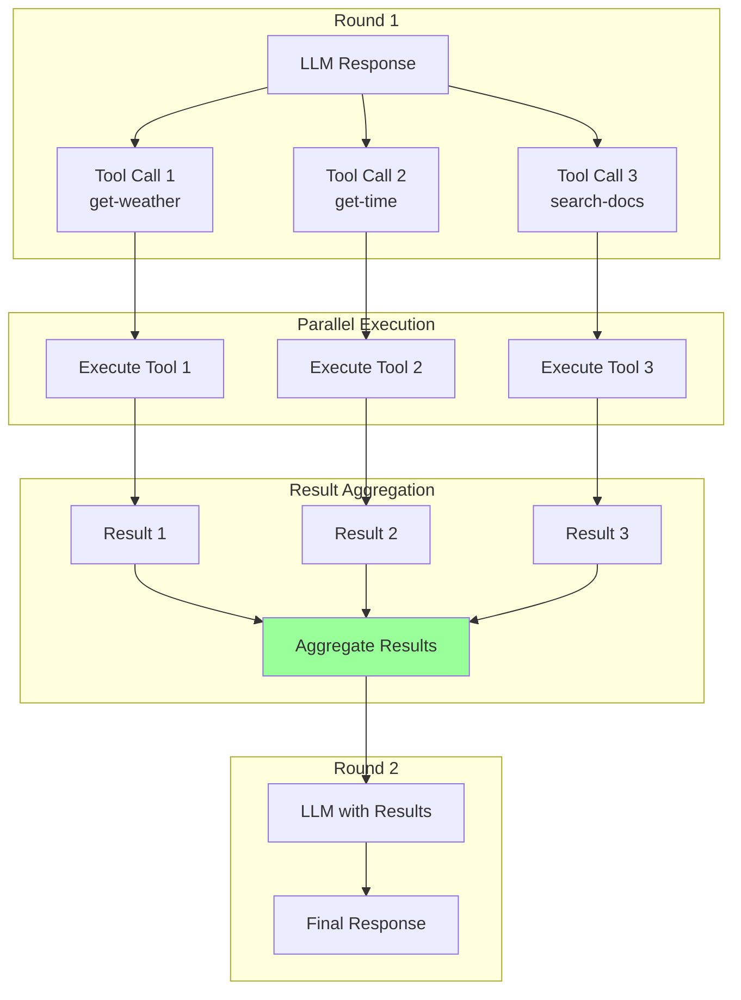

**Features**:
- Parallel execution of independent tools
- Result aggregation
- Error handling per tool
- Configurable timeout and retry

## Model Context Protocol (MCP) Integration

### MCP Architecture

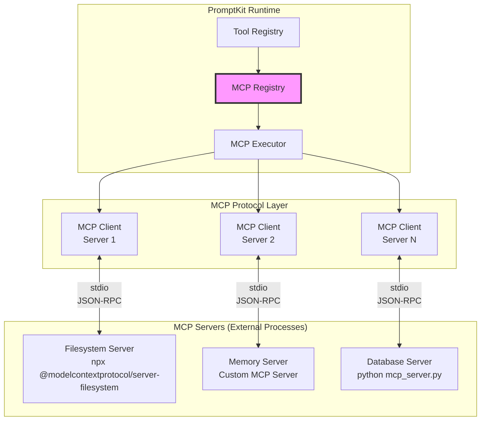

### MCP Client Implementation

The `StdioClient` implements the MCP protocol over stdio:

```go
type StdioClient struct {
    config     ServerConfig      // Server command and args
    options    ClientOptions     // Timeout, retry config
    cmd        *exec.Cmd         // Running process
    stdin      io.WriteCloser    // JSON-RPC request stream
    stdout     io.ReadCloser     // JSON-RPC response stream

    // JSON-RPC state
    nextID     atomic.Int64      // Request ID counter
    pendingReqs sync.Map         // Active requests

    // Lifecycle
    started    bool
    closed     bool
    serverInfo *InitializeResponse
}
```

**Connection Lifecycle**:

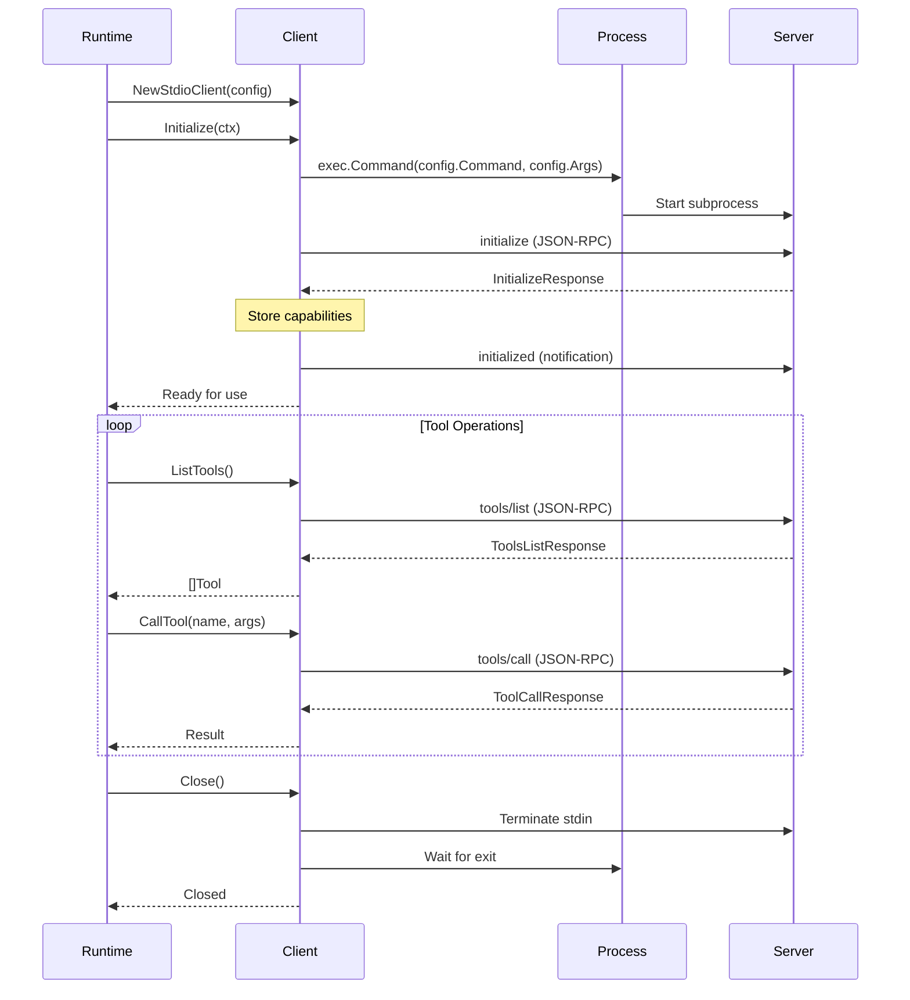

### MCP Registry

The `RegistryImpl` manages multiple MCP server connections:

```go
type RegistryImpl struct {
    servers   map[string]ServerConfig // Server configurations
    clients   map[string]Client       // Active connections (lazy)
    toolIndex map[string]string       // tool name -> server name
}
```

**Key Features**:

1. **Lazy Initialization**: Clients are created on first use
2. **Tool Discovery**: Automatic indexing of tools from all servers
3. **Health Monitoring**: Automatic reconnection on failure
4. **Concurrent Access**: Thread-safe operations

**Tool Discovery Flow**:

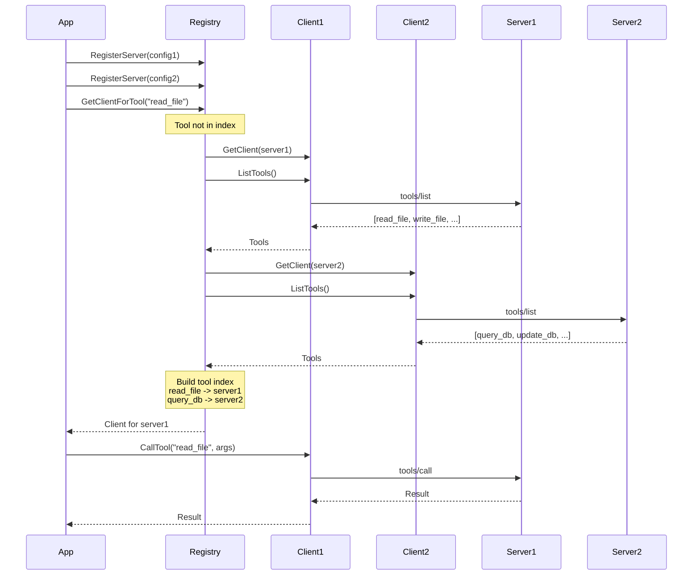

### MCP Executor

The `MCPExecutor` bridges the Tool Registry and MCP Registry:

```go
type MCPExecutor struct {
    mcpRegistry *mcp.RegistryImpl
}

func (e *MCPExecutor) Execute(
    descriptor *ToolDescriptor,
    args json.RawMessage,
) (json.RawMessage, error) {
    // Get the MCP client for this tool
    client, err := e.mcpRegistry.GetClientForTool(ctx, descriptor.Name)
    if err != nil {
        return nil, err
    }

    // Execute via MCP
    response, err := client.CallTool(ctx, descriptor.Name, args)
    if err != nil {
        return nil, err
    }

    // Convert MCP response to tool result
    return convertMCPResponse(response)
}
```

**MCP Content Types**:

MCP supports rich content in responses:

```go
type Content struct {
    Type     string // "text", "image", "resource"
    Text     string
    Data     string // Base64 encoded
    MimeType string
    URI      string
}
```

## Schema Validation

### JSON Schema Support

The `SchemaValidator` validates arguments and results:

```go
type SchemaValidator struct {
    compiledSchemas map[string]*gojsonschema.Schema
}

func (v *SchemaValidator) ValidateArgs(
    descriptor *ToolDescriptor,
    args []byte,
) error {
    schema := v.compileSchema(descriptor.InputSchema)
    result, err := schema.Validate(gojsonschema.NewBytesLoader(args))
    if err != nil {
        return err
    }
    if !result.Valid() {
        return &ValidationError{
            Type:   "args_invalid",
            Tool:   descriptor.Name,
            Detail: formatValidationErrors(result.Errors()),
        }
    }
    return nil
}
```

**Schema Example**:

```json
{
  "type": "object",
  "properties": {
    "location": {
      "type": "string",
      "description": "City name or coordinates",
      "minLength": 1
    },
    "units": {
      "type": "string",
      "enum": ["celsius", "fahrenheit"],
      "default": "celsius"
    }
  },
  "required": ["location"]
}
```

**Validation Stages**:

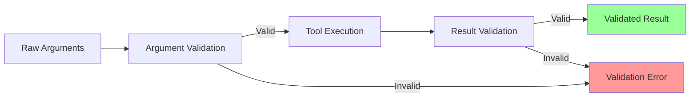

## Execution Modes

### Mock Mode (Static)

**Use Case**: Unit testing, deterministic responses

**Configuration**:
```yaml
mode: mock
mock_result:
  temperature: 72
  conditions: "Sunny"
```

**Executor**: Returns `mock_result` without external calls

### Mock Mode (Scripted)

**Use Case**: Dynamic testing, template-based responses

**Configuration**:

```yaml
mode: mock
mock_template: |
  {
    "location": "",
    "temperature": 72,
    "message": "Weather for "
  }
```

**Executor**: Renders template with provided arguments

**Template Syntax**:
- ``: Substitute argument value
- Simple string replacement
- Result must be valid JSON

### Live Mode (HTTP)

**Use Case**: Integration with REST APIs

**Configuration**:
```yaml
mode: live
http:
  url: https://api.weather.com/v1/current
  method: POST
  timeout_ms: 5000
  headers:
    Authorization: Bearer ${WEATHER_API_KEY}
    Content-Type: application/json
  headers_from_env:
    - WEATHER_API_KEY
```

**Features**:
- Environment variable substitution
- Custom headers
- Configurable timeout
- Automatic retry on transient errors
- Response redaction for sensitive data

### MCP Mode

**Use Case**: Integration with MCP ecosystem

**Configuration**:
MCP tools are discovered automatically; no explicit configuration needed in tool descriptors.

**MCP Server Configuration**:
```yaml
mcp_servers:
  filesystem:
    command: npx
    args:
      - "@modelcontextprotocol/server-filesystem"
      - "/home/user/documents"
    env:
      NODE_ENV: production

  memory:
    command: python
    args:
      - "-m"
      - "mcp_memory_server"
    env:
      MEMORY_BACKEND: redis
      REDIS_URL: redis://localhost:6379
```

## Tool Policy & Governance

### ToolPolicy

Enforces constraints on tool usage:

```go
type ToolPolicy struct {
    ToolChoice          string   // "auto" | "required" | "none"
    MaxToolCallsPerTurn int      // Per LLM response
    MaxTotalToolCalls   int      // Across entire conversation
    Blocklist           []string // Prohibited tools
}
```

**Enforcement Points**:

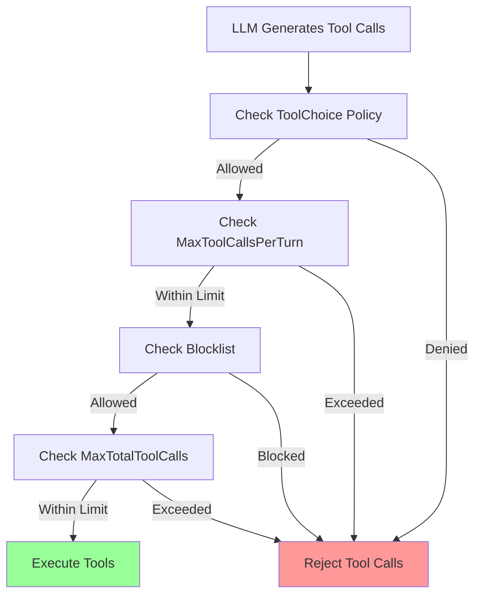

### Pending Tool Execution

Some tools require external approval or asynchronous completion:

```go
type ToolExecutionResult struct {
    Status      ToolExecutionStatus // "complete" | "pending" | "failed"
    Content     json.RawMessage
    Error       string
    PendingInfo *PendingToolInfo    // Set when Status == "pending"
}

type PendingToolInfo struct {
    Reason      string              // "requires_approval"
    Message     string              // Human-readable description
    ToolName    string
    Args        json.RawMessage
    ExpiresAt   *time.Time
    CallbackURL string
    Metadata    map[string]interface{}
}
```

**Use Cases**:
- Human-in-the-loop workflows
- Approval-gated actions (e.g., financial transactions)
- Long-running operations
- External service dependencies

## Integration with Pipeline

### Tool Execution in Provider Middleware

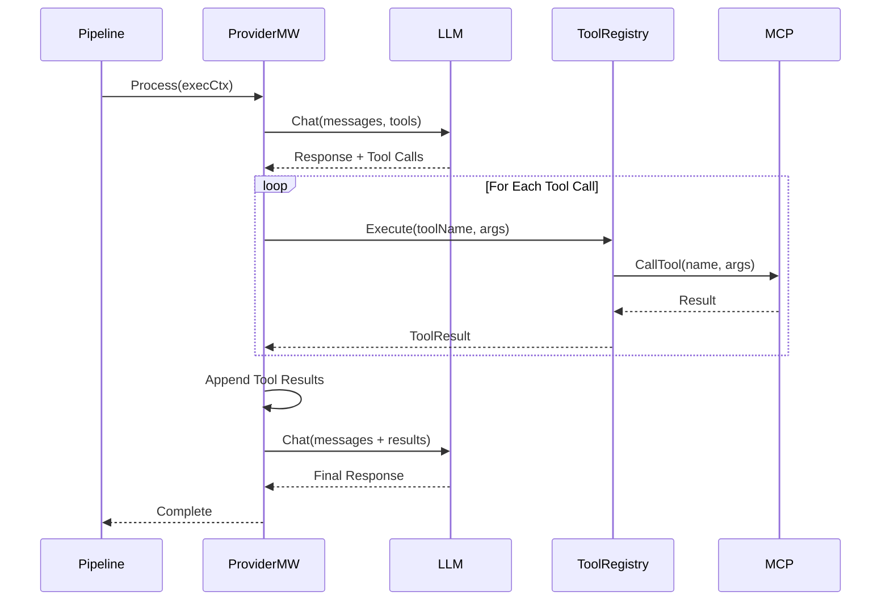

### Tool Discovery at Runtime

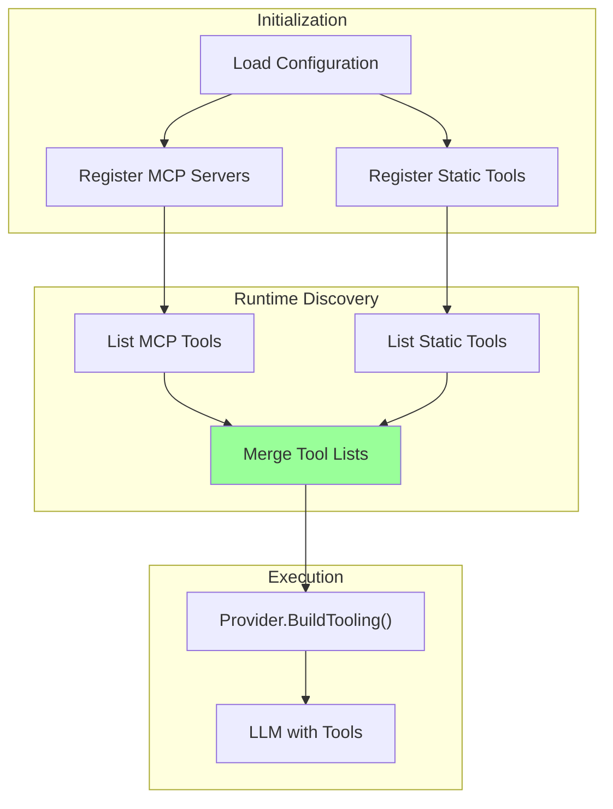

**Key Points**:
- MCP tools discovered at runtime
- Static tools loaded from configuration
- Combined tool list provided to LLM
- Provider transforms to native format

## Testing Strategies

### Unit Testing with Mocks

```go
// Create registry with mock executor
registry := tools.NewRegistry()
descriptor := &tools.ToolDescriptor{
    Name: "test-tool",
    Mode: "mock",
    MockResult: json.RawMessage(`{"status": "ok"}`),
    InputSchema: /* ... */,
}
registry.Register(descriptor)

// Execute
result, err := registry.Execute(ctx, "test-tool", args)
```

### Integration Testing with Mock MCP

```go
// Create mock MCP server
mockServer := mcp.NewMockServer()
mockServer.AddTool(mcp.Tool{
    Name: "test-tool",
    InputSchema: /* ... */,
})
mockServer.SetResponse("test-tool", response)

// Use in tests
client := mcp.NewStdioClient(mockServer.Config())
result, err := client.CallTool(ctx, "test-tool", args)
```

### End-to-End Testing

Use real MCP servers in test environment:
- Filesystem server with test data
- Memory server with ephemeral storage
- Custom test servers for specific scenarios

## Performance Considerations

### Connection Pooling

MCP clients maintain persistent connections:
- Reuse stdio connections across calls
- Lazy initialization on first use
- Automatic reconnection on failure

### Concurrent Execution

Tools execute in parallel when possible:
```go
var wg sync.WaitGroup
results := make([]ToolResult, len(toolCalls))

for i, call := range toolCalls {
    wg.Add(1)
    go func(i int, call ToolCall) {
        defer wg.Done()
        results[i] = registry.Execute(ctx, call.Name, call.Args)
    }(i, call)
}

wg.Wait()
```

### Caching

Implement caching for deterministic tools:
- Cache key: hash(toolName + args)
- TTL-based expiration
- Optional cache bypass

### Timeouts

Multiple timeout layers:
1. **Per-Tool Timeout**: `ToolDescriptor.TimeoutMs`
2. **HTTP Timeout**: `HTTPConfig.TimeoutMs`
3. **MCP Request Timeout**: `ClientOptions.RequestTimeout`
4. **Pipeline Timeout**: `ExecutionContext.Context`

## Error Handling

### Error Types

```go
// Validation error
type ValidationError struct {
    Type   string // "args_invalid" | "result_invalid"
    Tool   string
    Detail string
    Path   string
}

// Execution error
type ExecutionError struct {
    Tool    string
    Phase   string // "execute" | "validate" | "connect"
    Message string
    Cause   error
}

// MCP error
type MCPError struct {
    Server  string
    Code    int    // JSON-RPC error code
    Message string
}
```

### Retry Strategy

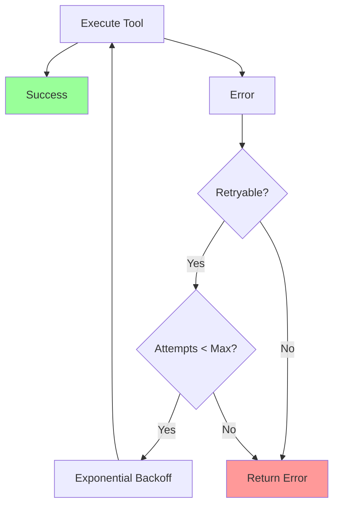

**Retryable Conditions**:
- Network timeouts
- MCP server unavailable
- HTTP 429 (rate limit)
- HTTP 5xx (server errors)

## Best Practices

1. **Use JSON Schema**: Validate all tool inputs and outputs
2. **Set Timeouts**: Prevent hanging on slow tools
3. **Implement Idempotency**: Design tools to handle retries safely
4. **Monitor MCP Health**: Track connection status and latency
5. **Cache When Possible**: Reduce redundant tool calls
6. **Test with Mocks**: Use mock mode for fast, deterministic tests
7. **Handle Errors Gracefully**: Provide clear error messages to LLM
8. **Document Tools Well**: Good descriptions improve LLM tool selection
9. **Use Tool Policies**: Enforce governance and safety constraints
10. **Version Tool Schemas**: Support schema evolution

## Future Enhancements

- **MCP Resource Support**: Access read-only resources from servers
- **MCP Prompt Support**: Use server-provided prompts
- **Streaming Tool Execution**: Progressive result delivery
- **Tool Composition**: Chain tools together
- **Tool Marketplace**: Discover and share tool definitions
- **Advanced Caching**: Semantic caching for similar requests
- **Tool Analytics**: Track usage, performance, and costs
- **Tool Sandboxing**: Execute untrusted tools safely

---

**Related Documentation**:
- [Runtime Pipeline Architecture](./runtime-pipeline)
- [Provider System Architecture](./runtime-providers)
- [System Overview](./system-overview)
- [MCP Specification](https://modelcontextprotocol.org/)
