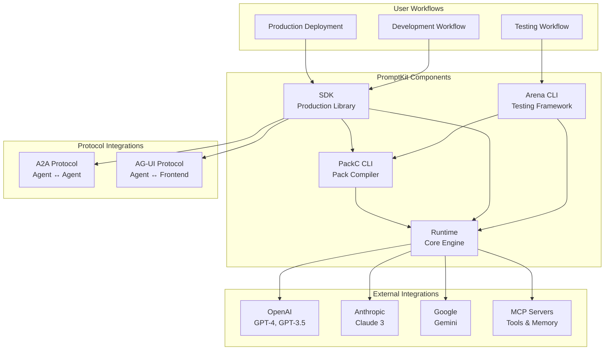
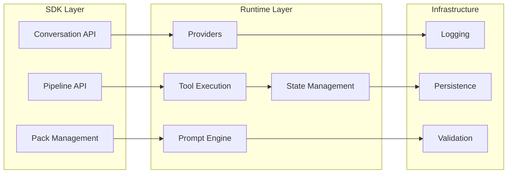
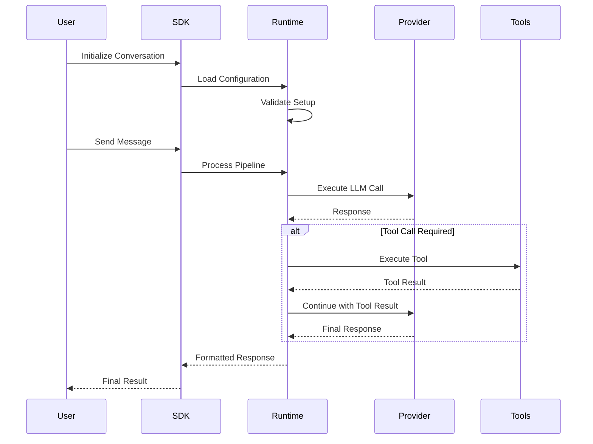
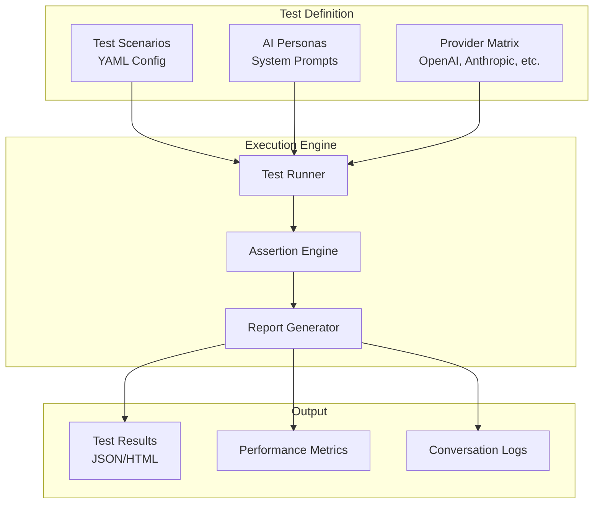
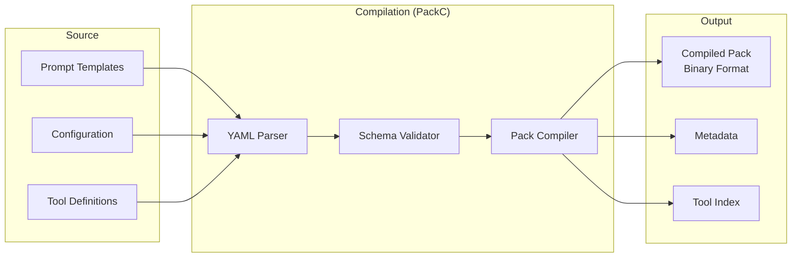

Visual representations of the PromptKit system architecture and component relationships.

---

## Overview

## Component Architecture

## Data Flow Architecture

## Testing Architecture (Arena)

## Pack Format Architecture

