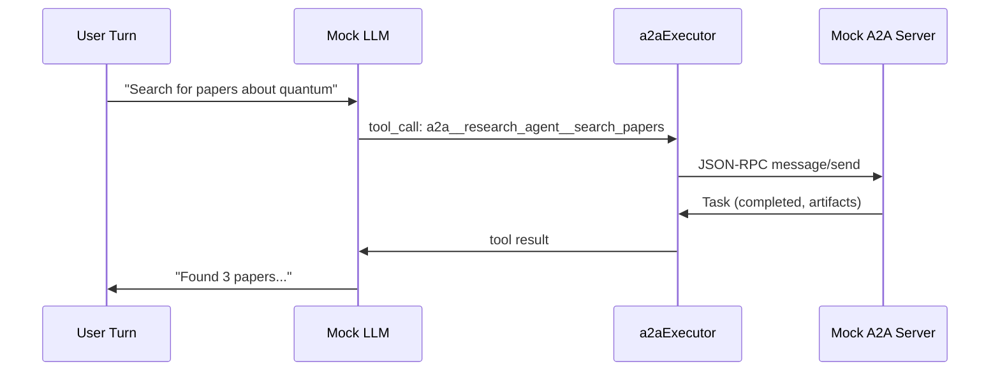

Test agent-to-agent delegation using Arena's built-in mock A2A infrastructure. Define mock agents in your Arena config, write scenarios that trigger tool calls, and verify the full delegation pipeline.

---

## Overview



Arena spins up mock A2A servers from your config, registers their skills as tools via the Tool Bridge, and connects them to the mock LLM provider. You control both sides — the LLM responses and the A2A agent responses — for fully deterministic tests.

---

## Configure A2A Agents

Add an `a2a_agents` block to your Arena config:

```yaml
# config.arena.yaml
apiVersion: promptkit.altairalabs.ai/v1alpha1
kind: Arena
metadata:
  name: a2a-demo
spec:
  providers:
    - file: providers/mock-provider.yaml
  prompt_configs:
    - id: assistant
      file: prompts/assistant.yaml
  scenarios:
    - file: scenarios/delegated_research.yaml

  a2a_agents:
    - name: research_agent
      card:
        name: Research Agent
        description: A mock research agent that returns papers
        skills:
          - id: search_papers
            name: Search Papers
            description: Search for academic papers on a given topic
            tags: [research, papers, search]
      responses:
        - skill: search_papers
          match:
            contains: quantum
          response:
            parts:
              - text: |
                  Found 3 papers on quantum computing:
                  1. Quantum Computing Fundamentals (2024)
                  2. Advances in Quantum Error Correction (2024)
                  3. Practical Quantum Algorithms for Optimization (2023)
        - skill: search_papers
          response:
            parts:
              - text: |
                  Found 1 paper on the requested topic:
                  1. General Survey of the Field (2024)
```

Each agent produces a tool named `a2a__{name}__{skillId}` — in this case, `a2a__research_agent__search_papers`.

---

## Prompt Config

Enable the A2A tool in your prompt config with `allowed_tools`:

```yaml
# prompts/assistant.yaml
apiVersion: promptkit.altairalabs.ai/v1alpha1
kind: PromptConfig
spec:
  task_type: assistant
  version: v1.0.0
  description: An assistant that can delegate research to A2A agents
  allowed_tools:
    - a2a__research_agent__search_papers
  system_template: |
    You are a helpful assistant with access to research tools.
    When asked to search for papers or research a topic, use the available tools.
    Summarize the results for the user.
```

---

## Mock LLM Responses

Configure the mock LLM to issue tool calls and then summarize results:

```yaml
# mock-responses.yaml
scenarios:
  delegated-research:
    turns:
      1:
        tool_calls:
          - name: "a2a__research_agent__search_papers"
            arguments:
              query: "Search for papers about quantum computing"
      2:
        response: |
          Based on the research results, I found 3 papers on quantum computing:
          1. Quantum Computing Fundamentals (2024)
          2. Advances in Quantum Error Correction (2024)
          3. Practical Quantum Algorithms for Optimization (2023)
```

Turn 1: the mock LLM emits a tool call. Arena's `a2aExecutor` routes it to the mock A2A server, which matches the "quantum" rule and returns the canned response. Turn 2: the mock LLM sees the tool result and produces a final summary.

---

## Scenario Setup

Write a scenario that sends the user message and asserts on the outcome:

```yaml
# scenarios/delegated_research.yaml
apiVersion: promptkit.altairalabs.ai/v1alpha1
kind: Scenario
metadata:
  name: delegated-research
spec:
  id: delegated-research
  task_type: assistant
  description: Test delegation of research queries to an A2A agent
  tool_policy:
    tool_choice: auto
    max_tool_calls_per_turn: 3
    max_total_tool_calls: 5
  turns:
    - role: user
      content: "Search for papers about quantum computing"
      assertions:
        - type: tools_called
          params:
            tools:
              - a2a__research_agent__search_papers
        - type: content_includes
          params:
            patterns:
              - "Quantum Computing Fundamentals"
```

### Assertions

| Assertion | Description |
|-----------|-------------|
| `tools_called` | Verify that specific tools were invoked during the turn |
| `content_includes` | Check that the final response contains expected patterns |
| `agent_invoked` | Verify that specific agents were delegated to (checks for agent tool calls) |
| `agent_not_invoked` | Verify that specific agents were NOT delegated to |
| `agent_response_contains` | Verify that an agent's response contains expected text |

The `agent_invoked` and `agent_response_contains` assertions provide a higher-level alternative to `tools_called` for agent delegation testing. Instead of checking raw tool names, you can express intent directly:

```yaml
assertions:
  # Lower-level: check the raw tool name
  - type: tools_called
    params:
      tools:
        - a2a__research_agent__search_papers

  # Higher-level: check that an agent was invoked and returned expected content
  - type: agent_invoked
    params:
      agents:
        - a2a__research_agent__search_papers
  - type: agent_response_contains
    params:
      agent: a2a__research_agent__search_papers
      contains: "Quantum Computing Fundamentals"
```

---

## Run and Verify

```bash
cd examples/a2a-demo
promptarena run -c arena/config.arena.yaml
```

Arena will:

1. Start the mock A2A server from your config
2. Register agent skills as tools via the Tool Bridge
3. Run each scenario turn with the mock LLM
4. Route tool calls through the `a2aExecutor` to the mock server
5. Evaluate assertions and produce a report

Check the output directory for results:

```bash
ls arena/out/
# report-2026-02-08T17-55-25.html
# report-2026-02-08T17-55-25-data.json
```

---

## Multiple Agents

Add more agents to test multi-agent delegation:

```yaml
a2a_agents:
  - name: research_agent
    card:
      name: Research Agent
      skills:
        - id: search_papers
          name: Search Papers
    responses:
      - skill: search_papers
        response:
          parts:
            - text: "Research results..."

  - name: translation_agent
    card:
      name: Translation Agent
      skills:
        - id: translate
          name: Translate
    responses:
      - skill: translate
        response:
          parts:
            - text: "Translated text..."
```

This registers both `a2a__research_agent__search_papers` and `a2a__translation_agent__translate` as available tools.

Use `agent_invoked` and `agent_not_invoked` assertions to verify which agents are delegated to:

```yaml
turns:
  - role: user
    content: "Research quantum computing and translate the summary to French"
    assertions:
      - type: agent_invoked
        params:
          agents:
            - a2a__research_agent__search_papers
            - a2a__translation_agent__translate
          message: "Should delegate to both agents"
      - type: agent_not_invoked
        params:
          agents:
            - a2a__admin_agent__execute
          message: "Should not invoke admin agent"
      - type: agent_response_contains
        params:
          agent: a2a__research_agent__search_papers
          contains: "Research results"
          message: "Research agent should return results"
```

For conversation-wide checks, use `conversation_assertions`:

```yaml
conversation_assertions:
  - type: agent_invoked
    params:
      agent_names:
        - a2a__research_agent__search_papers
      min_calls: 1
    message: "Research agent should be invoked at least once across the conversation"
  - type: agent_not_invoked
    params:
      agent_names:
        - a2a__admin_agent__execute
    message: "Admin agent should never be invoked"
```

---

## Response Rules Reference

### Match Config

| Field | Description |
|-------|-------------|
| `contains` | Case-insensitive substring match on message text |
| `regex` | Regular expression match on message text |

### Error Responses

Return a failed task instead of a successful response:

```yaml
responses:
  - skill: search_papers
    error: "Service temporarily unavailable"
```

---

## Next Steps

- [A2A Concept](/concepts/a2a/) — learn about the A2A protocol
- [Use Mock Server](/runtime/how-to/use-a2a-mock-server/) — use the mock programmatically in Go tests
- [Write Scenarios](/arena/how-to/write-scenarios/) — general scenario authoring guide
- [Assertions Reference](/arena/reference/assertions/) — all available assertion types
