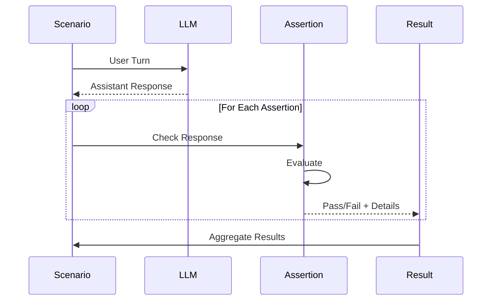
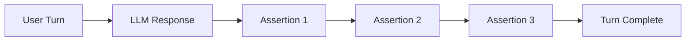

Assertions are checks that verify LLM behavior during test execution. They run after each turn and determine whether the response meets expectations.

## How Assertions Work



## Assertion Structure

All assertions follow this structure:

```yaml
assertions:
  - type: assertion_name          # Required: Assertion type
    params:                       # Required: Type-specific parameters
      param1: value1
      param2: value2
    message: "Description"        # Optional: Human-readable description
    when:                         # Optional: Conditional filtering
      tool_called: "tool_name"
```

**Fields**:
- `type`: The assertion type (see list below)
- `params`: Parameters specific to the assertion type
- `message`: Optional description shown in reports
- `when`: Optional conditions that must be met for the assertion to run (see [Conditional Filtering](#conditional-filtering-when))

## Available Assertions

### Content Assertions

#### `content_includes`

Checks that the response contains specific text patterns (case-insensitive).

**Use Cases**:
- Verify specific keywords appear
- Check that important information is mentioned
- Ensure acknowledgment phrases are present

**Parameters**:
- `patterns` (array of strings): Text patterns that must appear in response (all patterns must be found)

**Example**:
```yaml
- role: user
  content: "What is the capital of France?"
  assertions:
    - type: content_includes
      params:
        patterns: ["Paris"]
        message: "Should mention Paris"
```

**Matching**: Case-insensitive substring match
- ✅ "Paris" matches "The capital is Paris"
- ✅ "paris" matches "PARIS is the capital"
- ❌ "Pari" does not match "Paris"

**Multiple Patterns**:
```yaml
assertions:
  - type: content_includes
    params:
      patterns:
        - "Paris"
        - "France"
      message: "Should mention both Paris and France"
```

**Failure Details**:
```json
{
  "passed": false,
  "details": {
    "missing_patterns": ["Paris"]
  }
}
```

---

#### `content_matches`

Checks that the response matches a regular expression pattern.

**Use Cases**:
- Flexible pattern matching
- Validate response structure
- Check for specific formats (emails, phone numbers, etc.)

**Parameters**:
- `pattern` (string): Regular expression pattern (Go regex syntax)

**Example**:
```yaml
- role: user
  content: "What's your email?"
  assertions:
    - type: content_matches
      params:
        pattern: "(?i)\\b[A-Za-z0-9._%+-]+@[A-Za-z0-9.-]+\\.[A-Z|a-z]{2,}\\b"
        message: "Should provide email address"
```

**Pattern Examples**:

```yaml
# Case-insensitive word match
pattern: "(?i)hello"

# Match phone number
pattern: "\\d{3}-\\d{3}-\\d{4}"

# Match order number
pattern: "#\\d{5,}"

# Match "yes" or "no"
pattern: "(?i)\\b(yes|no)\\b"

# Match empathy phrases
pattern: "(?i)(understand|sorry|apologize|help)"
```

**Regex Flags**:
- `(?i)`: Case-insensitive
- `(?m)`: Multiline mode
- `(?s)`: Dot matches newline

**Common Patterns**:

```yaml
# Email
pattern: "(?i)\\b[A-Za-z0-9._%+-]+@[A-Za-z0-9.-]+\\.[A-Z|a-z]{2,}\\b"

# URL
pattern: "https?://[^\\s]+"

# Order/Tracking Number
pattern: "#?[A-Z0-9]{6,}"

# Currency
pattern: "\\$\\d+(\\.\\d{2})?"

# Phone (US)
pattern: "\\(?\\d{3}\\)?[-.\\s]?\\d{3}[-.\\s]?\\d{4}"
```

**Failure Details**:
```json
{
  "passed": false,
  "details": {
    "pattern": "(?i)email",
    "content": "Please call us instead"
  }
}
```

---

### Tool Call Assertions

#### `tools_called`

Verifies that specific tools were invoked in the response.

**Use Cases**:
- Verify function calling behavior
- Ensure LLM uses available tools
- Check tool selection logic

**Parameters**:
- `tools` (array): List of tool names that should be called

**Example**:
```yaml
- role: user
  content: "What's the weather in San Francisco?"
  assertions:
    - type: tools_called
      params:
        tools:
          - get_weather
        message: "Should call weather tool"
```

**Multiple Tools**:
```yaml
- role: user
  content: "Check my order and update my address"
  assertions:
    - type: tools_called
      params:
        tools:
          - check_order_status
          - update_customer_address
        message: "Should call both order and address tools"
```

**Failure Details**:
```json
{
  "passed": false,
  "details": {
    "missing_tools": ["get_weather"],
    "called_tools": ["search_web"]
  }
}
```

**Important Notes**:
- Checks that ALL specified tools were called
- Order doesn't matter
- Tool may be called multiple times (counts as one)
- Only checks current turn, not previous turns

---

#### `tools_not_called`

Verifies that specific tools were NOT invoked in the response.

**Use Cases**:
- Ensure inappropriate tools aren't used
- Verify tool policies are enforced
- Check conditional tool usage

**Parameters**:
- `tools` (array): List of tool names that should NOT be called

**Example**:
```yaml
- role: user
  content: "What's the weather like?"
  assertions:
    - type: tools_not_called
      params:
        tools:
          - delete_account
          - charge_credit_card
        message: "Should not call destructive tools"
```

**Policy Enforcement**:
```yaml
# Ensure read-only operations
- role: user
  content: "Show me my account details"
  assertions:
    - type: tools_not_called
      params:
        tools:
          - update_account
          - delete_account
          - create_order
        message: "Should only read, not modify"
```

**Failure Details**:
```json
{
  "passed": false,
  "details": {
    "forbidden_tools_called": ["delete_account"],
    "all_called_tools": ["get_account", "delete_account"]
  }
}
```

---

#### `tool_calls_with_args` (Turn-Level)

Verifies that a tool was called with specific arguments in the current turn. Supports both exact value matching and regex pattern matching.

**Use Cases**:
- Validate argument passing to tools
- Check parameter extraction from user input
- Ensure correct tool configuration
- Flexible pattern matching for dynamic values

**Parameters**:
- `tool_name` (string): Tool name to check
- `expected_args` (object): Exact argument values to match (use `null` for presence-only check)
- `args_match` (object): Regex patterns to match against argument values

**Example - Exact Match**:
```yaml
- role: user
  content: "What's the weather in San Francisco?"
  assertions:
    - type: tool_calls_with_args
      params:
        tool_name: get_weather
        expected_args:
          location: "San Francisco"
      message: "Should pass location correctly"
```

**Example - Regex Pattern Match**:
```yaml
- role: user
  content: "Analyze this image and describe it"
  assertions:
    - type: tool_calls_with_args
      params:
        tool_name: analyze_image
        args_match:
          description: "(?i)(logo|image|picture|graphic)"
      message: "Description should reference visual content"
```

**Example - Presence Check (any value)**:
```yaml
- role: user
  content: "Get weather for my city"
  assertions:
    - type: tool_calls_with_args
      params:
        tool_name: get_weather
        expected_args:
          location: null  # Just check that location exists
      message: "Should pass some location"
```

**Failure Details**:
```json
{
  "passed": false,
  "details": {
    "violations": [
      {"type": "missing_argument", "tool": "get_weather", "argument": "location"},
      {"type": "pattern_mismatch", "tool": "analyze_image", "argument": "description", "pattern": "(?i)logo"}
    ]
  }
}
```

---

#### `tool_calls_with_args` (Conversation-Level)

Verifies that a tool was called with specific arguments across the entire conversation.

**Note**: This is a **conversation-level assertion**, used in the `conversation_assertions` field of a scenario, not in turn-level assertions.

**Use Cases**:
- Validate argument passing across conversation
- Check parameter extraction from user input
- Ensure correct tool configuration
- Pattern matching for dynamic argument values

**Parameters**:
- `tool_name` (string): Tool name to check
- `required_args` (object): Expected argument values (exact match)
- `args_match` (object): Regex patterns to match against argument values

**Example - Exact Match**:
```yaml
apiVersion: promptkit.altairalabs.ai/v1alpha1
kind: Scenario
metadata:
  name: tool-args-test
spec:
  task_type: test
  description: "Test tool arguments"
  turns:
    - role: user
      content: "What's the weather in San Francisco?"
  conversation_assertions:
    - type: tool_calls_with_args
      params:
        tool_name: get_weather
        required_args:
          location: "San Francisco"
      message: "Should pass location correctly"
```

**Example - Regex Pattern Match**:
```yaml
conversation_assertions:
  - type: tool_calls_with_args
    params:
      tool_name: search_products
      args_match:
        query: "(?i)(laptop|computer|electronics)"
    message: "Should search for electronics-related terms"
```

**Combined Exact and Pattern Match**:
```yaml
conversation_assertions:
  - type: tool_calls_with_args
    params:
      tool_name: create_order
      required_args:
        category: "electronics"
      args_match:
        product_id: "^PROD-[0-9]+$"
    message: "Should create order with valid product ID"
```

**Failure Details**:
```json
{
  "passed": false,
  "details": {
    "tool": "get_weather",
    "expected": {"location": "San Francisco"},
    "actual": {"location": "SF"}
  }
}
```

---

### Agent Assertions

#### `agent_invoked` (Turn-Level)

Verifies that specific agents were invoked via tool calls in the current turn. Agent invocations appear as tool calls whose name matches the agent member name (e.g., `a2a__research_agent__search_papers`).

**Use Cases**:
- Verify multi-agent delegation behavior
- Check that the LLM routes requests to the correct agent
- Validate agent selection logic in orchestration scenarios

**Parameters**:
- `agents` (array of strings): Agent tool names that should have been called

**Example**:
```yaml
- role: user
  content: "Search for papers about quantum computing"
  assertions:
    - type: agent_invoked
      params:
        agents:
          - a2a__research_agent__search_papers
        message: "Should delegate to the research agent"
```

**Multiple Agents**:
```yaml
- role: user
  content: "Research quantum computing and translate the summary to French"
  assertions:
    - type: agent_invoked
      params:
        agents:
          - a2a__research_agent__search_papers
          - a2a__translation_agent__translate
        message: "Should delegate to both research and translation agents"
```

**Failure Details**:
```json
{
  "passed": false,
  "details": {
    "missing_agents": ["a2a__research_agent__search_papers"]
  }
}
```

**Important Notes**:
- Checks that ALL specified agents were called
- Order doesn't matter
- Only checks the current turn, not previous turns
- For conversation-wide checks, use the conversation-level variant

---

#### `agent_not_invoked` (Turn-Level)

Verifies that specific agents were NOT invoked in the current turn.

**Use Cases**:
- Ensure the LLM handles requests directly without unnecessary delegation
- Verify agent routing policies are enforced
- Check that agents are only used when appropriate

**Parameters**:
- `agents` (array of strings): Agent tool names that should NOT have been called

**Example**:
```yaml
- role: user
  content: "What is 2 + 2?"
  assertions:
    - type: agent_not_invoked
      params:
        agents:
          - a2a__research_agent__search_papers
        message: "Should answer directly without delegating to research agent"
```

**Failure Details**:
```json
{
  "passed": false,
  "details": {
    "forbidden_agents_called": ["a2a__research_agent__search_papers"]
  }
}
```

---

#### `agent_response_contains` (Turn-Level)

Verifies that a specific agent's response contains expected text. When an agent is invoked as a tool call, its response comes back as a tool result message. This assertion checks the content of that result.

**Use Cases**:
- Validate that a delegated agent returned the expected information
- Check that agent responses include specific keywords or data
- Verify end-to-end delegation pipeline output

**Parameters**:
- `agent` (string): The agent tool name whose response to check
- `contains` (string): Substring to look for in the agent's response

**Example**:
```yaml
- role: user
  content: "Search for papers about quantum computing"
  assertions:
    - type: agent_response_contains
      params:
        agent: a2a__research_agent__search_papers
        contains: "Quantum Computing Fundamentals"
        message: "Research agent should return quantum computing papers"
```

**Failure Details**:
```json
{
  "passed": false,
  "details": {
    "agent": "a2a__research_agent__search_papers",
    "expected_substr": "Quantum Computing Fundamentals",
    "reason": "no matching agent response found containing expected text"
  }
}
```

---

#### `agent_invoked` (Conversation-Level)

Verifies that specific agents were invoked at least a minimum number of times across the entire conversation.

**Note**: This is a **conversation-level assertion**, used in the `conversation_assertions` field of a scenario, not in turn-level assertions.

**Use Cases**:
- Validate overall agent delegation patterns across a multi-turn conversation
- Ensure agents are invoked a minimum number of times
- Verify end-to-end orchestration behavior

**Parameters**:
- `agent_names` (array of strings): Required agent names
- `min_calls` (int, optional): Minimum number of calls per agent (default: 1)

**Example**:
```yaml
apiVersion: promptkit.altairalabs.ai/v1alpha1
kind: Scenario
metadata:
  name: multi-agent-test
spec:
  task_type: assistant
  description: "Test multi-agent delegation"
  turns:
    - role: user
      content: "Research quantum computing"
    - role: user
      content: "Translate the summary to French"
  conversation_assertions:
    - type: agent_invoked
      params:
        agent_names:
          - a2a__research_agent__search_papers
          - a2a__translation_agent__translate
        min_calls: 1
      message: "Both agents should be invoked at least once"
```

**Failure Details**:
```json
{
  "passed": false,
  "message": "missing required agent invocations: a2a__translation_agent__translate",
  "details": {
    "requirements": [
      {"agent": "a2a__research_agent__search_papers", "calls": 1, "requiredCalls": 1},
      {"agent": "a2a__translation_agent__translate", "calls": 0, "requiredCalls": 1}
    ],
    "counts": {
      "a2a__research_agent__search_papers": 1
    }
  }
}
```

---

#### `agent_not_invoked` (Conversation-Level)

Verifies that specific agents were NOT invoked anywhere in the conversation.

**Note**: This is a **conversation-level assertion**, used in the `conversation_assertions` field of a scenario, not in turn-level assertions.

**Use Cases**:
- Ensure forbidden agents are never invoked across the entire conversation
- Validate agent access control policies
- Verify that sensitive agents are not called in certain contexts

**Parameters**:
- `agent_names` (array of strings): Forbidden agent names

**Example**:
```yaml
conversation_assertions:
  - type: agent_not_invoked
    params:
      agent_names:
        - a2a__admin_agent__execute
    message: "Admin agent should never be invoked in user-facing scenarios"
```

**Failure Details**:
```json
{
  "passed": false,
  "message": "forbidden agents were invoked",
  "violations": [
    {
      "turn_index": 2,
      "description": "forbidden agent was invoked",
      "evidence": {
        "agent": "a2a__admin_agent__execute",
        "arguments": {"command": "..."}
      }
    }
  ]
}
```

---

### Workflow Assertions

#### `state_is`

Checks that the workflow is currently in a specific state. Used in workflow scenario steps to verify state machine position after transitions.

**Use Cases**:
- Verify the workflow reached an expected state after a transition
- Confirm the workflow hasn't progressed past a certain point
- Validate state machine routing logic

**Parameters**:
- `state` (string): The expected current state name

**Example**:
```yaml
steps:
  - type: input
    content: "I need help with billing"
    assertions:
      - type: state_is
        params:
          state: "intake"
        message: "Should still be in intake state"
```

**Failure Details**:
```json
{
  "passed": false,
  "message": "expected state \"intake\" but workflow is in state \"processing\"",
  "details": {
    "expected": "intake",
    "actual": "processing"
  }
}
```

---

#### `transitioned_to`

Checks that the workflow has transitioned to a specific state at any point during execution. Inspects the accumulated transition history.

**Use Cases**:
- Verify a specific state was visited during the workflow
- Confirm escalation or routing occurred
- Validate multi-step workflow progression

**Parameters**:
- `state` (string): The target state name that should appear in transition history

**Example**:
```yaml
steps:
  - type: input
    content: "I need to speak with a specialist about my billing issue"
    assertions:
      - type: transitioned_to
        params:
          state: "specialist"
        message: "LLM should have called workflow__transition to escalate"
```

**Failure Details**:
```json
{
  "passed": false,
  "message": "workflow never transitioned to state \"specialist\"",
  "details": {
    "expected_state": "specialist",
    "transitions": []
  }
}
```

---

#### `workflow_complete`

Checks that the workflow has reached a terminal state (a state with no outgoing transitions).

**Use Cases**:
- Verify the workflow completed successfully
- Confirm the conversation reached a natural end
- Validate end-to-end workflow execution

**Parameters**: None required.

**Example**:
```yaml
steps:
  - type: input
    content: "Thanks for your help, everything is resolved!"
    assertions:
      - type: workflow_complete
        message: "LLM should have resolved the workflow to a terminal state"
```

**Failure Details**:
```json
{
  "passed": false,
  "message": "workflow is not complete",
  "details": {
    "complete": false
  }
}
```

---

### Guardrail Assertions

#### `guardrail_triggered`

Verifies that a specific validator/guardrail was triggered.

**Use Cases**:
- Test that guardrails work correctly
- Verify policy enforcement
- Ensure validators catch violations

**Parameters**:
- `guardrail` (string): Validator type that should trigger
- `expected` (bool): Whether trigger is expected (default: true)

**Example**:
```yaml
# Verify banned word is caught
- role: user
  content: "Will this definitely work?"
  assertions:
    - type: guardrail_triggered
      params:
        guardrail: banned_words
        assertions: true
        message: "Should catch banned word 'definitely'"

# Verify no guardrail triggered
- role: user
  content: "This should be fine"
  assertions:
    - type: guardrail_triggered
      params:
        assertions: false
        message: "Should not trigger any guardrail"
```

**Testing Length Limits**:
```yaml
- role: user
  content: "Tell me everything about the universe"
  assertions:
    - type: guardrail_triggered
      params:
        guardrail: max_length
        assertions: true
        message: "Should trigger length limit"
```

**Failure Details**:
```json
{
  "passed": false,
  "details": {
    "expected_triggered": true,
    "actually_triggered": false,
    "guardrail": "banned_words"
  }
}
```

---

### Tool Call Trace Assertions

These assertions inspect detailed tool call data — names, arguments, results, and errors — from within a turn or across an entire conversation. They require the tool trace to be available; in duplex/streaming paths where traces are unavailable, these assertions are automatically **skipped** (not failed).

#### `tool_call_sequence`

Asserts that tool calls appear in a specified order using **subsequence matching** — intervening calls to other tools are allowed.

**Use Cases**:
- Verify tools are called in a logical dependency order
- Ensure a multi-step workflow calls tools in the right sequence
- Validate LLM reasoning chains that require ordered operations

**Parameters**:
- `sequence` (array of strings): Ordered list of expected tool names

**Example**:
```yaml
- role: user
  content: "Look up customer #123, then process their refund"
  assertions:
    - type: tool_call_sequence
      params:
        sequence:
          - lookup_customer
          - process_refund
      message: "Should look up customer before processing refund"
```

**How Matching Works**: The validator walks through tool calls in order and advances through the `sequence` list whenever a matching tool name is found. Other tool calls between steps are ignored. For example, if the sequence is `[A, B]` and the actual calls are `[A, C, B]`, this passes — `C` is simply skipped.

**Failure Details**:
```json
{
  "passed": false,
  "details": {
    "message": "sequence not satisfied: matched 1/2 steps, stuck at \"process_refund\"",
    "expected_sequence": ["lookup_customer", "process_refund"],
    "actual_tools": "lookup_customer → validate_input",
    "matched_steps": 1
  }
}
```

**Conversation-Level**: Also available as a conversation-level assertion in `conversation_assertions`, checking across all turns.

---

#### `tool_call_count`

Asserts that a tool (or all tools) was called a specific number of times.

**Use Cases**:
- Enforce tool call budgets
- Verify a tool is called at least once
- Prevent excessive API calls

**Parameters**:
- `tool` (string, optional): If set, only counts calls to this specific tool. If omitted, counts all tool calls.
- `min` (integer, optional): Minimum number of calls (inclusive)
- `max` (integer, optional): Maximum number of calls (inclusive)

**Example**:
```yaml
- role: user
  content: "Find me 3 restaurants nearby"
  assertions:
    - type: tool_call_count
      params:
        tool: search_restaurants
        min: 1
        max: 5
      message: "Should call search between 1 and 5 times"
```

**Count All Tools**:
```yaml
assertions:
  - type: tool_call_count
    params:
      max: 10
    message: "Should not exceed 10 total tool calls"
```

**Failure Details**:
```json
{
  "passed": false,
  "details": {
    "message": "expected at most 5 call(s), got 8",
    "count": 8,
    "tool": "search_restaurants"
  }
}
```

**Conversation-Level**: Also available in `conversation_assertions`.

---

#### `tool_result_includes`

Asserts that tool call results contain specific substrings (case-insensitive).

**Use Cases**:
- Verify a tool returned expected data
- Check that search results contain relevant content
- Validate API responses include required fields

**Parameters**:
- `tool` (string, optional): If set, only inspects calls to this tool
- `patterns` (array of strings): All substrings that must appear in the result
- `occurrence` (integer, optional, default: 1): Minimum number of tool calls that must contain all patterns

**Example**:
```yaml
- role: user
  content: "What's the weather in Tokyo?"
  assertions:
    - type: tool_result_includes
      params:
        tool: get_weather
        patterns:
          - "temperature"
          - "humidity"
      message: "Weather result should include temperature and humidity"
```

**Failure Details**:
```json
{
  "passed": false,
  "details": {
    "message": "expected 1 call(s) with all patterns, found 0",
    "missing_details": [
      {
        "tool": "get_weather",
        "missing_patterns": ["humidity"],
        "round_index": 0
      }
    ]
  }
}
```

**Conversation-Level**: Also available in `conversation_assertions`.

---

#### `tool_result_matches`

Asserts that tool call results match a regex pattern.

**Use Cases**:
- Validate tool result format (dates, IDs, structured data)
- Check for pattern-based content in results
- Verify API responses match expected schemas

**Parameters**:
- `tool` (string, optional): If set, only inspects calls to this tool
- `pattern` (string): Go regex pattern to match against the result
- `occurrence` (integer, optional, default: 1): Minimum number of tool calls whose result must match

**Example**:
```yaml
- role: user
  content: "Create an order for the customer"
  assertions:
    - type: tool_result_matches
      params:
        tool: create_order
        pattern: "ORD-\\d{6}"
      message: "Order result should contain an order ID"
```

**Failure Details**:
```json
{
  "passed": false,
  "details": {
    "message": "expected 1 call(s) matching pattern, found 0",
    "pattern": "ORD-\\d{6}",
    "tool": "create_order"
  }
}
```

**Conversation-Level**: Also available in `conversation_assertions`.

---

#### `no_tool_errors`

Asserts that no tool calls returned errors.

**Use Cases**:
- Verify all tool calls executed successfully
- Catch API errors and connection failures
- Validate tool integration stability

**Parameters**:
- `tools` (array of strings, optional): If set, only checks calls to the named tools. If omitted, checks all tool calls.

**Example**:
```yaml
- role: user
  content: "Process this order end-to-end"
  assertions:
    - type: no_tool_errors
      message: "All tool calls should succeed"
```

**Filter Specific Tools**:
```yaml
assertions:
  - type: no_tool_errors
    params:
      tools:
        - create_order
        - charge_payment
    message: "Critical tools should not error"
```

**Failure Details**:
```json
{
  "passed": false,
  "details": {
    "message": "2 tool call(s) returned errors",
    "tool_errors": [
      {
        "tool": "database_query",
        "error": "connection timeout",
        "round_index": 0
      }
    ]
  }
}
```

**Conversation-Level**: Also available in `conversation_assertions`. The conversation-level variant returns violations with `turn_index` instead of `round_index`.

---

#### `tool_call_chain`

Asserts a **dependency chain**: tool calls must appear in order (subsequence matching), and each step can have additional per-call constraints on arguments, result content, regex matching, and error presence.

**Use Cases**:
- Validate complex multi-step workflows with per-step constraints
- Check that data flows correctly between tool calls
- Verify argument values are derived from previous tool results

**Parameters**:
- `steps` (array of objects): Ordered list of chain steps

Each step object supports:
- `tool` (string): The tool name to match at this step
- `result_includes` (array of strings, optional): Substrings that must appear in the result (case-insensitive)
- `result_matches` (string, optional): Regex that must match the result
- `args_match` (map of string to string, optional): Map of argument name to regex pattern
- `no_error` (boolean, optional): If `true`, the tool call must not have an error

**Example**:
```yaml
- role: user
  content: "Look up customer #123 and process their refund"
  assertions:
    - type: tool_call_chain
      params:
        steps:
          - tool: lookup_customer
            args_match:
              customer_id: "^123$"
            no_error: true
          - tool: process_refund
            result_includes:
              - "refund_id"
            no_error: true
      message: "Should look up customer then process refund with valid results"
```

**Failure Details — Step Constraint Violation**:
```json
{
  "passed": false,
  "details": {
    "message": "step 1 (process_refund): result missing pattern \"refund_id\"",
    "step_index": 1,
    "tool": "process_refund",
    "missing_pattern": "refund_id"
  }
}
```

**Failure Details — Incomplete Chain**:
```json
{
  "passed": false,
  "details": {
    "message": "chain incomplete: satisfied 1/2 steps, missing \"process_refund\"",
    "completed_steps": 1,
    "total_steps": 2
  }
}
```

**Failure Details — Args Mismatch**:
```json
{
  "passed": false,
  "details": {
    "message": "step 0 (lookup_customer): argument \"customer_id\" does not match pattern",
    "step_index": 0,
    "tool": "lookup_customer",
    "argument": "customer_id",
    "pattern": "^123$",
    "actual": "456"
  }
}
```

**Conversation-Level**: Also available in `conversation_assertions`.

---

### LLM Judge Assertions

LLM judge assertions use a separate LLM as a judge to evaluate responses or tool call behavior. These require `judge_targets` to be configured in the arena config (via `config.judges`).

#### `llm_judge`

Uses an LLM judge to evaluate the assistant's text response against specified criteria.

**Use Cases**:
- Evaluate response quality, tone, and accuracy
- Check for nuanced requirements that can't be expressed as patterns
- Score responses on custom rubrics

**Parameters**:
- `criteria` (string, recommended): Evaluation criteria sent to the judge
- `rubric` (string, optional): Scoring rubric for the judge
- `judge` (string, optional): Named judge from `judge_targets` config. If omitted, uses the first available judge.
- `temperature` (float, optional, default: 0.0): Judge inference temperature
- `max_tokens` (integer, optional): Max tokens for judge response
- `conversation_aware` (boolean, optional): If `true`, includes prior conversation context in the judge prompt
- `prompt` (string, optional): Name of a prompt template from the prompt registry

**Example**:
```yaml
- role: user
  content: "Explain quantum computing to a 5-year-old"
  assertions:
    - type: llm_judge
      params:
        criteria: "The explanation should be simple, use age-appropriate language, and include a concrete analogy"
        rubric: |
          1.0: Perfect — simple language, great analogy, engaging
          0.7: Good — mostly simple, some analogy
          0.4: Fair — too complex or missing analogy
          0.0: Poor — not age-appropriate at all
      message: "Response should be appropriate for a 5-year-old"
```

**With Conversation Context**:
```yaml
assertions:
  - type: llm_judge
    params:
      criteria: "The assistant should reference information from earlier in the conversation"
      conversation_aware: true
    message: "Should maintain conversation context"
```

**Failure Details**:
```json
{
  "passed": false,
  "details": {
    "reasoning": "The response uses technical jargon inappropriate for a 5-year-old...",
    "score": 0.3,
    "evidence": ["Uses terms like 'superposition' without explanation"],
    "raw": "{\"passed\":false,\"score\":0.3,\"reasoning\":\"...\"}"
  }
}
```

**Conversation-Level**: Use `llm_judge_conversation` type in `conversation_assertions` to judge across the entire conversation. The conversation variant supports a `min_score` parameter for score thresholds.

```yaml
conversation_assertions:
  - type: llm_judge_conversation
    params:
      criteria: "The assistant should maintain a consistent helpful tone throughout"
      min_score: 0.8
    message: "Consistent tone across conversation"
```

---

#### `llm_judge_tool_calls`

Uses an LLM judge to evaluate tool call behavior — names, arguments, results, and errors — instead of the assistant's text response.

**Use Cases**:
- Evaluate whether tool calls are appropriate for the user's request
- Judge the quality of tool arguments (e.g., well-formed search queries)
- Assess whether tool results were used correctly
- Review multi-step tool call strategies

**Parameters**:
- `criteria` (string, recommended): Evaluation criteria for tool call behavior
- `rubric` (string, optional): Scoring rubric
- `judge` (string, optional): Named judge from `judge_targets` config
- `tools` (array of strings, optional): Only send calls to these tools to the judge
- `round_index` (integer, optional, turn-level only): Only include tool calls from this specific round
- `conversation_aware` (boolean, optional): Include conversation context alongside tool calls
- `temperature` (float, optional, default: 0.0): Judge inference temperature
- `max_tokens` (integer, optional): Max tokens for judge response
- `min_score` (float, optional): Score threshold — passed requires `score >= min_score`
- `prompt` (string, optional): Custom prompt template name (variables: `criteria`, `rubric`, `conversation`, `tool_calls`)

**Example**:
```yaml
- role: user
  content: "Find restaurants near Times Square"
  assertions:
    - type: llm_judge_tool_calls
      params:
        criteria: "The search tool should be called with a well-formed location query"
        tools:
          - search_restaurants
        min_score: 0.7
      message: "Search tool was used correctly"
```

**Judge Multiple Tools**:
```yaml
assertions:
  - type: llm_judge_tool_calls
    params:
      criteria: |
        1. The lookup tool should be called before the process tool
        2. Arguments should reference data from previous results
        3. No unnecessary tool calls should be made
      conversation_aware: true
    message: "Tool call strategy is appropriate"
```

**Skipped When No Matching Calls**: If filtering by `tools` results in no matching calls, the assertion is skipped (passed with `"skipped": true`).

**Failure Details**:
```json
{
  "passed": false,
  "details": {
    "reasoning": "The search query was too broad...",
    "score": 0.4,
    "raw": "{\"passed\":false,\"score\":0.4,\"reasoning\":\"...\"}",
    "tool_calls_sent": 2
  }
}
```

**Conversation-Level**: Also available in `conversation_assertions` with type `llm_judge_tool_calls`. The conversation variant evaluates tool calls across all turns.

```yaml
conversation_assertions:
  - type: llm_judge_tool_calls
    params:
      criteria: "Tool calls across the conversation should show progressive refinement of search queries"
      tools:
        - search_products
      min_score: 0.8
    message: "Search strategy improves across turns"
```

---

### External Eval Assertions

External eval assertions delegate evaluation to an external service — either a REST endpoint or an A2A agent. Both return a structured `{passed, score, reasoning}` JSON response. These are useful when you have specialized evaluation logic deployed as a service, or when you want to use a custom model or evaluation pipeline that isn't available as a local handler.

#### `rest_eval`

POSTs conversation context to an external HTTP endpoint and interprets the structured JSON response as an eval result.

**Use Cases**:
- Delegate evaluation to a specialized evaluation microservice
- Use custom ML models or pipelines for evaluation
- Integrate with third-party evaluation APIs
- Run evaluations that require access to external data sources

**Parameters**:
- `url` (string, required): Endpoint URL to POST to
- `method` (string, optional, default: `POST`): HTTP method
- `headers` (map, optional): Request headers — values support `${ENV_VAR}` interpolation
- `timeout` (string, optional, default: `30s`): Request timeout (Go duration format)
- `criteria` (string, optional): Evaluation criteria forwarded in the request body
- `min_score` (float, optional): Minimum score to pass. If set, overrides the `passed` field from the response
- `include_messages` (boolean, optional, default: `true`): Include conversation history in the request
- `include_tool_calls` (boolean, optional, default: `false`): Include tool call records in the request
- `extra` (map, optional): Arbitrary data forwarded in the request body

**Request Schema** (POST body sent to the endpoint):
```json
{
  "current_output": "The assistant's latest response...",
  "messages": [
    {"role": "user", "content": "..."},
    {"role": "assistant", "content": "..."}
  ],
  "tool_calls": [],
  "criteria": "Is the response helpful?",
  "variables": {},
  "extra": {}
}
```

**Response Schema** (expected from the endpoint):
```json
{
  "passed": true,
  "score": 0.95,
  "reasoning": "The response provides clear, actionable steps..."
}
```

All three fields are optional. Pass logic: if `passed` is present, use it; else if `min_score` is set, use `score >= min_score`; else default to `score >= 0.5`.

**Example**:
```yaml
- role: user
  content: "Explain how to reset my password"
  assertions:
    - type: rest_eval
      params:
        url: "https://eval-service.example.com/evaluate"
        headers:
          Authorization: "Bearer ${EVAL_API_KEY}"
        criteria: "Response should provide clear step-by-step instructions"
        min_score: 0.8
      message: "Response quality meets threshold"
```

**With Extra Context**:
```yaml
assertions:
  - type: rest_eval
    params:
      url: "https://eval-service.example.com/evaluate"
      headers:
        Authorization: "Bearer ${EVAL_API_KEY}"
        X-Team: "support"
      timeout: "15s"
      criteria: "Is the response helpful and accurate?"
      include_tool_calls: true
      extra:
        scenario_id: "helpfulness-1"
        domain: "customer-support"
    message: "External eval passed"
```

**Failure Details**:
```json
{
  "passed": false,
  "score": 0.4,
  "explanation": "The response lacks specific steps and uses vague language..."
}
```

**Conversation-Level**: Use `rest_eval_session` in `conversation_assertions` to evaluate the full conversation. The session variant sends all assistant messages (joined by newlines) as `current_output`.

```yaml
conversation_assertions:
  - type: rest_eval_session
    params:
      url: "https://eval-service.example.com/evaluate"
      headers:
        Authorization: "Bearer ${EVAL_API_KEY}"
      criteria: "The assistant should maintain a helpful tone throughout the conversation"
      min_score: 0.8
    message: "Consistent quality across conversation"
```

---

#### `a2a_eval`

Sends conversation context to an A2A (Agent-to-Agent) agent and interprets the agent's response as an eval result. Uses the A2A protocol (`message/send`) for communication.

**Use Cases**:
- Use a specialized eval agent that has its own tools and reasoning capabilities
- Leverage A2A agents that can cross-reference external knowledge bases
- Run complex multi-step evaluations that require agent-level reasoning
- Evaluate responses using agents hosted on different platforms

**Parameters**:
- `agent_url` (string, required): Base URL of the A2A eval agent
- `auth_token` (string, optional): Authentication token — supports `${ENV_VAR}` interpolation. Sent as `Bearer` token.
- `timeout` (string, optional, default: `60s`): Request timeout (Go duration format)
- `criteria` (string, optional): Evaluation criteria included in the message to the agent
- `min_score` (float, optional): Minimum score to pass
- `include_messages` (boolean, optional, default: `true`): Include conversation history
- `include_tool_calls` (boolean, optional, default: `false`): Include tool call records
- `extra` (map, optional): Arbitrary data forwarded in the message

**Behavior**:
1. Creates an A2A client for the `agent_url`
2. Builds a user message containing evaluation instructions, criteria, and conversation context as structured JSON
3. Calls `message/send` (blocking mode)
4. Parses the agent's text response for a JSON block with `{passed, score, reasoning}`
5. Applies pass logic (same as `rest_eval`)

**Example**:
```yaml
- role: user
  content: "What are the side effects of ibuprofen?"
  assertions:
    - type: a2a_eval
      params:
        agent_url: "https://medical-eval-agent.example.com"
        auth_token: "${A2A_EVAL_TOKEN}"
        criteria: "Response should be medically accurate and include appropriate disclaimers"
        min_score: 0.9
      message: "Medical accuracy check"
```

**Failure Details**:
```json
{
  "passed": false,
  "score": 0.5,
  "explanation": "The response lists common side effects but omits the disclaimer to consult a healthcare provider..."
}
```

**Conversation-Level**: Use `a2a_eval_session` in `conversation_assertions` to evaluate the full conversation.

```yaml
conversation_assertions:
  - type: a2a_eval_session
    params:
      agent_url: "https://eval-agent.example.com"
      auth_token: "${A2A_EVAL_TOKEN}"
      criteria: "The agent should demonstrate progressive problem-solving across turns"
      min_score: 0.8
    message: "Conversation quality check"
```

---

### JSON Validation Assertions

#### `is_valid_json`

Validates that the assistant's response is parseable JSON.

**Use Cases**:
- Verify structured output from LLMs
- Validate API-style responses
- Check that JSON generation is syntactically correct

**Parameters**:
- `allow_wrapped` (boolean, optional, default: false): If `true`, extracts JSON from Markdown `` ```json `` code blocks
- `extract_json` (boolean, optional, default: false): If `true`, scans for the first `{` or `[` and extracts balanced JSON from mixed text

**Example**:
```yaml
- role: user
  content: "Return a JSON object with name and age"
  assertions:
    - type: is_valid_json
      message: "Response should be valid JSON"
```

**With Markdown Extraction**:
```yaml
assertions:
  - type: is_valid_json
    params:
      allow_wrapped: true
    message: "Should contain valid JSON (even in code blocks)"
```

**Failure Details**:
```json
{
  "passed": false,
  "details": {
    "error": "invalid character 'H' looking for beginning of value",
    "content": "Here is your answer: ..."
  }
}
```

---

#### `json_schema`

Validates that the response is valid JSON conforming to a JSON Schema.

**Use Cases**:
- Enforce structured output schemas
- Validate API contract compliance
- Ensure required fields are present with correct types

**Parameters**:
- `schema` (object, conditionally required): Inline JSON Schema definition
- `schema_file` (string, conditionally required): Path to a JSON Schema file
- `allow_wrapped` (boolean, optional): Extract JSON from code blocks
- `extract_json` (boolean, optional): Extract JSON from mixed text

At least one of `schema` or `schema_file` must be provided.

**Example — Inline Schema**:
```yaml
- role: user
  content: "Create an order response"
  assertions:
    - type: json_schema
      params:
        schema:
          type: object
          required:
            - order_id
            - status
          properties:
            order_id:
              type: string
            status:
              type: string
              enum: ["pending", "confirmed", "shipped"]
            total:
              type: number
      message: "Response should match order schema"
```

**Example — Schema File**:
```yaml
assertions:
  - type: json_schema
    params:
      schema_file: "/path/to/order-schema.json"
      allow_wrapped: true
    message: "Response should match order schema"
```

**Failure Details**:
```json
{
  "passed": false,
  "details": {
    "errors": [
      "order_id: order_id is required",
      "status: status must be one of the following: \"pending\", \"confirmed\", \"shipped\""
    ],
    "count": 2
  }
}
```

---

#### `json_path`

Validates that a JMESPath expression evaluated against the response JSON meets specified constraints.

**Use Cases**:
- Check specific fields in JSON responses
- Validate array lengths and numeric ranges
- Assert nested values without full schema validation

**Parameters**:
- `jmespath_expression` (string): JMESPath expression to evaluate (alias: `expression`)
- `expected` (any, optional): The result must equal this value (deep equality)
- `contains` (array, optional): The result array must contain all listed items
- `min` (number, optional): The numeric result must be `>= min`
- `max` (number, optional): The numeric result must be `<= max`
- `min_results` (integer, optional): The result array must have `>= min_results` items
- `max_results` (integer, optional): The result array must have `<= max_results` items
- `allow_wrapped` (boolean, optional): Extract JSON from code blocks
- `extract_json` (boolean, optional): Extract JSON from mixed text

**Example — Exact Value**:
```yaml
assertions:
  - type: json_path
    params:
      jmespath_expression: "status"
      expected: "confirmed"
    message: "Order status should be confirmed"
```

**Example — Numeric Range**:
```yaml
assertions:
  - type: json_path
    params:
      jmespath_expression: "confidence_score"
      min: 0.8
      max: 1.0
    message: "Confidence score should be between 0.8 and 1.0"
```

**Example — Array Constraints**:
```yaml
assertions:
  - type: json_path
    params:
      jmespath_expression: "results[].name"
      min_results: 3
      contains:
        - "Restaurant A"
    message: "Should return at least 3 results including Restaurant A"
```

**Failure Details — Value Mismatch**:
```json
{
  "passed": false,
  "details": {
    "expected": "confirmed",
    "actual": "pending",
    "message": "Result does not match expected value"
  }
}
```

**Failure Details — Range Violation**:
```json
{
  "passed": false,
  "details": {
    "message": "Value 0.50 is below minimum 0.80",
    "actual": 0.5,
    "min": 0.8
  }
}
```

---

### Conversation-Only Content Assertions

#### `content_not_includes` (Conversation-Level)

Ensures that NO assistant message across the conversation contains any of the specified patterns.

**Note**: This is a **conversation-level assertion**, used in the `conversation_assertions` field.

**Use Cases**:
- Ensure sensitive information is never disclosed
- Verify competitor names are not mentioned
- Check that forbidden topics are avoided across the entire conversation

**Parameters**:
- `patterns` (array of strings): Forbidden substrings
- `case_sensitive` (boolean, optional, default: false): If `false`, comparison is case-insensitive

**Example**:
```yaml
conversation_assertions:
  - type: content_not_includes
    params:
      patterns:
        - "internal-api-key"
        - "admin password"
    message: "Should never reveal sensitive information"
```

**Failure Details**:
```json
{
  "passed": false,
  "message": "forbidden content detected",
  "violations": [
    {
      "turn_index": 2,
      "description": "response contains forbidden pattern: internal-api-key",
      "evidence": {
        "pattern": "internal-api-key",
        "snippet": "...the internal-api-key is ABC123..."
      }
    }
  ]
}
```

---

#### `content_includes_any` (Conversation-Level)

Asserts that at least one assistant message across the conversation contains at least one of the specified patterns.

**Note**: This is a **conversation-level assertion**, used in the `conversation_assertions` field.

**Use Cases**:
- Verify the assistant mentioned at least one of several acceptable alternatives
- Check that a key concept was communicated in at least one turn
- Validate that at least one response addressed the topic

**Parameters**:
- `patterns` (array of strings): At least one must appear in at least one assistant turn
- `case_sensitive` (boolean, optional, default: false): If `false`, comparison is case-insensitive

**Example**:
```yaml
conversation_assertions:
  - type: content_includes_any
    params:
      patterns:
        - "order confirmed"
        - "confirmation number"
        - "successfully placed"
    message: "At least one response should confirm the order"
```

**Failure Details**:
```json
{
  "passed": false,
  "message": "no response contained required patterns"
}
```

**Success Details**:
```json
{
  "passed": true,
  "message": "at least one response contains required pattern",
  "details": {
    "turn": 3,
    "pattern": "order confirmed"
  }
}
```

---

## Conditional Filtering (`when`)

The optional `when` field on any assertion specifies preconditions that must be met for the assertion to **run**. If any condition is not met, the assertion is **skipped** (recorded as passed with `skipped: true`) — not failed. This is critical for cost control with expensive assertions like LLM judges.

### `when` Fields

| Field | Type | Description |
|---|---|---|
| `tool_called` | string | Assertion runs only if this exact tool was called in the turn |
| `tool_called_pattern` | string | Assertion runs only if a tool matching this regex was called |
| `any_tool_called` | boolean | Assertion runs only if at least one tool was called |
| `min_tool_calls` | integer | Assertion runs only if at least N tool calls were made |

All conditions are **AND-ed**: every specified field must be satisfied.

### Example — Only Judge When a Specific Tool Was Called

```yaml
- role: user
  content: "Search for recent papers on AI safety"
  assertions:
    - type: llm_judge_tool_calls
      when:
        tool_called: search_papers
      params:
        criteria: "Search queries should be well-formed and specific"
        min_score: 0.7
      message: "Search quality check"
```

If `search_papers` was not called in this turn, the assertion is skipped entirely — no judge LLM call is made.

### Example — Regex Pattern Match

```yaml
assertions:
  - type: llm_judge
    when:
      tool_called_pattern: "^(search|lookup|query)_"
    params:
      criteria: "The response correctly uses the retrieved data"
    message: "Data usage check"
```

### Example — Multiple Conditions (AND)

```yaml
assertions:
  - type: tool_call_chain
    when:
      any_tool_called: true
      min_tool_calls: 2
    params:
      steps:
        - tool: lookup_customer
        - tool: process_order
    message: "Multi-step flow check (only when 2+ tools called)"
```

### Skip Behavior

When a `when` condition is not met, the assertion result appears in reports as:

```json
{
  "type": "llm_judge_tool_calls",
  "passed": true,
  "skipped": true,
  "message": "Search quality check",
  "details": {
    "skip_reason": "tool \"search_papers\" not called"
  }
}
```

**Note**: In duplex/streaming paths where tool trace data is unavailable, `when` conditions pass unconditionally — the assertion runs and the validator itself decides how to handle the missing trace (typically by skipping).

---

## Advanced Assertion Patterns

### Combining Assertions

Multiple assertions can check different aspects:

```yaml
- role: user
  content: "What's the weather?"
  assertions:
    # Check content
    - type: content_includes
      params:
        patterns: ["weather"]
        message: "Should acknowledge weather request"

    # Check tool usage
    - type: tools_called
      params:
        tools: ["get_weather"]
        message: "Should call weather tool"

    # Check response format
    - type: content_matches
      params:
        pattern: "\\d+°[CF]"
        message: "Should include temperature with unit"
```

### Conditional Logic

Use different assertions for different scenarios:

```yaml
# Test A: Expect tool call
- role: user
  content: "What's the weather in NYC?"
  assertions:
    - type: tools_called
      params:
        tools: ["get_weather"]

# Test B: Expect admission of limitation
- role: user
  content: "What's the weather next month?"
  assertions:
    - type: content_matches
      params:
        pattern: "(?i)(can't|cannot|unable|don't know)"
        message: "Should admit inability to predict future"
    - type: tools_not_called
      params:
        tools: ["get_weather"]
        message: "Should not attempt weather call for future"
```

### Cost-Effective LLM Judging with `when`

Use `when` to avoid expensive LLM judge calls when they aren't relevant:

```yaml
- role: user
  content: "Help me with my order"
  assertions:
    # Always runs (cheap)
    - type: content_includes
      params:
        patterns: ["order"]

    # Only runs if search tool was called (expensive LLM judge)
    - type: llm_judge_tool_calls
      when:
        tool_called: search_orders
      params:
        criteria: "Search queries should extract order number from user input"
      message: "Search quality check"

    # Only runs if any tools were used
    - type: no_tool_errors
      when:
        any_tool_called: true
      message: "All tool calls should succeed"
```

### Progressive Verification

Check behavior across multiple turns:

```yaml
turns:
  # Turn 1: Initial request
  - role: user
    content: "I need help with my order"
    assertions:
      - type: content_includes
        params:
          patterns: ["order"]

  # Turn 2: Provide details
  - role: user
    content: "Order #12345"
    assertions:
      - type: content_includes
        params:
          patterns: ["#12345"]
      - type: tools_called
        params:
          tools: ["check_order_status"]

  # Turn 3: Follow-up
  - role: user
    content: "When will it arrive?"
    assertions:
      - type: content_matches
        params:
          pattern: "(?i)(date|time|day)"
```

## Assertion Best Practices

### 1. Be Specific

```yaml
# ❌ Too vague
- type: content_includes
  params:
    patterns: ["help"]

# ✅ Specific and meaningful
- type: content_includes
  params:
    patterns: ["Let me help you track your order"]
    message: "Should offer specific order tracking help"
```

### 2. Use Messages

```yaml
# ❌ No message
- type: content_matches
  params:
    pattern: "(?i)email"

# ✅ Clear message for reports
- type: content_matches
  params:
    pattern: "(?i)email"
    message: "Should provide email contact information"
```

### 3. Test Both Success and Failure

```yaml
# Test success case
- role: user
  content: "Get the weather"
  assertions:
    - type: tools_called
      params:
        tools: ["get_weather"]

# Test failure case (should NOT call tool)
- role: user
  content: "What's the weather like generally?"
  assertions:
    - type: tools_not_called
      params:
        tools: ["get_weather"]
        message: "Should not call tool for general question"
```

### 4. Use Appropriate Assertion Types

```yaml
# ❌ Using regex for simple text match
- type: content_matches
  params:
    pattern: "Paris"

# ✅ Using content_includes for simple text
- type: content_includes
  params:
    patterns: ["Paris"]

# ✅ Using regex for complex patterns
- type: content_matches
  params:
    pattern: "(?i)\\b(bonjour|hello|hi)\\b"
```

## Troubleshooting Assertions

### Assertion Always Fails

**Check**:
1. Case sensitivity (use `(?i)` in patterns)
2. Exact text vs substring matching
3. Whitespace and punctuation
4. Regex escaping

```yaml
# ❌ May fail due to case or punctuation
pattern: "Hello!"

# ✅ More robust
pattern: "(?i)hello"
```

### Tool Assertion Fails

**Check**:
1. Tool name matches exactly
2. Tool is registered in arena.yaml
3. Provider supports function calling
4. Prompt allows tool usage

### Regex Pattern Errors

**Common Issues**:

```yaml
# ❌ Missing escape
pattern: "."  # Matches any character

# ✅ Escaped literal dot
pattern: "\\."

# ❌ Unescaped dollar
pattern: "$100"

# ✅ Escaped dollar sign
pattern: "\\$100"
```

## Performance Considerations

### Assertion Execution

Assertions run synchronously after each turn:



**Tips**:
- Limit assertions per turn (3-5 recommended)
- Use specific patterns (avoid complex regex)
- Combine related checks when possible
- Use `when` conditions on LLM judge assertions to avoid unnecessary API calls
- Place cheap assertions (content checks, tool call checks) before expensive ones (LLM judges)

### Regex Performance

```yaml
# ❌ Slow: backtracking
pattern: "(a+)+"

# ✅ Fast: specific
pattern: "\\ba+\\b"

# ❌ Slow: lookahead/lookbehind
pattern: "(?<=word)pattern(?=word)"

# ✅ Fast: simple match
pattern: "word.*pattern.*word"
```

## Next Steps

- **[Validators Reference](./validators-reference)** - Runtime guardrails
- **[Configuration Reference](./config-reference)** - Full config documentation
- **[Writing Scenarios](./writing-scenarios)** - Effective test authoring

---

**See Examples**: Check `examples/` directory for real-world assertion usage.
