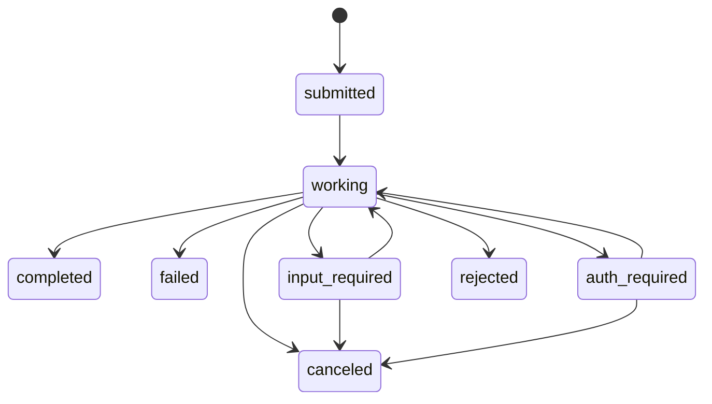

A deep dive into the A2A protocol design, task lifecycle, and how PromptKit implements it.

---

## Why Agent-to-Agent?

Modern AI applications often need multiple specialized agents working together. A research agent might delegate citation lookups to a knowledge agent, or an orchestrator might fan out tasks to domain experts.

A2A solves this by treating **agents as services** — each agent publishes a card describing its capabilities, and other agents call it over standard HTTP. This enables:

- **Skill delegation** — route tasks to the best-suited agent
- **Composability** — build complex systems from simple, focused agents
- **Language independence** — any HTTP client can call any A2A server
- **Discovery** — agents self-describe their skills, input/output modes, and capabilities

---

## Protocol Overview

A2A uses **JSON-RPC 2.0 over HTTP**. All method calls go to a single endpoint (`POST /a2a`), and agent discovery uses a well-known URL.

| Endpoint | Method | Purpose |
|----------|--------|---------|
| `GET /.well-known/agent.json` | HTTP GET | Agent discovery |
| `POST /a2a` | `message/send` | Send a message (synchronous) |
| `POST /a2a` | `message/stream` | Send a message (SSE streaming) |
| `POST /a2a` | `tasks/get` | Get task by ID |
| `POST /a2a` | `tasks/cancel` | Cancel a running task |
| `POST /a2a` | `tasks/list` | List tasks by context ID |
| `POST /a2a` | `tasks/subscribe` | Subscribe to task updates (SSE) |

Every request is a standard JSON-RPC envelope:

```json
{
  "jsonrpc": "2.0",
  "id": 1,
  "method": "message/send",
  "params": { ... }
}
```

---

## Agent Cards

An **Agent Card** is a JSON document served at `/.well-known/agent.json` that describes an agent's identity and capabilities:

```json
{
  "name": "Research Agent",
  "description": "Searches academic papers on a given topic",
  "version": "1.0.0",
  "capabilities": {
    "streaming": true
  },
  "skills": [
    {
      "id": "search_papers",
      "name": "Search Papers",
      "description": "Search for academic papers on a given topic",
      "tags": ["research", "papers"]
    }
  ],
  "defaultInputModes": ["text/plain"],
  "defaultOutputModes": ["text/plain"]
}
```

Key fields:

| Field | Description |
|-------|-------------|
| `name` | Human-readable agent name |
| `description` | What the agent does |
| `capabilities` | Feature flags (streaming, push notifications) |
| `skills` | List of specific tasks the agent can perform |
| `defaultInputModes` | MIME types the agent accepts (e.g., `text/plain`, `image/png`) |
| `defaultOutputModes` | MIME types the agent can produce |

Skills can override the agent's default input/output modes with their own `inputModes` and `outputModes`.

---

## Task Lifecycle

Every message creates a **Task** that progresses through a state machine:



| State | Meaning |
|-------|---------|
| `submitted` | Task created, not yet processing |
| `working` | Agent is actively processing |
| `completed` | Task finished successfully |
| `failed` | Task encountered an error |
| `canceled` | Task was canceled by the caller |
| `input_required` | Agent needs more information from the caller |
| `auth_required` | Agent requires authentication |
| `rejected` | Agent declined the task |

Terminal states (`completed`, `failed`, `canceled`, `rejected`) cannot transition further. The `input_required` and `auth_required` states allow the caller to provide additional input and resume processing.

---

## Message Format

Messages consist of **parts** — each part carries one type of content:

```go
type Part struct {
    Text      *string        `json:"text,omitempty"`
    Raw       []byte         `json:"raw,omitempty"`
    URL       *string        `json:"url,omitempty"`
    Data      map[string]any `json:"data,omitempty"`
    Metadata  map[string]any `json:"metadata,omitempty"`
    Filename  string         `json:"filename,omitempty"`
    MediaType string         `json:"mediaType,omitempty"`
}
```

A message has a `role` (`user` or `agent`), a list of parts, and optional metadata:

```go
type Message struct {
    MessageID string `json:"messageId"`
    ContextID string `json:"contextId,omitempty"`
    TaskID    string `json:"taskId,omitempty"`
    Role      Role   `json:"role"`
    Parts     []Part `json:"parts"`
    Metadata  map[string]any `json:"metadata,omitempty"`
}
```

The `contextId` groups related tasks into a conversation. If omitted, the server generates one automatically.

---

## Artifacts

When a task completes, the agent's output is stored as **artifacts** on the task:

```go
type Artifact struct {
    ArtifactID  string `json:"artifactId"`
    Name        string `json:"name,omitempty"`
    Description string `json:"description,omitempty"`
    Parts       []Part `json:"parts"`
}
```

A single task can produce multiple artifacts (e.g., text response + generated image).

---

## SSE Streaming

The `message/stream` method returns Server-Sent Events (SSE) instead of a single JSON response. The server sends two types of events:

**TaskStatusUpdateEvent** — emitted when the task state changes:

```json
{
  "taskId": "abc123",
  "contextId": "ctx456",
  "status": { "state": "working" }
}
```

**TaskArtifactUpdateEvent** — emitted as the agent produces output:

```json
{
  "taskId": "abc123",
  "contextId": "ctx456",
  "artifact": {
    "artifactId": "artifact-0",
    "parts": [{ "text": "The capital" }]
  },
  "append": true
}
```

Each SSE event is wrapped in a JSON-RPC response envelope:

```
data: {"jsonrpc":"2.0","id":1,"result":{"taskId":"abc123","status":{"state":"working"}}}

data: {"jsonrpc":"2.0","id":1,"result":{"taskId":"abc123","artifact":{"artifactId":"artifact-0","parts":[{"text":"Hello"}]},"append":true}}
```

The client parses these events and delivers them as a channel of `StreamEvent` values, each containing either a `StatusUpdate` or `ArtifactUpdate`.

---

## Design Decisions

### Why JSON-RPC?

JSON-RPC provides a clean request/response model with typed methods, error codes, and request IDs — all over a single HTTP endpoint. This avoids the complexity of REST path design and keeps the protocol simple.

### Why Agent Cards?

Agent cards enable dynamic discovery. A client can connect to any A2A server, fetch its card, and understand what it can do — no hardcoded knowledge required. The Tool Bridge uses this to automatically generate tool descriptors from agent skills.

### Architecture Split

PromptKit splits A2A into two packages:

- **`runtime/a2a`** — protocol types, client, tool bridge, mock server, and conversion helpers. This is for *consuming* A2A services.
- **`sdk`** — A2A server (`A2AServer`), task store, and conversation opener. This is for *exposing* an agent as an A2A service.

This separation keeps the runtime free of SDK dependencies while letting the SDK build on top of the protocol types.

---

## Next Steps

- [Tutorial: A2A Client](/runtime/tutorials/07-a2a-client/) — discover agents and send messages
- [Tutorial: A2A Server](/sdk/tutorials/10-a2a-server/) — expose your agent as an A2A service
- [Tool Bridge How-To](/runtime/how-to/use-a2a-tool-bridge/) — register agents as tools
- [Runtime A2A Reference](/runtime/reference/a2a/) — client, types, bridge, mock API
- [SDK A2A Reference](/sdk/reference/a2a-server/) — server, task store, opener API
