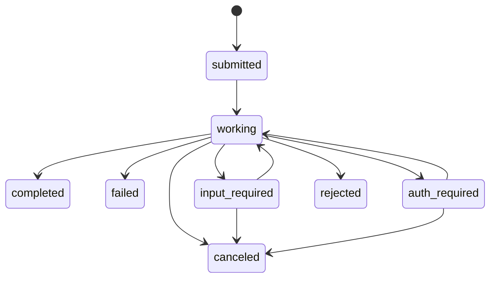

A deep dive into the A2A protocol design, task lifecycle, and how PromptKit implements it.

---

## Why Agent-to-Agent?

Modern AI applications often need multiple specialized agents working together. A research agent might delegate citation lookups to a knowledge agent, or an orchestrator might fan out tasks to domain experts.

A2A solves this by treating **agents as services** — each agent publishes a card describing its capabilities, and other agents call it over standard HTTP. This enables:

- **Skill delegation** — route tasks to the best-suited agent
- **Composability** — build complex systems from simple, focused agents
- **Language independence** — any HTTP client can call any A2A server
- **Discovery** — agents self-describe their skills, input/output modes, and capabilities

---

## Protocol Overview

A2A uses **JSON-RPC 2.0 over HTTP**. All method calls go to a single endpoint (`POST /a2a`), and agent discovery uses a well-known URL.

PromptKit speaks two versions of the protocol on the same endpoint: **A2A 1.0** and **A2A 0.3**. Each request is answered in the version it asked for. That is the `A2A-Version` header when present. Otherwise it is the version whose method name the request used. The spec reads a request with no version as 0.3.

| Operation | A2A 1.0 method | A2A 0.3 method |
|-----------|----------------|----------------|
| Send a message | `SendMessage` | `message/send` |
| Send a message (SSE streaming) | `SendStreamingMessage` | `message/stream` |
| Get a task by ID | `GetTask` | `tasks/get` |
| Cancel a running task | `CancelTask` | `tasks/cancel` |
| List tasks in a context | `ListTasks` | (1.0 only) |
| Subscribe to a task's updates (SSE) | `SubscribeToTask` | `tasks/resubscribe` |

Agent discovery is `GET /.well-known/agent-card.json`. The legacy `/.well-known/agent.json` path serves the same card.

Every request is a standard JSON-RPC envelope:

```json
{
  "jsonrpc": "2.0",
  "id": 1,
  "method": "SendMessage",
  "params": { ... }
}
```

The two versions differ on the wire, not in meaning:

| | A2A 1.0 | A2A 0.3 |
|-|---------|---------|
| Task states | `TASK_STATE_COMPLETED`, `TASK_STATE_INPUT_REQUIRED`, ... | `completed`, `input-required`, ... |
| Roles | `ROLE_USER`, `ROLE_AGENT` | `user`, `agent` |
| `SendMessage` result | `{"task": {...}}` | the task, with `"kind": "task"` |
| Stream events | `{"task"\|"statusUpdate"\|"artifactUpdate": {...}}` | the event, with `"kind"` and, on status updates, `"final"` |
| File parts | `{"raw": ...}` / `{"url": ...}` with `mediaType` | `{"kind": "file", "file": {"bytes"\|"uri": ...}}` |
| Blocking `SendMessage` | by default; `returnImmediately: true` opts out | only with `blocking: true` |

A file part sent by URL is a URL the caller chose. OpenAI and Claude hand an image URL to the vendor to fetch. Other parts are fetched by the server itself: every media part for Gemini, documents for Claude, audio for OpenAI, and every image for Ollama, whose server usually sits inside the host's network. The server refuses to fetch from loopback, private, link-local or otherwise non-public addresses, including redirects to them, so a caller cannot point it at its cloud metadata service or internal network. The same applies to AG-UI messages. `sdk.WithUnsafePrivateNetworkMedia()` turns the check off. Use it only when every media URL comes from a source the host trusts. To allow specific internal destinations, use the host's egress policy instead.

A blocking `SendMessage` holds its request until the turn ends. If the caller disconnects first, the server stops waiting, and the turn runs on under its task. `a2aserver.WithMaxBlockingWait` caps the wait: past the cap, the caller gets the task still working, and polls `GetTask` or subscribes. The runtime's A2A tool executor does not block at all. It sends with `returnImmediately`, polls the task until it finishes (`Client.WaitForTask`), and cancels the task if the tool's timeout runs out first. It never resends a message after a response timeout, because the agent may already have started the turn.

The runtime client sends `A2A-Version: 1.0`. If the agent rejects a 1.0 method as unknown, the client retries once in 0.3 and remembers the answer; `a2a.WithProtocolVersion` pins a version instead. The client reads every version's shapes, so its callers see one set of Go types.

---

## Agent Cards

An **Agent Card** is a JSON document served at `/.well-known/agent-card.json` that describes an agent's identity and capabilities:

```json
{
  "name": "Research Agent",
  "description": "Searches academic papers on a given topic",
  "version": "1.0.0",
  "capabilities": {
    "streaming": true
  },
  "skills": [
    {
      "id": "search_papers",
      "name": "Search Papers",
      "description": "Search for academic papers on a given topic",
      "tags": ["research", "papers"]
    }
  ],
  "defaultInputModes": ["text/plain"],
  "defaultOutputModes": ["text/plain"]
}
```

Key fields:

| Field | Description |
|-------|-------------|
| `name` | Human-readable agent name |
| `description` | What the agent does |
| `capabilities` | Feature flags (streaming, push notifications) |
| `skills` | List of specific tasks the agent can perform |
| `defaultInputModes` | MIME types the agent accepts (e.g., `text/plain`, `image/png`) |
| `defaultOutputModes` | MIME types the agent can produce |

Skills can override the agent's default input/output modes with their own `inputModes` and `outputModes`.

A card should also say how to authenticate. Set `SecuritySchemes` (for example an `HTTPAuth` Bearer scheme) and `SecurityRequirements` on the `a2a.AgentCard`; the server publishes them in each version's shape.

The server completes the card's `supportedInterfaces` before serving it. A JSON-RPC interface is declared for both 1.0 and 0.3. A card that declares none gets one pointing at the server's own `/a2a` endpoint, taken from the request's `Host` header. `X-Forwarded-*` headers are ignored: any caller can set them, and a cached card that trusted them could point other callers somewhere else. Behind a proxy, declare the public URL in the card's `supportedInterfaces`. The served card also declares `streaming` (the server answers `SendStreamingMessage` and `SubscribeToTask` in every mode; a conversation that does not implement `StreamingConversation` is streamed from its `Send` result, as the task followed by its result and final status) and never `pushNotifications` (every push method fails with `-32003`), whatever the configured card says. `GetExtendedAgentCard` fails with `UnsupportedOperationError` (`-32004`) unless the card declares `extendedAgentCard`, and with `ExtendedAgentCardNotConfiguredError` (`-32007`) if it does. A request that sends `A2A-Version: 1.0` gets the 1.0 card. Any other request gets the 0.3 card: `url`, `preferredTransport` and `protocolVersion`, with `supportedInterfaces` alongside.

---

## Task Lifecycle

Every message without a `taskId` creates a **Task** that progresses through a state machine:


```mermaid
stateDiagram-v2
    [*] --> submitted
    submitted --> working
    working --> completed
    working --> failed
    working --> canceled
    working --> input_required
    working --> auth_required
    working --> rejected
    input_required --> working
    input_required --> canceled
    auth_required --> working
    auth_required --> canceled
```

| State | Meaning |
|-------|---------|
| `submitted` | Task created, processing has not started |
| `working` | Agent is actively processing |
| `completed` | Task finished successfully |
| `failed` | Task encountered an error |
| `canceled` | Task was canceled by the caller |
| `input_required` | Agent needs more information from the caller |
| `auth_required` | Agent requires authentication |
| `rejected` | Agent declined the task |

Terminal states (`completed`, `failed`, `canceled`, `rejected`) cannot transition further. The `input_required` and `auth_required` states allow the caller to provide additional input and resume processing: the caller sends its next message with the task's `taskId`, and the same task goes back to `working`. A message whose `taskId` names no task the caller can see fails with `TaskNotFoundError` (`-32001`); one naming a finished task, or a task that is not waiting for input, fails with `UnsupportedOperationError` (`-32004`); and a `contextId` that differs from the task's fails with `-32602`. The context is taken from the task when the message names only the `taskId`. A message without a `taskId` always starts a new task.

A streaming caller that disconnects closes only its own stream. The task runs on, its result is recorded, and subscribers keep receiving its updates; `CancelTask` is how to stop it.

These are PromptKit's Go names (`a2a.TaskStateInputRequired`). On the wire each state takes its version's spelling: `TASK_STATE_INPUT_REQUIRED` in 1.0, `input-required` in 0.3.

Canceling a task that has already finished fails with `TaskNotCancelableError` (`-32002`). Subscribing to one fails with `UnsupportedOperationError` (`-32004`).

---

## Message Format

Messages consist of **parts** — each part carries one type of content:

```go
type Part struct {
    Text      *string        `json:"text,omitempty"`
    Raw       []byte         `json:"raw,omitempty"`
    URL       *string        `json:"url,omitempty"`
    Data      map[string]any `json:"data,omitempty"`
    DataValue any            `json:"-"` // a data value that is not an object
    Metadata  map[string]any `json:"metadata,omitempty"`
    Filename  string         `json:"filename,omitempty"`
    MediaType string         `json:"mediaType,omitempty"`
}
```

A message has a `role` (`user` or `agent`), a list of parts, and optional metadata:

```go
type Message struct {
    MessageID string `json:"messageId"`
    ContextID string `json:"contextId,omitempty"`
    TaskID    string `json:"taskId,omitempty"`
    Role      Role   `json:"role"`
    Parts     []Part `json:"parts"`
    Metadata  map[string]any `json:"metadata,omitempty"`
}
```

The `contextId` groups related tasks into a conversation. If omitted, the server generates one automatically.

---

## Artifacts

When a task completes, the agent's output is stored as **artifacts** on the task:

```go
type Artifact struct {
    ArtifactID  string `json:"artifactId"`
    Name        string `json:"name,omitempty"`
    Description string `json:"description,omitempty"`
    Parts       []Part `json:"parts"`
}
```

A single task can produce multiple artifacts (e.g., text response + generated image).

---

## SSE Streaming

`SendStreamingMessage` (0.3: `message/stream`) returns Server-Sent Events instead of a single JSON response. The stream follows A2A 1.0 §3.1.2:

1. **The Task** comes first, already `working`.
2. **Artifact updates** follow as the agent produces output. A run of text is a single artifact: the first chunk opens it, later chunks carry `append: true`, and the last carries `lastChunk: true`. Media parts are artifacts of their own.
3. **A status update** ends the stream when the task finishes (`completed`, `failed`, `canceled`) or needs the caller (`input-required`).

In 1.0 each result is wrapped by what it is:

```
data: {"jsonrpc":"2.0","id":1,"result":{"task":{"id":"abc123","contextId":"ctx456","status":{"state":"TASK_STATE_WORKING"}}}}

data: {"jsonrpc":"2.0","id":1,"result":{"artifactUpdate":{"taskId":"abc123","contextId":"ctx456","artifact":{"artifactId":"artifact-1","parts":[{"text":"Hello"}]}}}}

data: {"jsonrpc":"2.0","id":1,"result":{"artifactUpdate":{"taskId":"abc123","contextId":"ctx456","artifact":{"artifactId":"artifact-1","parts":[{"text":" world"}]},"append":true,"lastChunk":true}}}

data: {"jsonrpc":"2.0","id":1,"result":{"statusUpdate":{"taskId":"abc123","contextId":"ctx456","status":{"state":"TASK_STATE_COMPLETED"}}}}
```

In 0.3 each result is sent bare, tagged with `"kind"` (`task`, `artifact-update`, `status-update`), and the closing status update carries `"final": true`.

`SubscribeToTask` (0.3: `tasks/resubscribe`) streams the same updates for a task already running. That includes a task started with a non-streaming `SendMessage`. The subscription opens with the task as it stands.

The client parses every version's events and delivers them as a channel of `StreamEvent` values. Each holds exactly one of `Task`, `Message`, `StatusUpdate` or `ArtifactUpdate`.

---

## Design Decisions

### Why JSON-RPC?

JSON-RPC provides a clean request/response model with typed methods, error codes, and request IDs — all over a single HTTP endpoint. This avoids the complexity of REST path design and keeps the protocol simple.

### Why Agent Cards?

Agent cards enable dynamic discovery. A client can connect to any A2A server, fetch its card, and understand what it can do — no hardcoded knowledge required. The Tool Bridge uses this to automatically generate tool descriptors from agent skills.

### Architecture Split

PromptKit splits A2A into two packages:

- **`runtime/a2a`** — protocol types, client, tool bridge, mock server, and conversion helpers. This is for *consuming* A2A services.
- **`sdk`** — A2A server (`A2AServer`), task store, and conversation opener. This is for *exposing* an agent as an A2A service.

This separation keeps the runtime free of SDK dependencies while letting the SDK build on top of the protocol types.

---

## A2A and AG-UI

A2A handles **agent-to-agent** communication — agents calling other agents as services. For the complementary problem of connecting agents to **frontend applications** (user interfaces, chat widgets, dashboards), PromptKit supports the [AG-UI protocol](/concepts/ag-ui/). Together, these protocols cover the full communication surface:

| Protocol | Direction | Use Case |
|----------|-----------|----------|
| **MCP** | Agent ↔ Tools | Tool discovery and execution |
| **A2A** | Agent ↔ Agents | Task delegation between agents |
| **AG-UI** | Agent ↔ Frontends | Real-time streaming to user interfaces |

---

## Next Steps

- [Tutorial: A2A Client](/runtime/tutorials/07-a2a-client/) — discover agents and send messages
- [Tutorial: A2A Server](/sdk/tutorials/10-a2a-server/) — expose your agent as an A2A service
- [Tool Bridge How-To](/runtime/how-to/a2a/use-a2a-tool-bridge/) — register agents as tools
- [Runtime A2A Reference](/runtime/reference/a2a/) — client, types, bridge, mock API
- [SDK A2A Reference](/sdk/reference/a2a-server/) — server, task store, opener API
- [AG-UI Concept](/concepts/ag-ui/) — the complementary agent-to-frontend protocol
