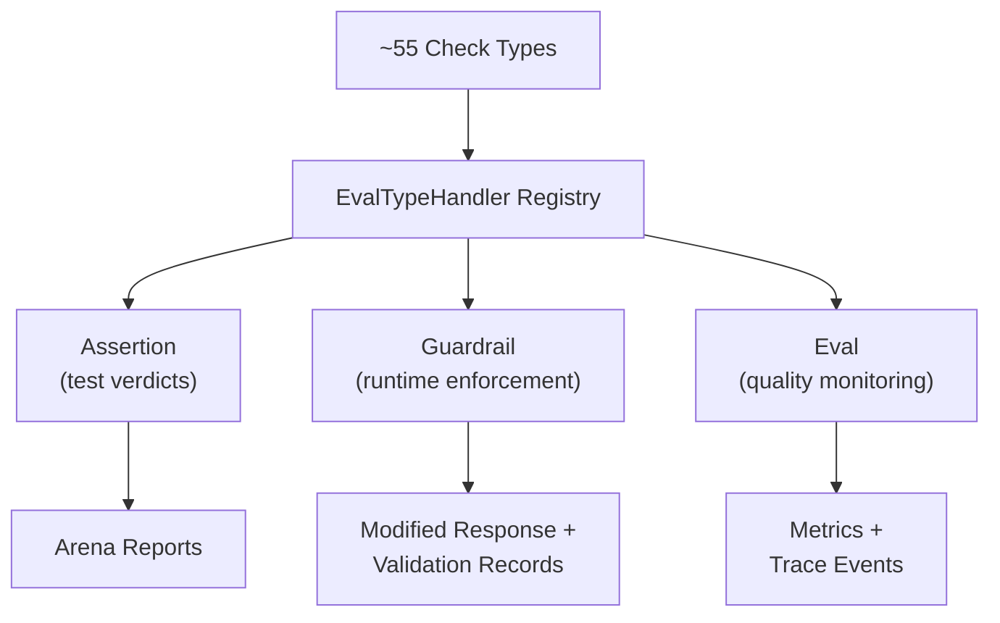

PromptKit has a single check system that serves three purposes: testing, runtime enforcement, and production monitoring. This page explains that unified model and when to use each surface.

## The Unified Check Model

PromptKit ships with ~55 built-in check types (`contains`, `max_length`, `llm_judge`, `regex`, `banned_words`, and many more). Every check type can be used in **three contexts** depending on where you configure it:

| Surface | Config Location | When It Runs | What It Does |
|---------|----------------|--------------|--------------|
| **Assertion** | Scenario YAML `assertions:` | After LLM generation, during testing | Produces pass/fail test verdicts |
| **Guardrail** | Pack YAML `validators:` | During LLM generation, at runtime | Enforces policies (truncate, replace, block) |
| **Eval** | Pack file `evals:` | Production + testing, configurable triggers | Produces scores (0.0–1.0) and records metrics |

Under the hood, all three paths share the same `EvalTypeHandler` registry. Eval handlers produce **scores only** (0.0–1.0) — they never determine pass/fail. Assertions and guardrails are wrappers that add pass/fail judgment on top:

- **Assertions** wrap an eval handler in `AssertionEvalHandler`, which applies score thresholds (`min_score`, `max_score`) to determine pass/fail. Without explicit thresholds, a score of 1.0 passes.
- **Guardrails** wrap an eval handler in `GuardrailEvalHandler`, which checks whether the score indicates a violation and enforces policy (truncate, replace, block).

This means you write a check once and deploy it wherever you need it. A `content_excludes` check works identically whether it is validating a test scenario, blocking banned words at runtime, or monitoring violations in production.

## Which Surface Should I Use?

**"I want to test LLM behavior in CI"** -- use an **Assertion**. Define checks in your scenario YAML under `assertions:`. They run only in Arena. Use `when:` for conditional checks and `pass_threshold` for statistical testing across multiple runs.

**"I want to enforce policies at runtime"** -- use a **Guardrail**. Define checks in your pack YAML under `validators:`. They run during every LLM call in production. Streaming-capable checks can abort early to save tokens. Set `fail_on_violation: false` for monitor-only mode.

**"I want to monitor quality in production"** -- use an **Eval**. Define checks in your pack file under `evals:`. They travel with the pack and run based on configurable triggers. Results are exported as Prometheus metrics and trace events.

**"I want all three"** -- use the same check type in all three configs. For example, configure `content_excludes` as a guardrail to block banned words at runtime, as an assertion to verify that blocking works in CI, and as an eval to track violation rates in production dashboards.

## Enforcement Behavior (Guardrails)

When a guardrail triggers, the pipeline continues with modified content rather than returning an error. The specific behavior depends on the check type:

- **Content blockers** (`content_excludes`, `banned_words`): Replace the entire response with a configurable policy message.
- **Length checks** (`max_length`): Truncate the response to the configured limit.
- **Other check types**: Log the violation without modifying content.
- **Monitor-only mode**: Evaluate and record results, but never modify the response. Useful for gradual rollout and observability.

All violations are recorded in `message.Validations` and emitted as `validation.failed` events, regardless of enforcement mode. This gives you full visibility into what triggered and why.

## Extending the Check System

PromptKit's check system is extensible at multiple levels:

- **Go handlers**: Implement the `EvalTypeHandler` interface for custom check logic that runs in-process.
- **Subprocess handlers**: Define exec eval bindings in RuntimeConfig YAML to run checks written in Python, Node.js, or any language.
- **External services**: Use the `rest_eval` or `a2a_eval` check types to delegate evaluation to HTTP endpoints or A2A agents.
- **Custom guardrails**: Implement the `ProviderHook` interface for runtime hooks that go beyond check types (e.g., ML-based content moderation with streaming abort).
- **Custom LLM judges**: Implement the `JudgeProvider` interface for specialized LLM evaluation logic.

See the [Checks Reference](/reference/checks/#extending-the-check-system) for implementation details and examples.

## Terminology

| Term | Meaning |
|------|---------|
| **Check** | Generic term for any evaluation -- a specific implementation like `contains`, `llm_judge`, or `max_length` |
| **Assertion** | A check used in an Arena test scenario to produce pass/fail verdicts |
| **Guardrail** | A check used as a runtime policy enforcer during LLM generation |
| **Eval** | A check used for production quality monitoring with metrics and triggers |
| **Check type** | The identifier for a check implementation (e.g., `contains`, `regex`, `banned_words`) |

:::note
The docs previously used "validator" as a synonym for "guardrail." We now consistently use **guardrail** for the runtime enforcement surface. You will still see `validators:` as the YAML key in pack files for backward compatibility.
:::

## See Also

- [Checks Reference](/reference/checks/) -- All check types, parameters, and extensibility details
- [Write Assertions](/arena/reference/assertions/) -- Using checks in Arena scenarios
- [Guardrails](/arena/reference/validators/) -- Using checks as runtime guardrails
- [Eval Framework](/arena/explanation/eval-framework/) -- Eval architecture, triggers, and metrics
- [Run Evals](/sdk/how-to/run-evals/) -- Programmatic eval execution
- [Hooks & Guardrails](/runtime/reference/hooks/) -- Runtime hook system API
