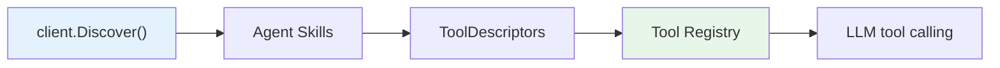

The Tool Bridge converts an A2A agent's skills into `ToolDescriptor` entries so they can be used through the standard tool registry — enabling LLMs to call remote agents as if they were local tools.

---

## Overview



1. The bridge calls `Discover()` to fetch the agent card
2. Each skill is converted to a `ToolDescriptor`
3. Descriptors are registered in the tool registry
4. The LLM can invoke them during tool-calling rounds

---

## Register an A2A Agent as a Tool

```go
package main

import (
    "context"
    "fmt"
    "log"

    "github.com/AltairaLabs/PromptKit/runtime/a2a"
    "github.com/AltairaLabs/PromptKit/sdk"
)

func main() {
    ctx := context.Background()

    // Point a client at the remote agent.
    client := a2a.NewClient("http://localhost:9999")

    // Create the bridge and register the agent's skills.
    bridge := a2a.NewToolBridge(client)
    tools, err := bridge.RegisterAgent(ctx)
    if err != nil {
        log.Fatal(err)
    }

    for _, t := range tools {
        fmt.Printf("Registered: %s — %s\n", t.Name, t.Description)
    }

    // Use the bridge with the SDK.
    conv, err := sdk.Open("assistant.pack.json", "chat",
        sdk.WithA2ATools(bridge),
    )
    if err != nil {
        log.Fatal(err)
    }
    defer conv.Close()

    resp, err := conv.Send(ctx, "Search for papers about quantum computing")
    if err != nil {
        log.Fatal(err)
    }
    fmt.Println(resp.Text())
}
```

---

## Naming Convention

Tool names follow the pattern:

```
a2a__{agentName}__{skillId}
```

Both the agent name and skill ID are sanitized: lowercased, with non-alphanumeric runs replaced by underscores. For example:

| Agent Name | Skill ID | Tool Name |
|------------|----------|-----------|
| Research Agent | search_papers | `a2a__research_agent__search_papers` |
| Code Helper | lint-code | `a2a__code_helper__lint_code` |

This naming is important for `allowed_tools` in prompt configs — you reference the tool by its generated name.

---

## Use with Prompt Config

To enable A2A tools in a prompt config, list them in `allowed_tools`:

```yaml
apiVersion: promptkit.altairalabs.ai/v1alpha1
kind: PromptConfig
spec:
  allowed_tools:
    - a2a__research_agent__search_papers
  system_template: |
    You are a helpful assistant with access to research tools.
    When asked to search for papers, use the available tools.
```

The tool calling pipeline automatically invokes the A2A agent when the LLM decides to call the tool.

---

## Multi-Agent Composition

Register multiple agents on the same bridge. Each `RegisterAgent` call appends to the bridge's internal tool list:

```go
bridge := a2a.NewToolBridge(researchClient)
bridge.RegisterAgent(ctx) // adds research agent tools

// Point the bridge at another agent.
bridge2 := a2a.NewToolBridge(translationClient)
bridge2.RegisterAgent(ctx)
```

Or discover from multiple agents and combine:

```go
bridge := a2a.NewToolBridge(client1)
bridge.RegisterAgent(ctx) // agent 1 tools

// The bridge only works with one client, so create a second bridge.
bridge2 := a2a.NewToolBridge(client2)
bridge2.RegisterAgent(ctx) // agent 2 tools

// Use both with SDK.
conv, _ := sdk.Open("assistant.pack.json", "chat",
    sdk.WithA2ATools(bridge),
    sdk.WithA2ATools(bridge2),
)
```

---

## Input/Output Schema Generation

The bridge automatically generates JSON Schemas for each tool based on the skill's input/output modes:

- **Text** — always includes a `query` field (required)
- **Image** input modes (`image/*`) — adds `image_url` and `image_data` fields
- **Audio** input modes (`audio/*`) — adds `audio_data` field
- **Media** output modes — adds `media_url` and `media_type` fields

---

## Next Steps

- [Use Mock Server](/runtime/how-to/use-a2a-mock-server/) — test tool bridge without a real agent
- [Test A2A Agents in Arena](/arena/how-to/test-a2a-agents/) — end-to-end testing with Arena
- [Runtime A2A Reference](/runtime/reference/a2a/) — `ToolBridge` API details
