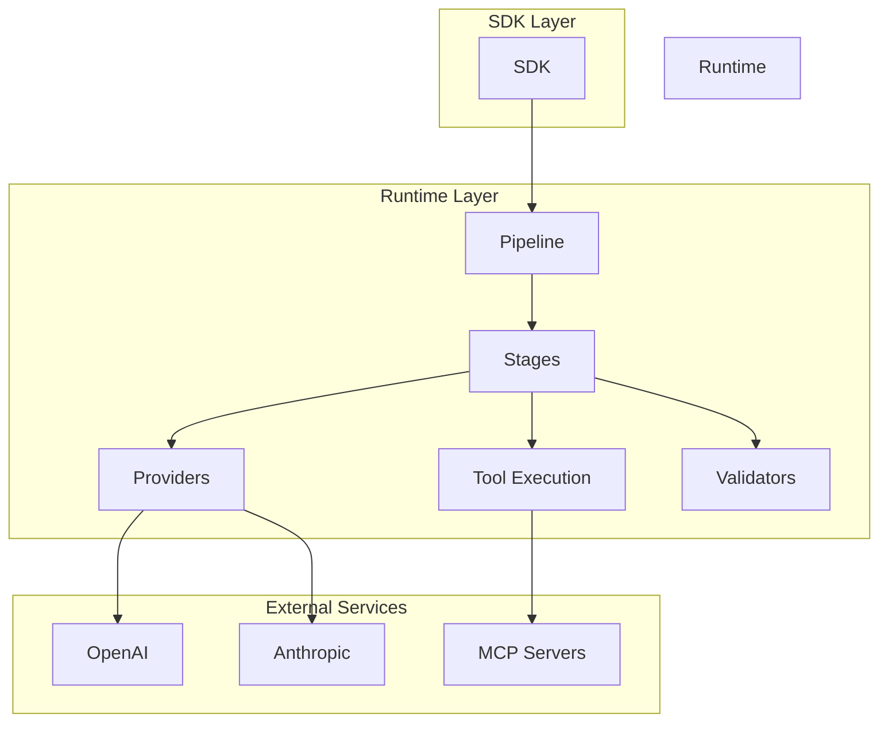

**Core framework powering all PromptKit tools**

---

## What is the Runtime?

The Runtime is the foundational layer that provides:

- **Provider interfaces** for implementing custom LLM providers
- **Pipeline architecture** for streaming request/response processing
- **Stage system** for extensible, composable processing layers
- **Type definitions** used across all PromptKit tools
- **Tool execution** framework for MCP integration
- **A2A protocol** for agent-to-agent communication and tool delegation
- **Validation system** for input/output checking

---

## Who Should Use Runtime?

The Runtime is for advanced users who want to:

- **Build custom providers** for new LLM services
- **Create custom stages** for specialized processing
- **Extend validators** with domain-specific checks
- **Integrate MCP servers** with custom tools
- **Understand internals** for contributions
- **Customize pipelines** for unique requirements

> **Note**: Most users should use the [SDK](/sdk/) instead. Use Runtime directly only if you're extending PromptKit.

---

## Quick Start

```go
package main

import (
    "context"
    "github.com/AltairaLabs/PromptKit/runtime/pipeline/stage"
    "github.com/AltairaLabs/PromptKit/runtime/providers"
    "github.com/AltairaLabs/PromptKit/runtime/providers/openai"
    "github.com/AltairaLabs/PromptKit/runtime/types"
)

func main() {
    // Create provider
    provider := openai.NewProvider(
        "openai", "gpt-4o-mini", "",
        providers.ProviderDefaults{Temperature: 0.7, MaxTokens: 1500},
        false,
    )

    // Build stage-based pipeline
    pipeline := stage.NewPipelineBuilder().
        Chain(
            stage.NewProviderStage(provider, nil, nil, &stage.ProviderConfig{
                MaxTokens:   1500,
                Temperature: 0.7,
            }),
        ).
        Build()

    // Execute
    input := make(chan stage.StreamElement, 1)
    msg := types.Message{Role: "user"}
    msg.AddTextPart("Hello!")
    input <- stage.NewMessageElement(msg)
    close(input)

    output, _ := pipeline.Execute(context.Background(), input)
    for elem := range output {
        if elem.Text != nil {
            fmt.Print(*elem.Text)
        }
    }
}
```

**Next**: [Build Your First Pipeline Tutorial](/runtime/tutorials/01-first-pipeline/)

---

## Documentation by Type

### Tutorials (Learn by Doing)

Step-by-step guides for extending Runtime:

1. [First Pipeline](/runtime/tutorials/01-first-pipeline/) - Build your first pipeline
2. [Multi-Turn Conversations](/runtime/tutorials/02-multi-turn/) - State management
3. [MCP Integration](/runtime/tutorials/03-mcp-integration/) - Add MCP tools
4. [Validation & Guardrails](/runtime/tutorials/04-validation-guardrails/) - Content safety
5. [Production Deployment](/runtime/tutorials/05-production-deployment/) - Deploy pipelines
6. [Advanced Patterns](/runtime/tutorials/06-advanced-patterns/) - Complex pipelines
7. [A2A Client](/runtime/tutorials/07-a2a-client/) - Discover agents and send messages

### How-To Guides (Accomplish Specific Tasks)

Focused guides for specific Runtime tasks:

- [Configure Pipeline](/runtime/how-to/configure-pipeline/) - Pipeline setup
- [Setup Providers](/runtime/how-to/setup-providers/) - Provider configuration
- [Handle Errors](/runtime/how-to/handle-errors/) - Error handling
- [Streaming Responses](/runtime/how-to/streaming-responses/) - Real-time output
- [Manage State](/runtime/how-to/manage-state/) - Conversation persistence
- [Integrate MCP](/runtime/how-to/integrate-mcp/) - MCP server integration
- [Monitor Costs](/runtime/how-to/monitor-costs/) - Cost tracking
- [Use A2A Tool Bridge](/runtime/how-to/use-a2a-tool-bridge/) - Register agents as tools
- [Use A2A Mock Server](/runtime/how-to/use-a2a-mock-server/) - Deterministic testing

### Explanation (Understand the Concepts)

Deep dives into Runtime architecture:

- [Pipeline Architecture](/runtime/explanation/pipeline-architecture/) - Stage-based streaming
- [Stage Design](/runtime/explanation/stage-design/) - Composable stage patterns
- [Provider System](/runtime/explanation/provider-system/) - LLM provider abstraction
- [State Management](/runtime/explanation/state-management/) - Conversation persistence

### Reference (Look Up Details)

Complete API documentation:

- [Pipeline API](/runtime/reference/pipeline/) - Stage and pipeline interfaces
- [Providers API](/runtime/reference/providers/) - Provider interfaces
- [Types API](/runtime/reference/types/) - Core type definitions
- [Tools & MCP API](/runtime/reference/tools-mcp/) - Tool execution
- [Validators API](/runtime/reference/validators/) - Validation interfaces
- [Storage API](/runtime/reference/storage/) - State storage
- [A2A API](/runtime/reference/a2a/) - Client, types, tool bridge, mock

---

## Key Concepts

### Stage Interface

Implement custom processing stages:

```go
type Stage interface {
    Name() string
    Type() StageType
    Process(ctx context.Context, input <-chan StreamElement, output chan<- StreamElement) error
}
```

### Pipeline Architecture

Streaming request processing flow:

```
Input → [Stage 1] → [Stage 2] → [Stage N] → Output
```

Each stage runs in its own goroutine, enabling concurrent streaming.

### Stage Types

Different stage behaviors:

| Type | Pattern | Example |
|------|---------|---------|
| Transform | 1:1 or 1:N | Validation, enrichment |
| Accumulate | N:1 | VAD buffering, collection |
| Generate | 0:N | LLM streaming, TTS |
| Sink | N:0 | State save, metrics |

### Tool Execution

MCP tool integration:

```go
type Tool interface {
    Execute(ctx context.Context, params map[string]interface{}) (interface{}, error)
    Schema() *ToolSchema
}
```

---

## Architecture



---

## Use Cases

### For Framework Contributors

- Add new provider support
- Implement new stage types
- Extend validation system
- Improve core functionality

### For Advanced Developers

- Build custom providers for internal APIs
- Create domain-specific stages
- Integrate proprietary LLM services
- Implement custom tool execution

### For System Integrators

- Bridge PromptKit with existing systems
- Customize request/response handling
- Add organization-specific features
- Extend for compliance requirements

---

## Pipeline Modes

Runtime supports three pipeline configurations:

### Text Mode

Standard HTTP-based LLM interactions:

```
Message → StateStoreLoad → PromptAssembly → Provider → StateStoreSave → Response
```

### VAD Mode (Voice Activity Detection)

For voice applications using text-based LLMs:

```
Audio → AudioTurn → STT → Provider → TTS → Audio
```

### ASM Mode (Audio Streaming)

For native multimodal LLMs with real-time audio:

```
Audio/Text → DuplexProvider → Audio/Text
```

---

## Core Types

### StreamElement

```go
type StreamElement struct {
    Text      *string
    Audio     *AudioData
    Message   *types.Message
    ToolCall  *types.ToolCall
    Metadata  map[string]interface{}
    Error     error
    Timestamp time.Time
}
```

### Message

```go
type Message struct {
    Role    string
    Content string
    Parts   []ContentPart
}
```

### Provider Response

```go
type Response struct {
    Content   string
    ToolCalls []ToolCall
    Usage     *Usage
    Metadata  map[string]interface{}
}
```

---

## Design Principles

### Streaming First

Runtime is designed for streaming from the ground up:

- Channel-based data flow
- Concurrent stage execution
- Backpressure support
- True streaming (not simulated)

### Extensibility

Runtime is designed to be extended without modifying core code:

- Plugin-based provider system
- Composable stages
- Flexible validation
- Open for extension, closed for modification

### Performance

Optimized for production use:

- Minimal allocations
- Efficient streaming
- Context-aware cancellation
- Connection pooling

### Type Safety

Leverage Go's type system:

- Strong typing throughout
- Interface-based design
- Compile-time checks
- Clear contracts

---

## Getting Help

- **Quick Start**: [First Pipeline Tutorial](/runtime/tutorials/01-first-pipeline/)
- **Questions**: [GitHub Discussions](https://github.com/AltairaLabs/PromptKit/discussions)
- **Issues**: [Report a Bug](https://github.com/AltairaLabs/PromptKit/issues)
- **Contributing**: [Contribution Guide](/community/contributing/)

---

## Related Documentation

- **SDK**: [Built on top of Runtime](/sdk/)
- **Arena**: [Uses Runtime for testing](/arena/)
- **Architecture**: [System Design](/concepts/architecture/)
