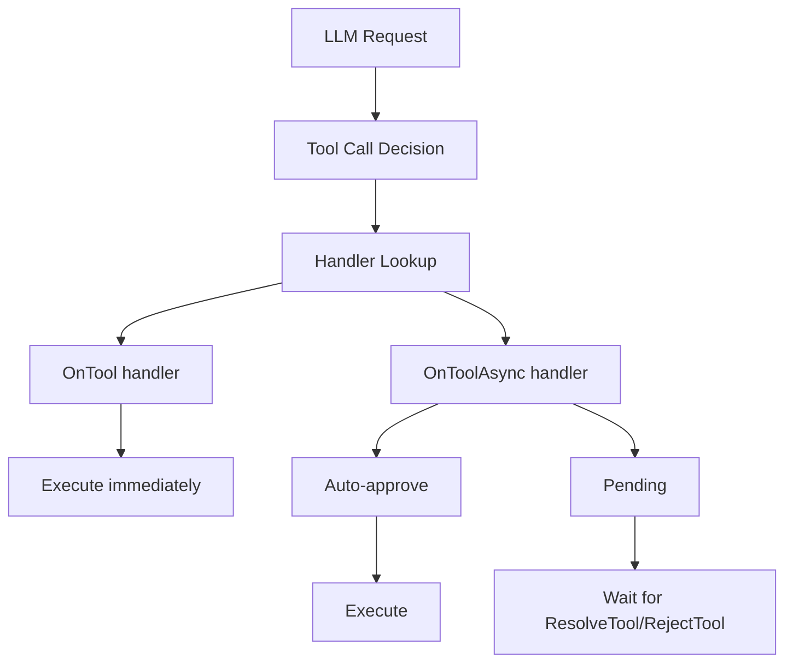
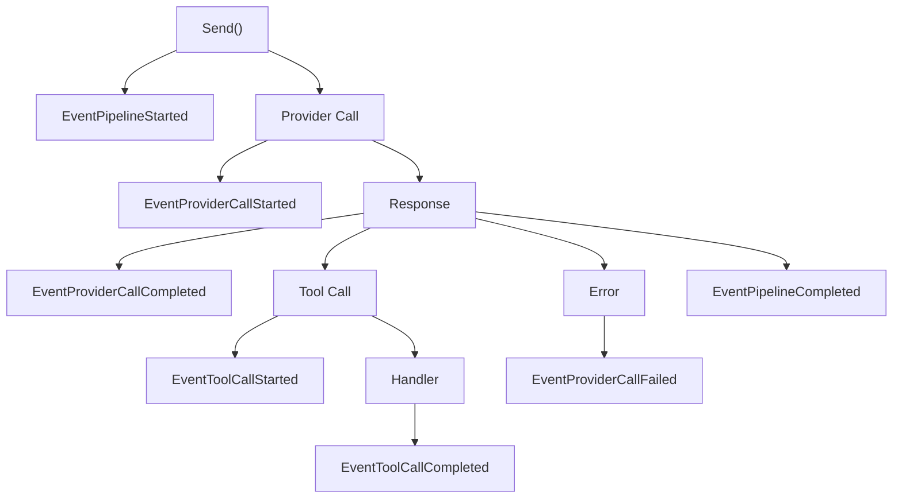

Deep-dive documentation explaining SDK architecture and design.

## Architecture

- **[SDK Architecture](/sdk/explanation/architecture/)** - Pack-first design and components
- **[Observability](/sdk/explanation/observability/)** - Event system and monitoring
- **[How Variables Resolve](/sdk/explanation/variables/)** - Sources, precedence, and the single substitution point

## Design Philosophy

### Pack-First Architecture

The SDK is built around the pack file as the single source of truth:

```d2
direction: down

pack: Pack File {
  label: "Pack File\n← Configuration, prompts, tools"
}

open: sdk.Open() {
  label: "sdk.Open()\n← Load and validate"
}

conv: Conversation {
  label: "Conversation\n← Ready to use"
}

pack -> open -> conv
```

### Why Pack-First?

1. **Reduced Boilerplate** - No manual provider/manager setup
2. **Tested Configuration** - Packs are validated by Arena
3. **Portable** - Same pack works across environments
4. **Versioned** - Pack files are version controlled

### Minimal API

```go
conv, _ := sdk.Open("./pack.json", "chat")
defer conv.Close()
resp, _ := conv.Send(ctx, "Hello")
```

Three lines to a working conversation.

## Key Concepts

### Conversation Lifecycle

1. **Open** - `sdk.Open()` loads pack, creates conversation
2. **Configure** - `SetVar()`, `OnTool()` setup
3. **Use** - `Send()`, `Stream()` interactions
4. **Close** - `Close()` cleanup

### Tool Execution

Tools are registered with handlers:



### Event System

Events flow through the hooks package:



## See Also

- [Tutorials](/sdk/tutorials/)
- [How-To Guides](/sdk/how-to/)
- [API Reference](/sdk/reference/)
