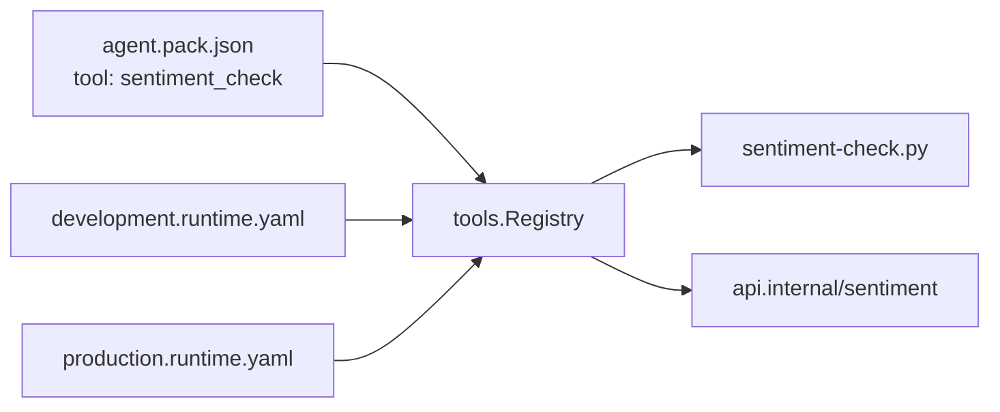

RuntimeConfig separates the agent definition from the execution environment.

## The Problem

Wiring up providers, tools, hooks, state stores and evaluators takes 50+ lines of imperative Go before the first message is sent. Each deployment environment needs different wiring (provider API keys, tool endpoints, state backends) while the agent's core behavior stays the same.

PromptArena solves this with declarative YAML configuration: you describe the runtime environment in a config file and the framework wires it up. RuntimeConfig gives SDK users the same declarative approach and keeps the programmatic options available.

## Pack vs RuntimeConfig

PromptKit separates two concerns:

- The pack defines what the agent does: its prompts, tool schemas, eval definitions and conversation structure.
- The RuntimeConfig defines how the agent runs: which provider to call, where tools are hosted and how to persist state.

```
agent.pack.json              <- what the agent does (portable)
production.runtime.yaml      <- how to run it in production
development.runtime.yaml     <- how to run it locally
```

The pack is platform-agnostic. You can share it across teams, check it into version control, and run it in any environment without modification. It declares _names_ for tools and evals, along with their schemas and trigger conditions, and carries no implementations.

RuntimeConfig is environment-specific. It binds those names to concrete implementations: a Python script, an HTTP endpoint, a Go function. Different environments get different RuntimeConfig files while sharing the same pack. A pack that works in development works in production, because only the RuntimeConfig changes.

## Name-Based Resolution

The pack declares a tool named `sentiment_check` with a JSON Schema describing its parameters. RuntimeConfig binds that name to an implementation, for example `./tools/sentiment-check.py` in development and `https://api.internal/sentiment` in production.

The following diagram shows how one pack resolves to different implementations in two environments.



At invocation time, the tool registry looks up the name and dispatches to the implementation the RuntimeConfig bound it to. The pack does not know whether the tool is Go code, a Python subprocess or an HTTP endpoint. The same applies to evals: the pack declares an eval type such as `sentiment_check`, and RuntimeConfig binds it to a handler.

This indirection lets the pack author and the platform operator work independently. The pack author defines the contract (name and schema). The platform operator fulfils it (binding and implementation).

## Config Struct Reuse

RuntimeConfig reuses the `pkg/config` types that Arena uses internally: `Provider`, `ToolSpec`, `MCPServerConfig`, `StateStoreConfig`, `LoggingConfigSpec` and others. The same Go structs that parse Arena's YAML configuration parse RuntimeConfig files.

This has two benefits. Bug fixes and new fields in `pkg/config` reach both Arena and SDK users. And configuration knowledge transfers: if you know how to configure a provider in Arena, you know how to configure it in RuntimeConfig.

## Override Semantics

RuntimeConfig provides a base layer of configuration. `WithRuntimeConfig()` takes the path to one YAML file, loads it and applies it. Options run in argument order, so options after `WithRuntimeConfig()` can change what the file set.

A team can maintain a shared RuntimeConfig file for the common case (provider settings, standard tool bindings, logging) and individual applications can override specific settings in code. A development build might load `base.runtime.yaml` and then swap in a mock provider. A production build might load the same file and add a custom state store.

Code wins only for the single-valued settings: the agent provider, the state store and the logger. A later `WithProvider`, `WithStateStore` or `WithLogger` overwrites what the file set. The file applies its state store and logger only when none is set yet.

Other settings combine instead of overriding:

- MCP servers are additive. `WithMCPServer` and the YAML both append to the same list.
- Extra LLM providers declared in the YAML stay in the pool next to a programmatic provider.
- Exec eval bindings from the YAML replace a handler of the same type already registered, whatever the option order.
- Exec tool bindings have no programmatic counterpart, so they are always applied.

## The Polyglot Exec Protocol

RuntimeConfig removes the Go-only restriction. Tools, evals and hooks can be implemented as external subprocesses in any language. If it can read stdin and write to stdout, it can participate in a PromptKit agent.

Tools support two modes:

- One-shot (`exec`) spawns a new process for each invocation. The runtime passes `{"args": ...}` as JSON on stdin and reads `{"result": ...}` or `{"error": ...}` from stdout. This is stateless and suits tools that do a single computation and return.
- Server mode (`server`) keeps a long-running process and talks to it over JSON-RPC 2.0, one JSON object per line, with the method `execute`. The runtime starts the process once and sends requests over its lifetime. This amortizes startup cost and lets the subprocess keep state between invocations.

Hook and eval bindings are always one-shot.

Both modes are configured entirely in RuntimeConfig. The pack declares the tool name and schema; the tool's exec binding specifies the `command`, `runtime`, `args` and `env`. The runtime resolves `command` relative to the config file, and the subprocess inherits the host's working directory.

## Security Model

The exec protocol adds a potential attack surface: arbitrary command execution. RuntimeConfig addresses it by separating who controls what.

Exec bindings live in RuntimeConfig, which the operator controls. They do not live in the pack, which can be shared from untrusted sources. The pack schema has no field for an exec binding, so a malicious pack cannot introduce new executables. It can only declare tool names and schemas, and the operator decides what those names resolve to.

The `env` field in RuntimeConfig lists variable _names_, not values. The runtime reads the values from the process environment when it spawns the subprocess, so you can check RuntimeConfig files into version control without leaking secrets. Names that are unset in the host are dropped. A one-shot exec tool with a non-empty `env` list receives only those variables; the other executors start from the host environment plus the named ones.

Tool calls run under a timeout, which limits runaway subprocesses. The timeout is the tool descriptor's `timeout_ms`, and the registry defaults it to 30 seconds. The registry wraps each call in a context deadline and kills a one-shot process that exceeds it. The tool result then carries a "tool execution timed out" error that the LLM sees. In server mode the deadline abandons the call but the long-running process keeps running.

## See Also

- [How-To: Use RuntimeConfig](/sdk/how-to/conversations/use-runtime-config/): practical guide to loading and applying RuntimeConfig
- RuntimeConfig Reference: field-by-field documentation of the RuntimeConfig schema
- Exec Protocol Reference: specification for the subprocess communication protocol
