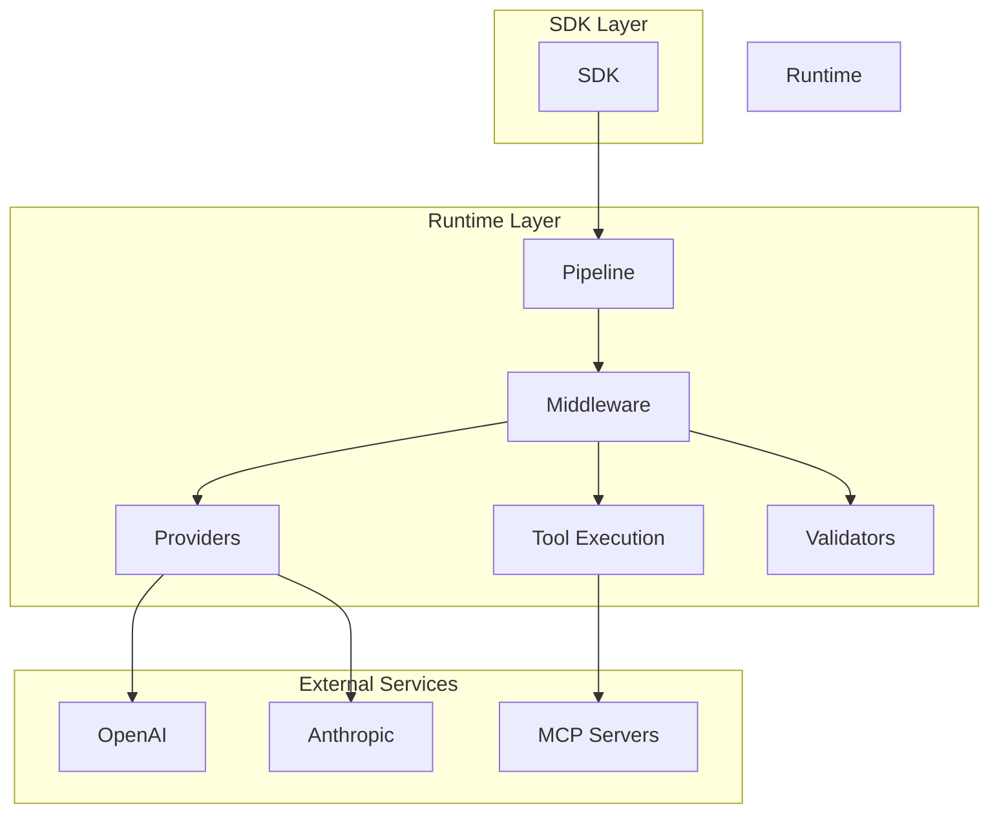

# ⚙️ Runtime

**Core framework powering all PromptKit tools**

---

## What is the Runtime?

The Runtime is the foundational layer that provides:

- **Provider interfaces** for implementing custom LLM providers
- **Pipeline architecture** for request/response processing
- **Middleware system** for extensible processing layers
- **Type definitions** used across all PromptKit tools
- **Tool execution** framework for MCP integration
- **Validation system** for input/output checking

---

## Who Should Use Runtime?

The Runtime is for advanced users who want to:

- **Build custom providers** for new LLM services
- **Create custom middleware** for specialized processing
- **Extend validators** with domain-specific checks
- **Integrate MCP servers** with custom tools
- **Understand internals** for contributions
- **Customize pipelines** for unique requirements

> **Note**: Most users should use the [SDK](/sdk/) instead. Use Runtime directly only if you're extending PromptKit.

---

## Quick Start

```go
package main

import (
    "context"
    "github.com/AltairaLabs/PromptKit/runtime/providers"
    "github.com/AltairaLabs/PromptKit/runtime/pipeline"
)

// Implement a custom provider
type MyProvider struct {
    providers.BaseProvider
}

func (p *MyProvider) Complete(ctx context.Context, req *providers.Request) (*providers.Response, error) {
    // Custom provider logic
    return &providers.Response{
        Content: "Custom response",
    }, nil
}

func main() {
    // Register your provider
    providers.Register("my-provider", NewMyProvider)
    
    // Use in pipeline
    p := pipeline.New().WithProvider("my-provider")
    // ...
}
```

**Next**: [Build a Custom Provider Tutorial](/runtime/tutorials/01-custom-provider/)

---

## Documentation by Type

### 📚 Tutorials (Learn by Doing)

Step-by-step guides for extending Runtime:

1. [Custom Provider](/runtime/tutorials/01-custom-provider/) - Implement a provider
2. [Custom Middleware](/runtime/tutorials/02-custom-middleware/) - Add processing layers
3. [Custom Validator](/runtime/tutorials/03-custom-validator/) - Extend validation

### 🔧 How-To Guides (Accomplish Specific Tasks)

Focused guides for specific Runtime tasks:

- [Implement a Provider](/runtime/how-to/implement-provider/) - Provider interface
- [Create Middleware](/runtime/how-to/create-middleware/) - Middleware patterns
- [Extend Validators](/runtime/how-to/extend-validators/) - Custom validation
- [Integrate MCP](/runtime/how-to/integrate-mcp/) - MCP server integration
- [Customize Pipeline](/runtime/how-to/customize-pipeline/) - Pipeline configuration

### 💡 Explanation (Understand the Concepts)

Deep dives into Runtime architecture:

- [Architecture Overview](/runtime/explanation/architecture-overview/) - System design
- [Pipeline Design](/runtime/explanation/pipeline-design/) - Request flow
- [Provider Interface](/runtime/explanation/provider-interface/) - Provider contract
- [Middleware Lifecycle](/runtime/explanation/middleware-lifecycle/) - Processing stages
- [Tool Execution](/runtime/explanation/tool-execution/) - Tool calling system
- [MCP Integration](/runtime/explanation/mcp-integration/) - Model Context Protocol

### 📖 Reference (Look Up Details)

Complete API documentation:

- [Providers API](/runtime/reference/api/providers/) - Provider interfaces
- [Pipeline API](/runtime/reference/api/pipeline/) - Pipeline builders
- [Middleware API](/runtime/reference/api/middleware/) - Middleware types
- [Types API](/runtime/reference/api/types/) - Core type definitions
- [Validators API](/runtime/reference/api/validators/) - Validation interfaces
- [MCP API](/runtime/reference/api/mcp/) - MCP integration

---

## Key Concepts

### Provider Interface

Implement custom LLM providers:

```go
type Provider interface {
    Complete(ctx context.Context, req *Request) (*Response, error)
    Stream(ctx context.Context, req *Request) (<-chan *StreamChunk, error)
    Metadata() *ProviderMetadata
}
```

### Pipeline Architecture

Request processing flow:

```
Request → Middleware₁ → Middleware₂ → Provider → Middleware₂ → Middleware₁ → Response
```

### Middleware System

Extensible processing layers:

```go
type Middleware interface {
    Process(ctx context.Context, req *Request, next Handler) (*Response, error)
}
```

### Tool Execution

MCP tool integration:

```go
type Tool interface {
    Execute(ctx context.Context, params map[string]interface{}) (interface{}, error)
    Schema() *ToolSchema
}
```

---

## Architecture



---

## Use Cases

### For Framework Contributors

- Add new provider support
- Implement new middleware types
- Extend validation system
- Improve core functionality

### For Advanced Developers

- Build custom providers for internal APIs
- Create domain-specific middleware
- Integrate proprietary LLM services
- Implement custom tool execution

### For System Integrators

- Bridge PromptKit with existing systems
- Customize request/response handling
- Add organization-specific features
- Extend for compliance requirements

---

## Examples

Runtime extension examples:

- [Custom Provider](/runtime/examples/custom-provider/) - Implement a new provider
- [Custom Middleware](/runtime/examples/custom-middleware/) - Add processing
- [MCP Integration](/runtime/examples/mcp-integration/) - Integrate MCP servers

---

## Extension Points

### Provider Registration

```go
providers.Register("my-provider", func(config *ProviderConfig) (Provider, error) {
    return &MyProvider{config: config}, nil
})
```

### Middleware Registration

```go
middleware.Register("my-middleware", func(config *MiddlewareConfig) (Middleware, error) {
    return &MyMiddleware{config: config}, nil
})
```

### Validator Registration

```go
validators.Register("my-validator", func() Validator {
    return &MyValidator{}
})
```

---

## Core Types

### Request

```go
type Request struct {
    Messages    []Message
    Model       string
    Temperature float64
    MaxTokens   int
    Tools       []Tool
    Metadata    map[string]interface{}
}
```

### Response

```go
type Response struct {
    Content     string
    ToolCalls   []ToolCall
    Usage       *Usage
    Metadata    map[string]interface{}
}
```

### StreamChunk

```go
type StreamChunk struct {
    Content   string
    Delta     string
    Done      bool
    Error     error
}
```

---

## Design Principles

### Extensibility

Runtime is designed to be extended without modifying core code:

- Plugin-based provider system
- Composable middleware
- Flexible validation
- Open for extension, closed for modification

### Performance

Optimized for production use:

- Minimal allocations
- Efficient streaming
- Context-aware cancellation
- Connection pooling

### Type Safety

Leverage Go's type system:

- Strong typing throughout
- Interface-based design
- Compile-time checks
- Clear contracts

---

## Getting Help

- **Quick Start**: [Custom Provider Tutorial](/runtime/tutorials/01-custom-provider/)
- **Questions**: [GitHub Discussions](https://github.com/AltairaLabs/PromptKit/discussions)
- **Issues**: [Report a Bug](https://github.com/AltairaLabs/PromptKit/issues)
- **Contributing**: [Contribution Guide](/community/contributing/)

---

## Related Documentation

- **SDK**: [Built on top of Runtime](/sdk/)
- **Arena**: [Uses Runtime for testing](/arena/)
- **Architecture**: [System Design](/concepts/architecture/)
- **ADRs**: [Architecture Decisions](/concepts/architecture/adr/)
